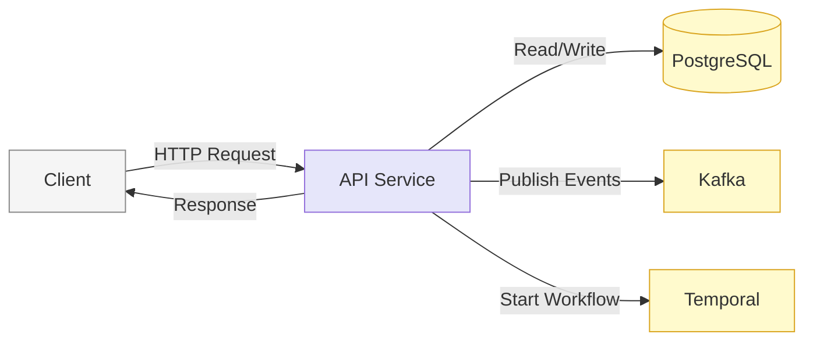
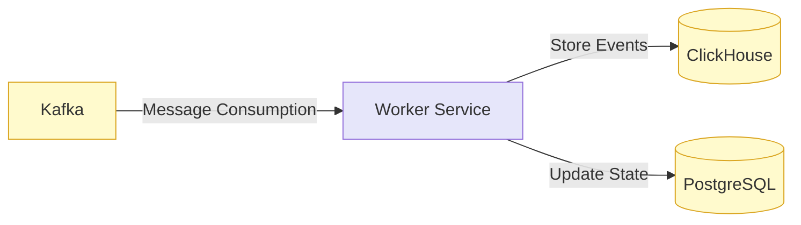
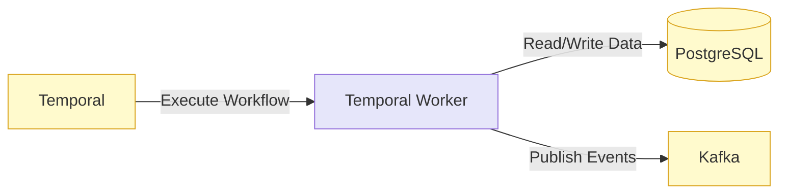
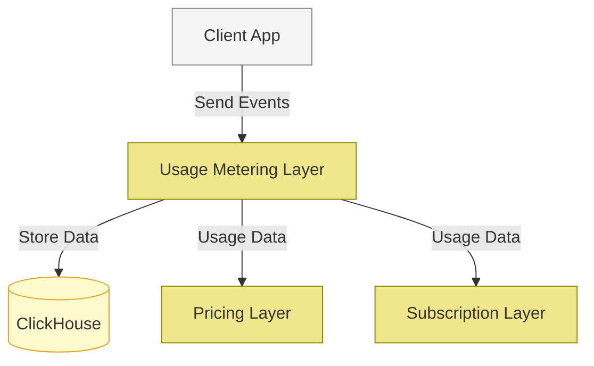
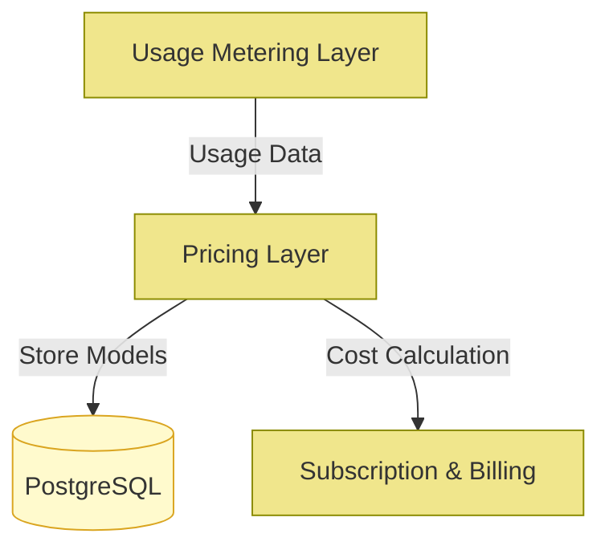
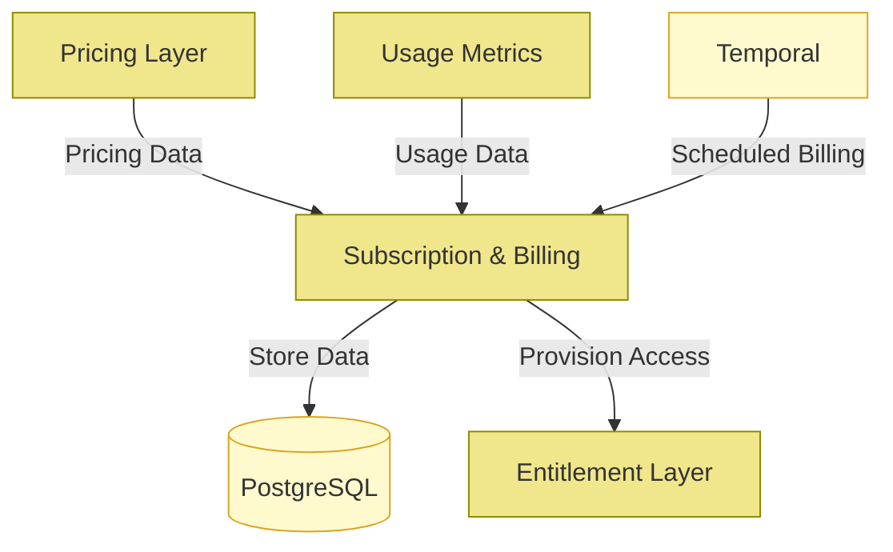
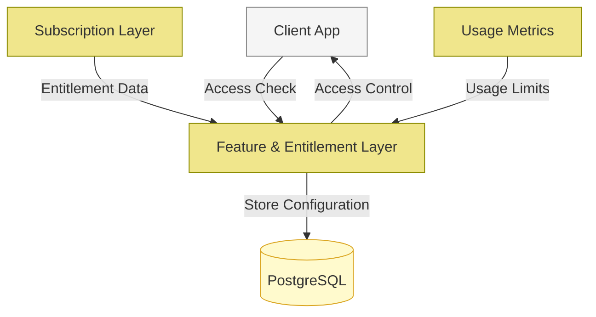

## Building Blocks

### Core Services

#### API Service
The API service is the primary entry point for client applications interacting with FlexPrice. It handles all HTTP requests, processes them through appropriate business logic, and returns responses. The API service:
- Exposes RESTful endpoints for various FlexPrice functionalities
- Handles authentication and authorization
- Writes data to PostgreSQL for persistent storage
- Publishes events to Kafka for asynchronous processing
- Initiates Temporal workflows for complex or scheduled processes

#### Worker Service
The Worker service consumes messages from Kafka and processes them asynchronously:
- Subscribes to configured Kafka topics
- Processes incoming events (usage data, system events, etc.)
- Writes aggregated data to ClickHouse for analytics
- Updates PostgreSQL when necessary based on event processing
- Handles event-driven business logic that doesn't need immediate response

#### Temporal Worker
The Temporal Worker executes scheduled and long-running workflows:
- Runs background job workflows such as billing cycles
- Processes multi-step operations that require state management
- Handles cron jobs for scheduled tasks
- Will eventually manage webhook delivery and related workflows
- Interacts with PostgreSQL and can trigger Kafka events

### Infrastructure Components

#### PostgreSQL
PostgreSQL serves as the primary transactional database storing all core business data:
- Customer data
- Subscription information
- Plan configurations
- Feature entitlements
- User accounts and authorization data

#### ClickHouse
ClickHouse is an OLAP database optimized for high-performance analytics:
- Stores usage metrics and events
- Supports real-time analytics queries
- Enables fast aggregation for billing calculations
- Provides data for usage dashboards and reporting

#### Kafka
Kafka serves as the message broker and event streaming platform:
- Decouples services for async processing
- Enables event-driven architecture
- Ensures reliable delivery of events between services
- Provides buffering during traffic spikes

#### Temporal
Temporal is a workflow orchestration platform that manages complex, stateful processes:
- Coordinates long-running business processes
- Provides durability and reliability for mission-critical workflows
- Manages scheduled jobs via cron-like functionality
- Handles retries and error recovery automatically

## Functional Building Blocks

FlexPrice is architected as a set of composable building blocks, each handling specific aspects of usage-based billing and subscription management. These blocks can be used independently or together, providing flexibility in how the platform is deployed and utilized.

#### Usage Metering Layer
**Core Functionality:**
- Collection and processing of usage events
- Real-time event ingestion
- Usage analytics and reporting

**Interactions:**
- Provides usage data to the Pricing Layer for cost calculations
- Feeds data to the Subscription Layer for usage-based billing
- Supports the Entitlement Layer with metering for feature limits

#### Pricing Layer
**Core Functionality:**
- Defines flexible pricing models
- Supports various pricing strategies (tiered, volume, graduated, etc.)
- Handles price calculations based on usage

**Interactions:**
- Works with Usage Metrics to calculate costs
- Feeds into Subscription & Billing for invoice generation
- Can be configured differently per subscription

#### Subscription & Billing Layer
**Core Functionality:**
- Manages subscription lifecycle
- Handles recurring and usage-based billing
- Processes invoices and payments
- Manages customer accounts and balances

**Interactions:**
- Uses Pricing Layer to determine charges
- Leverages Entitlement Layer to provision appropriate access
- Coordinates with Usage Metrics for consumption-based billing
- Utilizes Temporal for scheduled operations like billing cycles

#### Feature & Entitlement Layer
**Core Functionality:**
- Controls access to features
- Enforces usage limits and quotas
- Provides feature flagging capabilities
- Manages customer entitlements

**Interactions:**
- References Subscription data to determine entitlements
- Uses Usage Metrics to enforce limits
- Can be queried by client applications for access control

