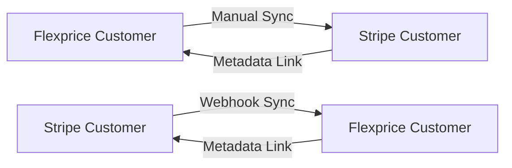
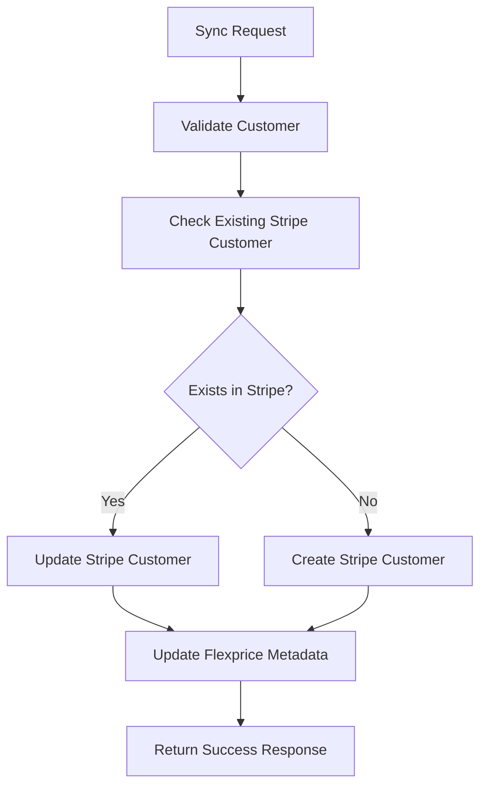
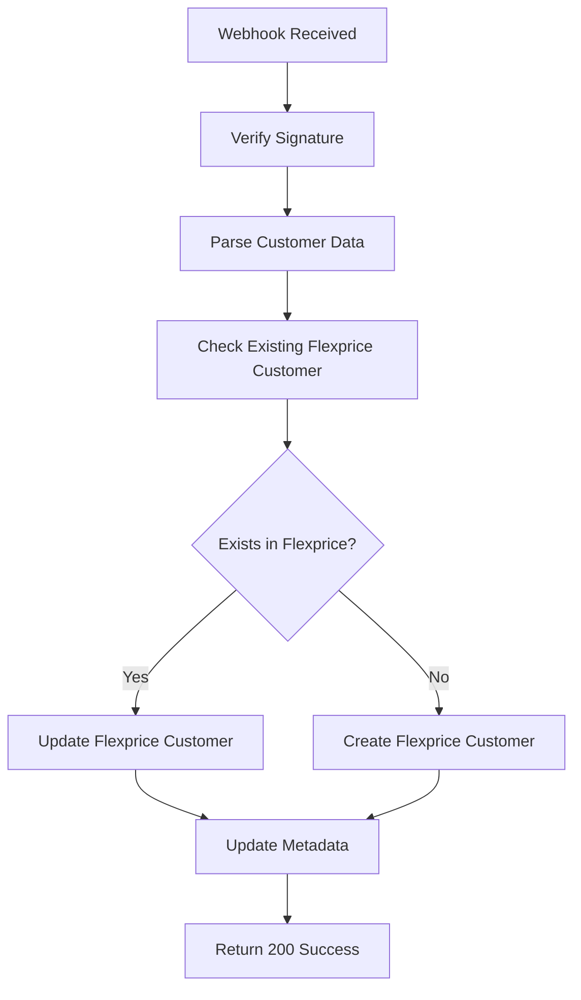

This guide explains how to synchronize customers between Flexprice and Stripe, enabling seamless payment processing and customer management across both platforms.

## Overview

Customer synchronization ensures that customers exist in both Flexprice and Stripe with linked identifiers, enabling:
- Payment link creation for any Flexprice customer
- Automatic customer creation from Stripe webhooks
- Consistent customer data across platforms
- Efficient payment processing workflows

## Synchronization Flow

Customer sync works bidirectionally:



### Key Concepts

- **Entity Integration Mapping**: Links Flexprice customers to Stripe customer IDs
- **Metadata Storage**: Customer metadata stores cross-platform references
- **Bidirectional Sync**: Data flows both ways to maintain consistency
- **Duplicate Prevention**: Intelligent checks prevent duplicate customer creation

## Customer Data Model

### Flexprice Customer Structure

```json
{
  "id": "cust_1234567890abcdef",
  "external_id": "customer_external_123",
  "name": "John Doe",
  "email": "john@example.com",
  "address_line1": "123 Main St",
  "address_line2": "Apt 4B",
  "address_city": "New York",
  "address_state": "NY",
  "address_postal_code": "10001",
  "address_country": "US",
  "metadata": {
    "stripe_customer_id": "cus_stripe123abc"
  },
  "environment_id": "prod",
  "tenant_id": "tenant_123",
  "status": "active",
  "created_at": "2024-01-20T10:30:00Z"
}
```

### Stripe Customer Structure

```json
{
  "id": "cus_stripe123abc",
  "name": "John Doe",
  "email": "john@example.com",
  "address": {
    "line1": "123 Main St",
    "line2": "Apt 4B",
    "city": "New York",
    "state": "NY",
    "postal_code": "10001",
    "country": "US"
  },
  "metadata": {
    "flexprice_customer_id": "cust_1234567890abcdef",
    "flexprice_environment": "prod",
    "external_id": "customer_external_123"
  },
  "created": 1642680600
}
```

## Synchronization Methods

### 1. Manual Sync (Flexprice → Stripe)

Manually sync existing Flexprice customers to Stripe.

**Endpoint:** `POST /api/v1/integrations/sync/customer`

**Request:**
```json
{
  "customer_id": "cust_1234567890abcdef",
  "provider": "stripe",
  "sync_direction": "flexprice_to_provider"
}
```

**Response:**
```json
{
  "success": true,
  "message": "Customer synced successfully",
  "data": {
    "flexprice_customer_id": "cust_1234567890abcdef",
    "stripe_customer_id": "cus_stripe123abc",
    "sync_timestamp": "2024-01-20T10:30:00Z"
  }
}
```

### 2. Automatic Sync (Stripe → Flexprice)

Customers created in Stripe are automatically synced via webhooks.

**Webhook Event:** `customer.created`

**Webhook Payload:**
```json
{
  "id": "evt_1234567890abcdef",
  "type": "customer.created",
  "data": {
    "object": {
      "id": "cus_stripe123abc",
      "name": "John Doe",
      "email": "john@example.com",
      "address": {
        "line1": "123 Main St",
        "city": "New York",
        "state": "NY",
        "postal_code": "10001",
        "country": "US"
      },
      "metadata": {
        "flexprice_environment": "prod"
      }
    }
  }
}
```

## Sync Configuration

### Required Fields for Sync

| Field | Flexprice → Stripe | Stripe → Flexprice | Notes |
|-------|-------------------|-------------------|-------|
| `name` | ✅ | ✅ | Customer full name |
| `email` | ✅ | ✅ | Primary email address |
| `address_line1` | ✅ | ✅ | Street address |
| `address_city` | ✅ | ✅ | City |
| `address_state` | ✅ | ✅ | State/province |
| `address_postal_code` | ✅ | ✅ | ZIP/postal code |
| `address_country` | ✅ | ✅ | Country code |

### Optional Fields

| Field | Description |
|-------|-------------|
| `address_line2` | Apartment/suite number |
| `phone` | Phone number |
| `external_id` | Your internal customer ID |
| `metadata` | Custom key-value pairs |

## Sync Process Details

### Flexprice → Stripe Sync Flow



### Stripe → Flexprice Sync Flow



## Customer Linking

### Metadata Storage

Customer linking is maintained through metadata fields:

**In Flexprice Customer:**
```json
{
  "metadata": {
    "stripe_customer_id": "cus_stripe123abc",
    "stripe_sync_timestamp": "2024-01-20T10:30:00Z"
  }
}
```

**In Stripe Customer:**
```json
{
  "metadata": {
    "flexprice_customer_id": "cust_1234567890abcdef",
    "flexprice_environment": "prod",
    "flexprice_sync_timestamp": "2024-01-20T10:30:00Z"
  }
}
```

### Link Verification

You can verify customer links using the API:

**Endpoint:** `GET /api/v1/customers/{customer_id}/integrations`

**Response:**
```json
{
  "customer_id": "cust_1234567890abcdef",
  "integrations": [
    {
      "provider": "stripe",
      "external_id": "cus_stripe123abc",
      "sync_status": "linked",
      "last_sync": "2024-01-20T10:30:00Z"
    }
  ]
}
```

## Duplicate Prevention

### Email-Based Deduplication

The system prevents duplicate customers using email addresses:

1. **Check Existing**: Look for customers with same email
2. **Merge Strategy**: Update existing customer with new data
3. **Link Creation**: Create cross-platform links
4. **Audit Trail**: Log all sync operations

### External ID Matching

For customers with external IDs:

1. **Priority Matching**: External ID takes precedence over email
2. **Fallback to Email**: If no external ID match, use email
3. **Manual Resolution**: Conflicts require manual intervention

## Error Handling

### Common Sync Errors

| Error | Cause | Resolution |
|-------|-------|------------|
| "Customer not found" | Invalid customer ID | Verify customer exists |
| "Email already exists" | Duplicate email in Stripe | Check for existing customer |
| "Invalid email format" | Malformed email address | Fix email format |
| "Stripe API error" | Stripe connection issue | Check Stripe credentials |

### Sync Failure Recovery

When sync fails:

1. **Log Error**: Record failure with details
2. **Retry Logic**: Automatic retry with exponential backoff
3. **Manual Intervention**: Admin can retry failed syncs
4. **Notification**: Alert on persistent failures

## Testing Customer Sync

### Test Environment Setup

1. **Test Stripe Account**: Use Stripe test mode
2. **Test Customers**: Create test customers in both systems
3. **Webhook Testing**: Use ngrok for local webhook testing

### Sync Testing Flow

1. **Create Test Customer**: Add customer in Flexprice
2. **Manual Sync**: Trigger Flexprice → Stripe sync
3. **Verify Creation**: Check customer exists in Stripe
4. **Test Webhook**: Create customer in Stripe via API
5. **Verify Auto-Sync**: Check customer appears in Flexprice

### Test Data

**Test Customer:**
```json
{
  "name": "Test Customer",
  "email": "test@example.com",
  "address_line1": "123 Test St",
  "address_city": "Test City",
  "address_state": "TS",
  "address_postal_code": "12345",
  "address_country": "US"
}
```