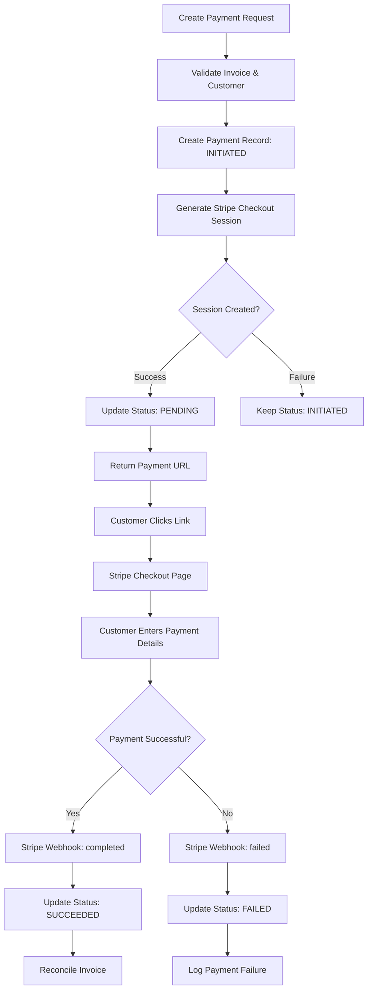

## Overview

Payment links in Flexprice provide a secure, hosted checkout experience powered by Stripe. Customers click a payment URL and are redirected to Stripe's secure checkout page to complete their payment.

### Key Features

- **Secure Checkout**: Hosted by Stripe with PCI compliance
- **Multiple Payment Methods**: Cards, bank transfers, digital wallets
- **Mobile Optimized**: Responsive checkout experience
- **Real-time Updates**: Webhook-driven status updates
- **Invoice Integration**: Automatic invoice reconciliation

## Payment Link Lifecycle



## Payment Status Flow

### Status Transitions

```
INITIATED → PENDING → SUCCEEDED
    ↓           ↓          ↓
  FAILED     FAILED    REFUNDED
```

### Status Definitions

| Status | Description | Triggers |
|--------|-------------|----------|
| `INITIATED` | Payment record created, Stripe session not yet created | Initial payment creation |
| `PENDING` | Stripe checkout session created successfully | Successful Stripe API call |
| `PROCESSING` | Payment is being processed | Temporary status during updates |
| `SUCCEEDED` | Payment completed successfully | Stripe webhook: `checkout.session.completed` |
| `FAILED` | Payment attempt failed | Stripe webhooks: `checkout.session.expired`, `payment_intent.payment_failed` |
| `REFUNDED` | Payment was refunded | Manual refund processing |

## Creating Payment Links

### Prerequisites

1. **Stripe Connection**: Active Stripe connection configured
2. **Customer Sync**: Customer must have Stripe customer ID
3. **Invoice Status**: Invoice must be finalized and unpaid
4. **Valid Amount**: Payment amount must match invoice outstanding

### API Request

**Endpoint:** `POST /api/v1/payments`

**Headers:**
```http
Content-Type: application/json
Authorization: Bearer your_api_key
X-Environment-ID: your_environment_id
```

**Request Body:**
```json
{
    "amount": 10,
    "currency": "usd",
    "destination_id": "inv_01K34HYZN03V6X8Q6V3T8X6G4F",
    "destination_type": "INVOICE",
    "payment_method_type": "PAYMENT_LINK",
    "process_payment": true,
    "payment_gateway": "stripe",
    "connection_id": "conn_01K2ETXVRS2ZWWJ5PB3PQ4Y9KY",
    "connection_name": "Stripe",
    "success_url": "https://admin-dev.flexprice.io/customer-management/invoices/inv_01K34HYZN03V6X8Q6V3T8X6G4F?page=1",
    "cancel_url": "https://admin-dev.flexprice.io/customer-management/invoices/inv_01K34HYZN03V6X8Q6V3T8X6G4F?page=1"
}
```

### Response

```json
{
  "id": "pay_1234567890abcdef",
  "payment_status": "pending",
  "payment_url": "https://checkout.stripe.com/c/pay/cs_test_...",
  "amount": "150.00",
  "currency": "usd",
  "gateway_tracking_id": "cs_test_1234567890abcdef",
  "created_at": "2024-01-20T10:30:00Z",
  "metadata": {
    "stripe_session_id": "cs_test_1234567890abcdef"
  }
}
```

## Payment Link Configuration

### Required Fields

| Field | Type | Required | Description |
|-------|------|----------|-------------|
| `destination_type` | string | ✅ | Must be `"invoice"` |
| `destination_id` | string | ✅ | Valid invoice ID |
| `payment_method_type` | string | ✅ | Must be `"payment_link"` |
| `payment_gateway` | string | ✅ | Must be `"stripe"` |
| `amount` | string | ✅ | Payment amount (must match invoice) |
| `currency` | string | ✅ | Valid currency code |
| `process_payment` | boolean | ✅ | Set to `true` to create Stripe session |


## Stripe Checkout Configuration

### Default Checkout Settings

When creating payment links, Flexprice automatically configures Stripe Checkout with:

- **Payment Methods**: Cards, bank transfers, digital wallets
- **Currency**: Matches the payment currency
- **Amount**: Exact payment amount
- **Customer**: Pre-filled with customer data
- **Invoice Details**: Line items from the invoice


## Webhook Processing

### Payment Completion Webhook

When a payment is completed, Stripe sends a `checkout.session.completed` webhook:

```json
{
  "id": "evt_1234567890abcdef",
  "type": "checkout.session.completed",
  "data": {
    "object": {
      "id": "cs_test_1234567890abcdef",
      "payment_status": "paid",
      "amount_total": 15000,
      "currency": "usd",
      "customer": "cus_stripe123abc",
      "metadata": {
        "flexprice_payment_id": "pay_1234567890abcdef"
      }
    }
  }
}
```

### Webhook Processing Flow

1. **Receive Webhook**: Flexprice receives the webhook from Stripe
2. **Verify Signature**: Validate webhook signature for security
3. **Find Payment**: Locate payment record using session ID
4. **Update Status**: Change payment status to `SUCCEEDED`
5. **Reconcile Invoice**: Update invoice payment status and amounts
6. **Trigger Events**: Send payment completion events

## Error Handling

### Common Payment Errors

| Error | Cause | Resolution |
|-------|-------|------------|
| "Customer not found in Stripe" | Customer not synced | Sync customer to Stripe first |
| "Invalid invoice amount" | Amount mismatch | Ensure amount matches invoice |
| "Invoice already paid" | Invoice status issue | Check invoice payment status |
| "Stripe session creation failed" | API error | Check Stripe connection |

### Payment Failure Handling

When payments fail:

1. **Webhook Received**: Stripe sends failure webhook
2. **Status Updated**: Payment status changed to `FAILED`
3. **Error Logged**: Failure reason recorded
4. **Customer Notified**: Optional failure notification
5. **Retry Available**: Customer can create new payment link

## Testing Payment Links

### Test Environment Setup

1. **Use Test Keys**: Configure Stripe test mode
2. **Test Cards**: Use Stripe's test card numbers
3. **Test Webhooks**: Use ngrok for local webhook testing

### Test Card Numbers

| Card Number | Description |
|-------------|-------------|
| `4242424242424242` | Successful payment |
| `4000000000000002` | Card declined |
| `4000000000009995` | Insufficient funds |
| `4000000000009987` | Expired card |

### Testing Flow

1. **Create Test Payment**: Use test invoice and customer
2. **Generate Payment Link**: Create payment with test data
3. **Complete Payment**: Use test card in Stripe checkout
4. **Verify Webhook**: Check webhook processing
5. **Confirm Status**: Verify payment and invoice updates

## Security Considerations

### Payment Link Security

- **HTTPS Required**: All payment links use HTTPS
- **Session Expiry**: Links expire after 24 hours
- **One-time Use**: Each link can only be used once
- **Signature Verification**: All webhooks verified

### Data Protection

- **PCI Compliance**: Stripe handles sensitive payment data
- **No Card Storage**: Card details never stored in Flexprice
- **Encrypted Storage**: All payment data encrypted at rest
- **Access Controls**: Role-based access to payment data


### Webhook Endpoints

- `POST /api/v1/webhooks/stripe/{tenant_id}/{environment_id}` - Stripe webhook handler

For complete API documentation, see the [API Reference](/api-reference).
