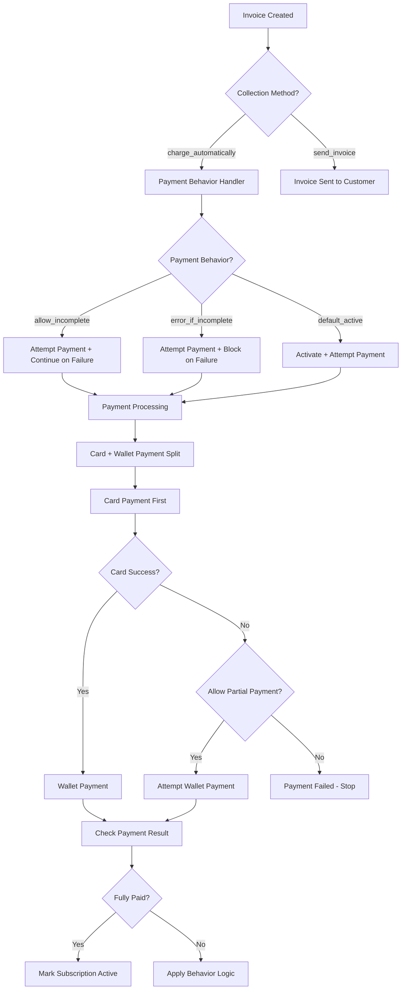
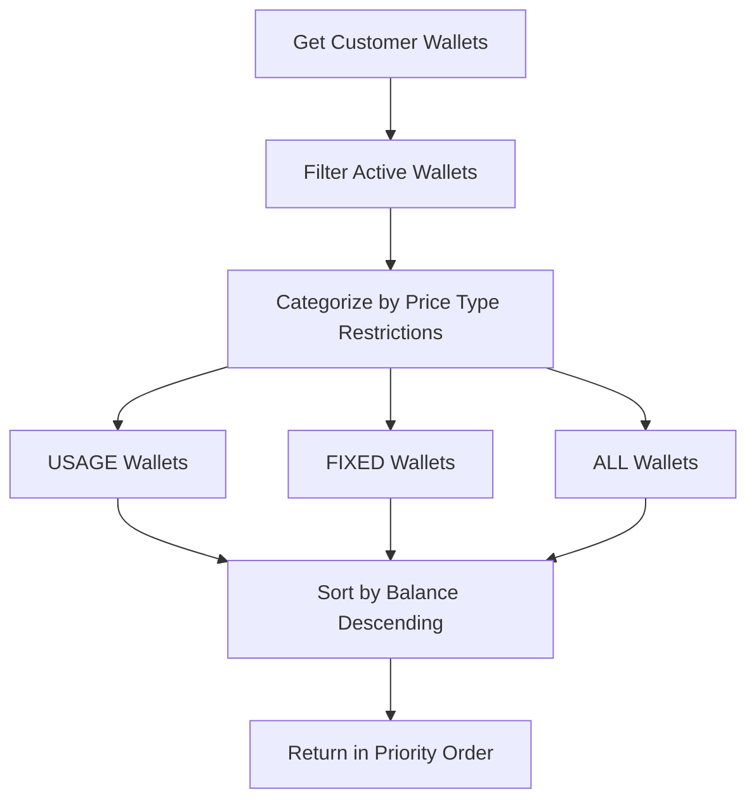

## Overview

Flexprice's payment system is designed to handle multiple payment methods and behaviors while providing flexible payment collection strategies. The system supports both automatic and manual payment collection with advanced wallet-based payment processing and intelligent partial payment handling.

### Key Features

- **Multiple Payment Methods**: Card, Credits, Offline, and Payment Link
- **Flexible Collection Methods**: Automatic charging and manual invoice sending
- **Smart Payment Behaviors**: Configurable handling of payment failures with partial payment support
- **Multi-Wallet Support**: Intelligent payment splitting between cards and wallets
- **Price Type Restrictions**: Wallet payments respect usage and fixed price type limitations
- **Flow-Based Logic**: Different payment behaviors based on invoice flow types
- **Gateway Integration**: Support for custom payment method IDs during subscription creation
- **Partial Payment Intelligence**: Context-aware partial payment allowance based on behavior and flow type

## Payment Methods

### 1. Card Payments (`CARD`)

**Use Case**: Primary payment method for automatic billing and manual payments

**Characteristics**:
- Requires saved payment method in Stripe
- Processed immediately when payment is attempted
- Supports off-session payments for subscriptions
- Full payment attempt tracking and error handling

**Requirements**:
- Customer must exist in both Flexprice and Stripe
- Default payment method must be set in Stripe OR gateway_payment_method_id provided
- Payment method created via payment link with `save_card_and_make_default: true`

**Gateway Payment Method ID Support**:
- Subscriptions can specify a custom `gateway_payment_method_id` during creation
- This overrides the customer's default payment method for that specific subscription
- Useful for subscription-specific payment methods or enterprise billing arrangements

### 2. Credits/Wallet Payments (`CREDITS`)

**Use Case**: Prepaid wallet balance payments

**Characteristics**:
- Instant processing with no external dependencies
- Respects wallet price type restrictions
- Supports multiple wallets per customer
- Automatic reconciliation with invoices

**Requirements**:
- Active wallet with positive balance
- Wallet must allow payment for invoice price types
- Customer must have sufficient wallet balance

### 3. Offline Payments (`OFFLINE`)

**Use Case**: Manually recorded payments (cash, check, wire transfer)

**Characteristics**:
- No automatic processing
- Manual reconciliation required
- Immediate success status
- Used for enterprise or custom payment arrangements

**Requirements**:
- Manual verification of payment receipt
- Admin or customer service intervention
- Payment amount must match invoice

### 4. Payment Link (`PAYMENT_LINK`)

**Use Case**: Customer-initiated payments through external checkout

**Characteristics**:
- Redirects customer to external payment page
- Supports card and ACH payments
- Handles 3D Secure authentication
- Webhook-based status updates

**Requirements**:
- Valid payment link configuration
- Customer interaction required
- Webhook endpoint configured

## Collection Methods

### 1. Charge Automatically (`charge_automatically`)

**Use Case**: Automatic subscription billing and immediate payment collection

**Behavior**:
- Attempts payment immediately when invoice is created
- Uses customer's default payment method and gateway_payment_method_id
- Applies payment behavior logic on failure
- Updates subscription status based on payment result

**Supported Payment Behaviors**:
- `allow_incomplete`: Activates subscription even if payment fails and marks the subscription as incomplete
- `error_if_incomplete`: Blocks subscription activation if payment fails 
- `default_active`: Activates subscription regardless of payment result and marks the subscription as active

### 2. Send Invoice (`send_invoice`)

**Use Case**: Manual payment collection with customer notification

**Behavior**:
- Creates invoice without immediate payment attempt
- Sends invoice to customer for manual payment
- Customer pays through payment link or other methods
- Subscription status depends on payment behavior

**Supported Payment Behaviors**:
- `default_active`: Activates subscription immediately without payment and marks the subscription as active
- `default_incomplete`: Sets subscription to incomplete status 

## Payment Behaviors

### 1. Allow Incomplete (`allow_incomplete`)

**Use Case**: Graceful handling of payment failures

**Behavior**:
- Attempts payment but allows subscription to continue if it fails
- Subscription remains active even with failed payments
- Useful for non-critical services or trial periods
- Customer can retry payment later

**Collection Method Compatibility**:
- ✅ `charge_automatically`: Attempts payment, continues on failure
- ❌ `send_invoice`: Not applicable (no automatic payment attempt)

### 2. Error If Incomplete (`error_if_incomplete`)

**Use Case**: Strict payment requirements

**Behavior**:
- Payment failure blocks subscription activation
- Subscription remains in incomplete status until payment succeeds
- Prevents service access without successful payment
- Used for critical services requiring guaranteed payment

**Collection Method Compatibility**:
- ✅ `charge_automatically`: Blocks activation on payment failure
- ❌ `send_invoice`: Not applicable (no automatic payment attempt)

### 3. Default Active (`default_active`)

**Use Case**: Service-first approach with payment collection

**Behavior**:
- Activates subscription immediately regardless of payment result
- Attempts payment in background
- Customer gets service access even if payment fails
- Used for freemium or trial models

**Collection Method Compatibility**:
- ✅ `charge_automatically`: Activates immediately, attempts payment
- ✅ `send_invoice`: Activates immediately, sends invoice

**Partial Payment Behavior**:
- **Subscription Creation + Default Active**: Allows partial wallet payment if card fails
- **Other Behaviors**: No partial payment allowed if card fails

### 4. Default Incomplete (`default_incomplete`)

**Use Case**: Payment-first approach

**Behavior**:
- Sets subscription to incomplete status
- Requires successful payment to activate
- Customer cannot access service until payment succeeds
- Used for paid services requiring upfront payment

**Collection Method Compatibility**:
- ❌ `charge_automatically`: Not supported (conflicts with automatic charging)
- ✅ `send_invoice`: Sets incomplete, sends invoice for payment

## Partial Payment Logic

### Overview

The system implements intelligent partial payment logic that determines when wallet payments should be attempted even if card payments fail. This behavior is context-aware and depends on the payment behavior and invoice flow type.

### Partial Payment Decision Matrix

| Flow Type | Payment Behavior | Card Fails | Wallet Attempted | Subscription Status |
|-----------|------------------|------------|------------------|-------------------|
| `subscription_creation` | `default_active` | ❌ | ✅ **Yes** | ✅ Active (regardless) |
| `subscription_creation` | `allow_incomplete` | ❌ | ❌ **No** | ❌ Incomplete |
| `subscription_creation` | `error_if_incomplete` | ❌ | ❌ **No** | ❌ Error returned |
| `renewal` | **Any** | ❌ | ✅ **Yes** | ⚠️ Based on behavior |
| `manual` | **Any** | ❌ | ✅ **Yes** | ⚠️ Active if fully paid |
| `cancel` | **Any** | ❌ | ✅ **Yes** | ⚠️ Based on behavior |

### Partial Payment Rules

#### 1. Subscription Creation Flow
- **`default_active` behavior**: Always allows partial wallet payment
  - Rationale: Subscription activates regardless, so partial payment is acceptable
  - Customer gets service access even with partial payment
  
- **Other behaviors**: No partial wallet payment allowed
  - Rationale: Payment success affects subscription status, partial payment could cause inconsistency

#### 2. Renewal/Manual/Cancel Flows
- **All behaviors**: Always allow partial wallet payment
  - Rationale: These flows are less critical for subscription activation
  - Partial payment is better than no payment for existing subscriptions

## Payment Method and Behavior Combinations

### Charge Automatically + Payment Behaviors

| Payment Behavior | Card Available | Card Declined | Result |
|------------------|----------------|---------------|---------|
| `allow_incomplete` | ✅ Payment succeeds | ✅ Subscription active (status - incomplete) | ✅ Subscription active |
| `error_if_incomplete` | ✅ Payment succeeds | ❌ Subscription incomplete | ❌ Subscription incomplete |
| `default_active` | ✅ Payment succeeds | ✅ Subscription active (status - active) | ✅ Subscription active |

### Send Invoice + Payment Behaviors

| Payment Behavior | Invoice Sent | Customer Pays | Result |
|------------------|--------------|---------------|---------|
| `default_active` | ✅ Invoice sent | ✅ Payment succeeds | ✅ Subscription active (status - active) |
| `default_incomplete` | ✅ Invoice sent | ✅ Payment succeeds | ✅ Subscription active  (status - incomplete)|

## Payment System Design

### Payment Flow Architecture



### Payment Splitting Logic

The system uses a **card-first payment strategy** with intelligent wallet fallback:

#### Card-First Strategy
1. **Primary Payment**: Card attempts to pay the full amount first
2. **Wallet Fallback**: If card fails, wallets attempt to pay available amount
3. **Partial Payment Logic**: Context-aware decision on whether to allow partial wallet payment

#### Payment Split Calculation

The system intelligently splits payments between card and wallet based on:

1. **Price Type Analysis**: Categorizes invoice charges as USAGE or FIXED
2. **Wallet Restrictions**: Determines which wallets can pay which price types
3. **Available Balance**: Calculates total wallet capacity
4. **Payment Priority**: Card pays what wallets cannot cover

#### Payment Processing Order
1. **Calculate Split**: Determine card vs wallet amounts based on wallet restrictions
2. **Card Payment First**: Attempt full card payment for card-eligible amount
3. **Evaluate Card Result**: Check if card payment succeeded or failed
4. **Partial Payment Decision**: Use behavior + flow type to decide on wallet fallback
5. **Wallet Payment**: Process wallet payment if allowed
6. **Final Assessment**: Determine overall payment success

### Wallet Payment Logic

#### Wallet Categorization

Wallets are categorized based on their `allowed_price_types` configuration:

1. **ALL Wallets**: Can pay any price type (USAGE + FIXED)
2. **USAGE Wallets**: Can only pay usage-based charges
3. **FIXED Wallets**: Can only pay fixed charges
4. **USAGE+FIXED Wallets**: Treated as ALL wallets

#### Wallet Selection Algorithm



#### Payment Processing Order

1. **USAGE Wallets First**: Pay usage-based charges
2. **FIXED Wallets Second**: Pay fixed charges
3. **ALL Wallets Last**: Pay remaining amounts
4. **Balance Sorting**: Highest balance wallets used first

#### Price Type Deduction Logic

When a wallet makes a payment, the system deducts from price types based on wallet restrictions:

### Payment Flow Types

#### 1. Manual Payment Flow (`InvoiceFlowManual`)

**Use Case**: Customer-initiated payment attempts

**Behavior**:
- Attempts payment using card-first logic with wallet fallback
- **Updates subscription status based on payment result**:
  - **Full payment success** → Mark subscription as active
  - **Partial or failed payment** → Keep subscription status unchanged
- Used for manual payment retry scenarios and one-off invoice payments

**Flow**:
```text
Manual Payment Request → Process Payment → Check Result → Update Subscription Status
```

**Key Changes**:
- Now supports subscription activation on successful payment
- Maintains status quo for failed/partial payments
- Consistent with other payment flows

#### 2. Subscription Creation Flow (`InvoiceFlowSubscriptionCreation`)

**Use Case**: New subscription activation

**Behavior**:
- Applies full payment behavior logic
- Updates subscription status based on payment result
- Blocks activation if `error_if_incomplete` behavior fails

**Flow**:
```text
Invoice Created → Payment Behavior Handler → Payment Processing → Status Update
```

#### 3. Renewal Flow (`InvoiceFlowRenewal`)

**Use Case**: Periodic subscription billing

**Behavior**:
- Always creates invoices regardless of payment result
- Marks invoices as pending on payment failure
- Non-blocking payment processing

**Flow**:
```text
Renewal Triggered → Create Invoice → Attempt Payment → Update Status
```

#### 4. Cancel Flow (`InvoiceFlowCancel`)

**Use Case**: Subscription cancellation with proration

**Behavior**:
- Uses subscription's payment method and behavior
- No subscription status changes
- Handles proration credits and charges

**Flow**:
```text
Cancellation Request → Create Proration Invoice → Process Payment → Complete Cancellation
```

## Error Handling

### Payment Failure Scenarios

| Scenario | Card Payment | Wallet Payment | Result |
|----------|--------------|----------------|---------|
| No Payment Method | ❌ Failed | ✅ Attempted | Partial payment |
| Insufficient Funds | ❌ Failed | ✅ Attempted | Partial payment |
| Card Declined | ❌ Failed | ✅ Attempted | Partial payment |
| Wallet Restrictions | ✅ Attempted | ❌ Skipped | Card-only payment |
| No Wallets Available | ✅ Attempted | ❌ Skipped | Card-only payment |

### Error Recovery

1. **Alternative Methods**: System attempts wallet payment if card fails
2. **Manual Intervention**: Admin can process offline payments
3. **Customer Notification**: Failed payments trigger customer notifications


## Payment Validation

#### Stripe Connection Validation
- **Connection Status**: Only published Stripe connections are used
- **Entity Mapping**: Customer must have valid Stripe entity mapping
- **Payment Method**: Valid payment method must be available

#### Entity Mapping Requirements
Before processing card payments, the system validates:
1. **Stripe Connection**: Tenant has active Stripe connection
2. **Customer Mapping**: Customer exists in Stripe with valid entity mapping
3. **Payment Method**: Either default payment method or gateway_payment_method_id available

### Wallet Security

- **Balance Validation**: Real-time balance checks prevent overpayment
- **Transaction Atomicity**: Wallet transactions are atomic and consistent
- **Price Type Enforcement**: Strict enforcement of wallet restrictions

## Testing Scenarios

### Payment Method Testing

| Test Case | Payment Method | Expected Result |
|-----------|----------------|-----------------|
| Valid Card | `CARD` | Payment succeeds |
| Declined Card | `CARD` | Payment fails with decline error |
| Insufficient Funds | `CARD` | Payment fails with insufficient funds |
| Valid Wallet | `CREDITS` | Payment succeeds |
| Insufficient Wallet | `CREDITS` | Partial payment or failure |
| No Payment Method | `CARD` | Payment fails with no method error |

### Behavior Testing

| Test Case | Behavior | Collection Method | Expected Result |
|-----------|----------|-------------------|-----------------|
| Payment Success | `allow_incomplete` | `charge_automatically` | Subscription active |
| Payment Failure | `allow_incomplete` | `charge_automatically` | Subscription active (status - incomplete) |
| Payment Success | `error_if_incomplete` | `charge_automatically` | Subscription active |
| Payment Failure | `error_if_incomplete` | `charge_automatically` | Subscription failed |
| Payment Success | `default_active` | `charge_automatically` | Subscription active |
| Payment Failure | `default_active` | `charge_automatically` | Subscription active |

## API Reference

### Payment Attempt Endpoint

**Endpoint**: `POST /v1/invoices/{invoice_id}/payment/attempt`

**Description**: Attempts to process payment for an invoice using available payment methods

**Response**:
```json
{
    "message": "payment processed successfully"
}
```

### Subscription Payment Parameters

**Endpoint**: `POST /v1/subscriptions`

**Description**: Creates subscription with payment behavior configuration

**Request**:
```json
{
  "customer_id": "cust_123",
  "plan_id": "plan_123",
  "collection_method": "charge_automatically",
  "payment_behavior": "default_active",
  "gateway_payment_method_id": "pm_123"
}
```

**Parameters**:
- `collection_method`: `"charge_automatically"` | `"send_invoice"`
- `payment_behavior`: `"allow_incomplete"` | `"error_if_incomplete"` | `"default_active"` | `"default_incomplete"`
- `gateway_payment_method_id` (optional): Stripe payment method ID to use for this subscription
  - Overrides customer's default payment method
  - Must be a valid payment method attached to the customer
  - Used for subscription-specific payment arrangements

## Troubleshooting

### Common Issues

1. **Payment Declined**: Check customer's payment method and billing address
2. **Wallet Restrictions**: Verify wallet configuration allows invoice price types
3. **Insufficient Balance**: Check wallet balances and top-up requirements
4. **Subscription Status**: Verify payment behavior configuration matches requirements

### Debug Information

The system provides detailed logging for payment processing:

- Payment attempt details
- Wallet selection and restrictions
- Price type breakdown
- Payment method usage
- Error conditions and recovery

For complete API documentation, see the [API Reference - Subscription ](/api-reference/subscriptions/create-subscription). , [API Reference - Attempt Payment ](/api-reference/invoices/attempt-payment-for-an-invoice)


