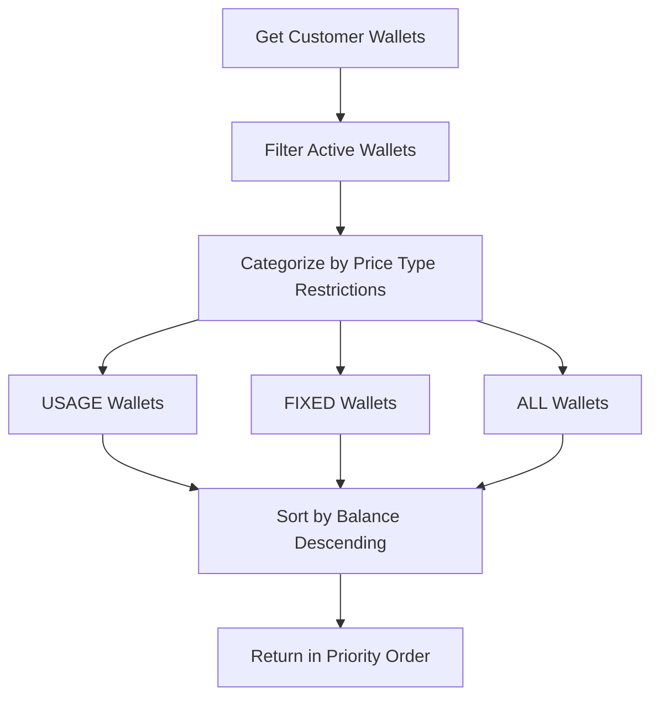
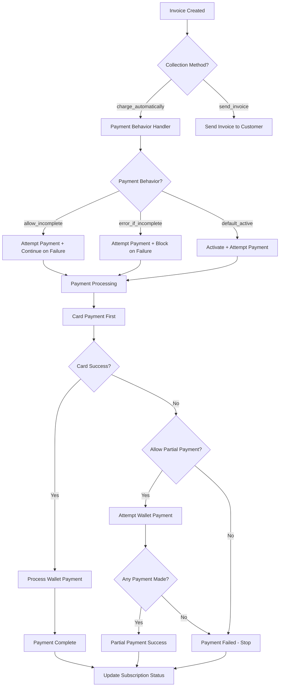

## Overview

Flexprice's payment system provides flexible subscription billing with intelligent payment processing. The system combines **payment behaviors** (how to handle payment failures) with **collection methods** (when to charge customers) to create a robust billing experience.

### Key Concepts

- **Collection Method**: Determines when payments are collected (`charge_automatically` or `send_invoice`)
- **Payment Behavior**: Defines how the system responds to payment failures
- **Payment Methods**: Card payments and wallet/credits with intelligent splitting
- **Flow Types**: Different contexts like subscription creation, renewals, manual payments
- **Partial Payments**: Smart fallback to wallet payments when card payments fail

## Why Payment Behaviors and Collection Methods Matter

Flexprice separates **when** to collect payment from **how** to handle failures. This design provides flexibility for different business models:

### Business Model Alignment
- **SaaS Products**: Use `charge_automatically` + `allow_incomplete` for graceful failure handling
- **Enterprise**: Use `send_invoice` + `default_active` for manual billing cycles  
- **Freemium**: Use `charge_automatically` + `default_active` for service-first approach
- **Premium Services**: Use `charge_automatically` + `error_if_incomplete` for strict payment requirements

## Valid Payment Configurations

The following table shows all valid combinations of collection methods, payment behaviors, and their outcomes:

| Collection Method | Payment Behavior | Card Payment | Wallet Payment | Payment Success | Payment Failure |
|-------------------|------------------|--------------|----------------|-----------------|-----------------|
| `charge_automatically` | `allow_incomplete` | ✅ Attempted | ✅ Fallback | ✅ Active | ⚠️ Incomplete |
| `charge_automatically` | `error_if_incomplete` | ✅ Attempted | ❌ No fallback* | ✅ Active | ❌ Failed/Incomplete |
| `charge_automatically` | `default_active` | ✅ Attempted | ✅ Fallback | ✅ Active | ✅ Active |
| `send_invoice` | `default_active` | ❌ Not attempted | ❌ Not attempted | ✅ Active | ✅ Active |
| `send_invoice` | `default_incomplete` | ❌ Not attempted | ❌ Not attempted | ✅ Active | ⚠️ Incomplete |

**Note**: *Wallet fallback depends on flow type - see Partial Payment Logic section below.

### Invalid Combinations

❌ `charge_automatically` + `default_incomplete` - Conflicts with automatic charging  
❌ `send_invoice` + `allow_incomplete` - No automatic payment to fail  
❌ `send_invoice` + `error_if_incomplete` - No automatic payment to fail  

- When no collection method is provided, the default is `charge_automatically`.
- When no payment behavior is provided, the default is `default_active`.

## Partial Payment Logic

### Overview

When card payments fail, the system can attempt wallet payments as a fallback. This behavior depends on the **payment behavior** and **flow type** combination.

### Decision Matrix

| Flow Type | Payment Behavior | Card Fails | Wallet Attempted | Rationale |
|-----------|------------------|------------|------------------|-----------|
| `subscription_creation` | `default_active` | ❌ | ✅ **Yes** | Subscription activates anyway |
| `subscription_creation` | `allow_incomplete` | ❌ | ❌ **No** | Payment affects subscription status |
| `subscription_creation` | `error_if_incomplete` | ❌ | ❌ **No** | Payment required for activation |
| `renewal` | **Any** | ❌ | ✅ **Yes** | Partial payment better than none |
| `manual` | **Any** | ❌ | ✅ **Yes** | Customer-initiated, allow partial |
| `cancel` | **Any** | ❌ | ✅ **Yes** | Proration handling |

### Rules Summary

- **Subscription Creation + Default Active**: Always allow partial wallet payment
- **Other Subscription Creation**: No partial payment (affects activation)  
- **All Other Flows**: Always allow partial payment (better than failure)

#### Wallet Categorization

Wallets are categorized based on their `allowed_price_types` configuration:

1. **ALL Wallets**: Can pay any price type (USAGE + FIXED)
2. **USAGE Wallets**: Can only pay usage-based charges
3. **FIXED Wallets**: Can only pay fixed charges
4. **USAGE+FIXED Wallets**: Treated as ALL wallets

#### Wallet Selection Algorithm



#### Payment Processing Order

1. **USAGE Wallets First**: Pay usage-based charges
2. **FIXED Wallets Second**: Pay fixed charges
3. **ALL Wallets Last**: Pay remaining amounts
4. **Balance Sorting**: Highest balance wallets used first

### **Endpoint**: `POST /v1/subscriptions`

**Request**:
```json
{
  "customer_id": "cust_123",
  "plan_id": "plan_456",
  "collection_method": "charge_automatically",
  "payment_behavior": "allow_incomplete",
  "gateway_payment_method_id": "pm_789"
}
```

**Parameters**:
- `collection_method`: `"charge_automatically"` | `"send_invoice" ` (default: `"charge_automatically"`)
- `payment_behavior`: `"allow_incomplete"` | `"error_if_incomplete"` | `"default_active"` | `"default_incomplete"` (default: `"default_active"`)
- `gateway_payment_method_id` (optional): Override default payment method

## Payment Flow Architecture



### Card-First Strategy

The system prioritizes card payments with intelligent wallet fallback:

1. **Calculate Split**: Determine what wallets can pay based on price type restrictions
2. **Card First**: Attempt card payment for the full eligible amount
3. **Evaluate Result**: Check if card payment succeeded or failed  
4. **Partial Decision**: Use behavior + flow type to decide on wallet fallback
5. **Wallet Payment**: Process available wallet payments if allowed
6. **Final Status**: Determine overall payment success and subscription status

## Payment Flow Types

### 1. Subscription Creation (`InvoiceFlowSubscriptionCreation`)

**New subscription activation with payment collection**

- **Behavior**: Applies full payment behavior logic
- **Status Updates**: Subscription status depends on payment result and behavior
- **Partial Payments**: Only allowed for `default_active` behavior

### 2. Renewal (`InvoiceFlowRenewal`)

**Periodic billing for existing subscriptions**

- **Behavior**: Non-blocking payment processing
- **Status Updates**: Subscription continues regardless of payment result
- **Partial Payments**: Always allowed (partial payment better than none)

### 3. Manual Payment (`InvoiceFlowManual`)

**Customer-initiated payment attempts**

- **Behavior**: Uses card-first logic with wallet fallback
- **Status Updates**: Activates subscription only on full payment success
- **Partial Payments**: Always allowed

### 4. Cancellation (`InvoiceFlowCancel`)

**Proration handling during subscription cancellation**

- **Behavior**: Processes final charges/credits
- **Status Updates**: No subscription status changes
- **Partial Payments**: Always allowed

## Payment Methods

### 1. Card Payments (`CARD`)

**Primary payment method for automatic billing**

- **Processing**: Immediate via Stripe integration
- **Requirements**: Customer must exist in Stripe with valid payment method
- **Gateway Support**: Can specify `gateway_payment_method_id` for subscription-specific cards
- **Fallback**: Wallet payment attempted if card fails (based on partial payment rules)


### 2. Credits/Wallet Payments (`CREDITS`)

**Prepaid balance payments with price type restrictions**

- **Processing**: Instant, no external dependencies
- **Restrictions**: Wallets can be limited to USAGE, FIXED, or ALL price types
- **Multi-Wallet**: Supports multiple wallets per customer with intelligent selection
- **Priority**: Promotional wallets used before paid wallets


### 3. Offline Payments (`OFFLINE`)

**Manually recorded payments for enterprise customers**

- **Processing**: Manual reconciliation required
- **Use Cases**: Wire transfers, checks, cash payments
- **Status**: Immediate success upon manual confirmation

### 4. Payment Link (`PAYMENT_LINK`)

**Customer-initiated payments through hosted checkout**

- **Processing**: Redirects to external payment page
- **Features**: Supports 3D Secure, multiple payment methods
- **Integration**: Webhook-based status updates


## API Reference

### Create Subscription with Payment Configuration

**Endpoint**: `POST /v1/subscriptions`

**Request**:
```json
{
  "customer_id": "cust_123",
  "plan_id": "plan_456",
  "collection_method": "send_invoice",
  "payment_behavior": "default_active",
  "gateway_payment_method_id": "pm_789"
}
```

**Parameters**:
- `collection_method`: `"charge_automatically"` | `"send_invoice"`
- `payment_behavior`: `"allow_incomplete"` | `"error_if_incomplete"` | `"default_active"` | `"default_incomplete"`
- `gateway_payment_method_id` (optional): Override default payment method


## Payment Method Strategy

- **Primary**: Configure card payments for automatic billing
- **Fallback**: Set up wallet payments for partial payment scenarios
- **Enterprise**: Enable offline payments for wire transfers
- **Customer Choice**: Offer payment links for flexible payment options


## Troubleshooting

### Common Issues

1. **Payment Declined**: Verify customer's payment method and billing details
2. **Wallet Restrictions**: Check wallet `allowed_price_types` match invoice charges  
3. **Subscription Not Activating**: Verify payment behavior allows activation on failure
4. **Partial Payments**: Check flow type and behavior combination in decision matrix


For complete API documentation, see:
- [Create Subscription API](/api-reference/subscriptions/create-subscription)
- [Attempt Payment API](/api-reference/invoices/attempt-payment-for-an-invoice)
