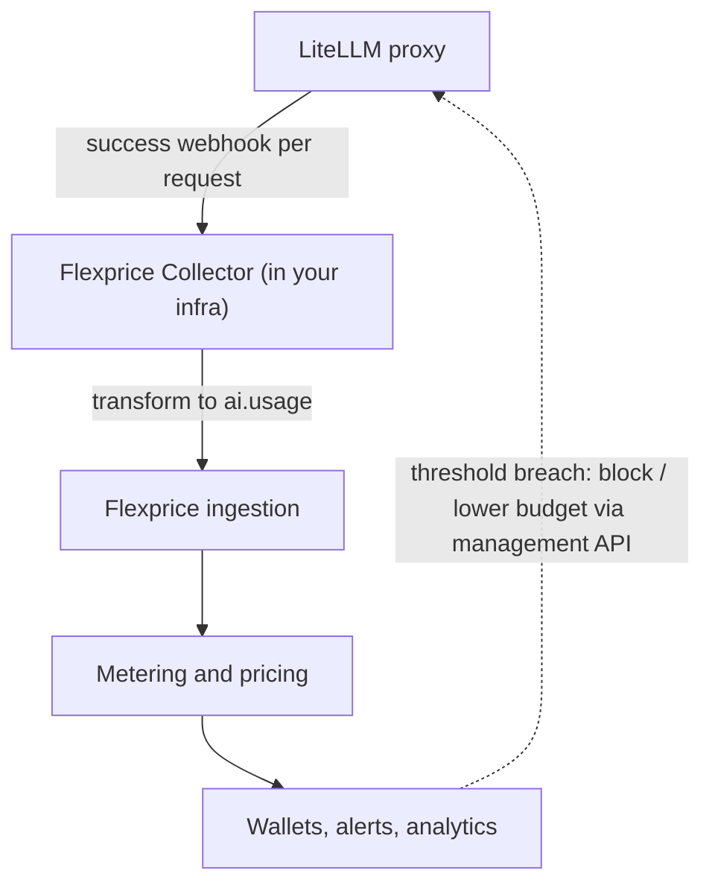
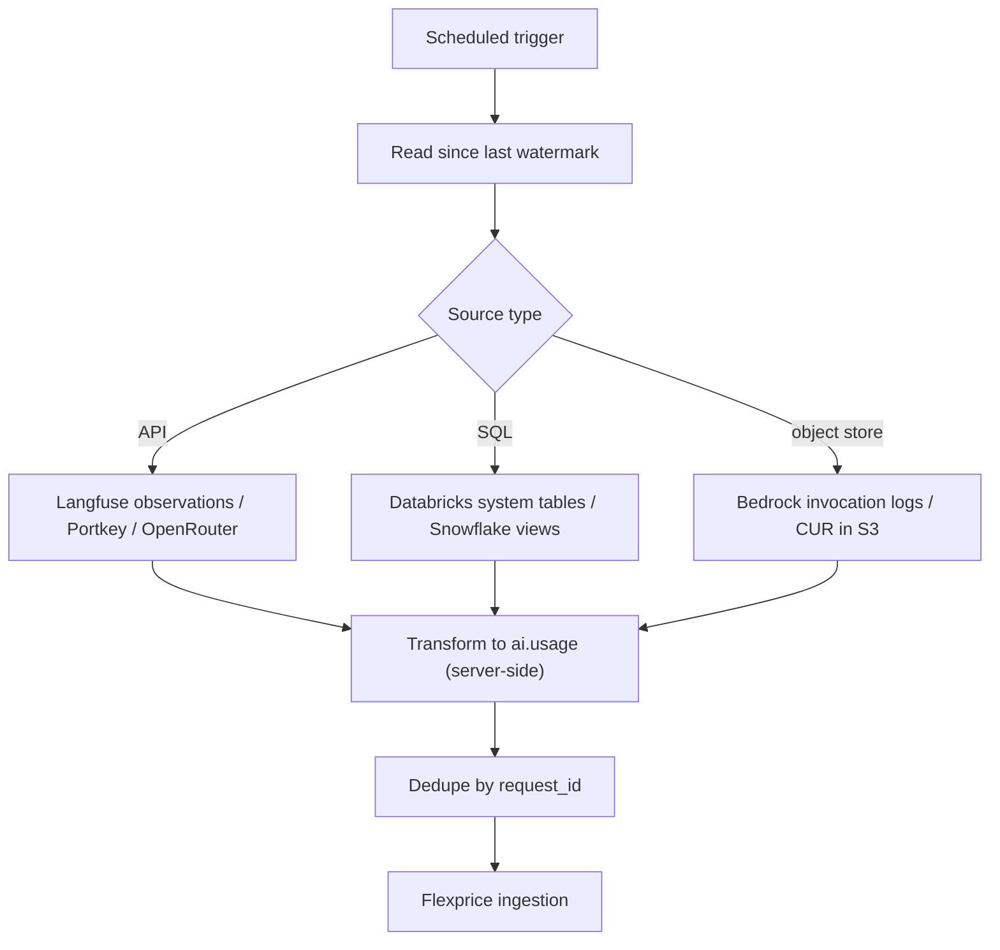
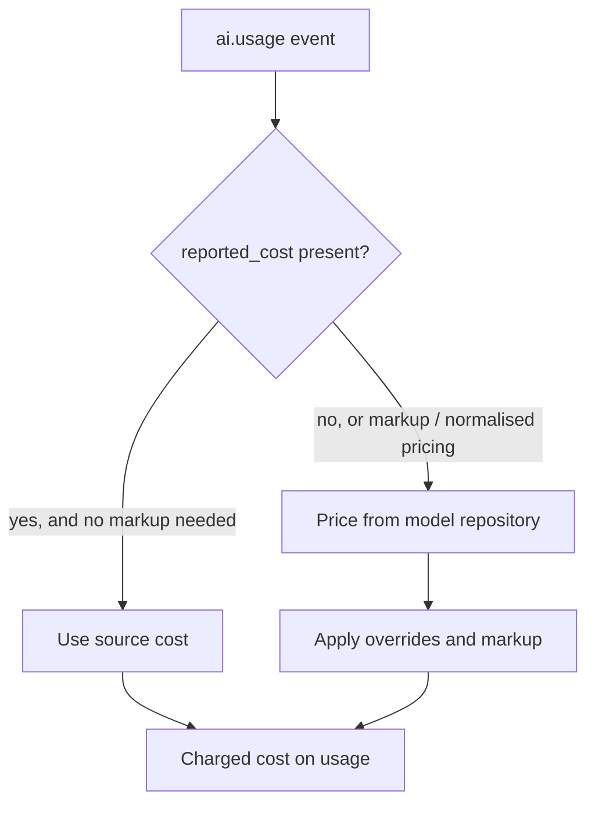

This page extends the [architecture overview](/docs/ai-cost-tracking/overview#architecture) with the mechanics of ingestion: the standardised event every source maps to, the connector types, how cost is attached, and how metering is provisioned for you.

The design goal is **zero manual setup**. You connect a source; Flexprice handles normalisation, pricing, and the creation of meters and features — you do not hand-write transforms, build a model price list, or define meters per model.

## The standardised AI usage event

Every source — a LiteLLM webhook, a Langfuse trace, a Bedrock log, a Databricks usage row — is normalised to one canonical shape before anything else happens. It rides on Flexprice's standard [event](/docs/event-ingestion/overview) (`event_name`, `external_customer_id`, `properties`, `timestamp`, `source`), with a fixed convention for AI properties.

```json
{
  "event_name": "ai.usage",
  "external_customer_id": "team_platform",
  "timestamp": "2026-06-14T10:30:00Z",
  "source": "litellm",
  "properties": {
    "provider": "anthropic",
    "model": "claude-opus-4-8",
    "operation": "chat",
    "input_tokens": "1840",
    "output_tokens": "320",
    "cached_tokens": "1024",
    "reasoning_tokens": "0",
    "reported_cost": "0.041",
    "request_id": "req_abc123",
    "raw_user": "u_91",
    "raw_team": "team_platform",
    "agent_id": "agent_support_bot",
    "fidelity": "per_request"
  }
}
```

Key fields:

| Field | Purpose |
|---|---|
| `provider`, `model`, `operation` | Drive model pricing and let analytics break down by provider/model/token type. |
| `input_tokens`, `output_tokens`, `cached_tokens`, `reasoning_tokens` | Token-level usage; `unit`/`quantity` are used for non-token sources (characters, seconds, requests, credits). |
| `reported_cost` | The source's own computed cost in USD, when it provides one (most gateways do). |
| `raw_user`, `raw_team`, `agent_id`, `tags` | Source identifiers used to resolve the billing entity and hierarchy. |
| `fidelity` | `per_request` or `aggregate` — records the granularity a source can offer, so analytics stays honest. |

<Note>
Following Flexprice's [event format](/docs/collectors/how-it-works#data-transformation), all `properties` values are sent as strings; Flexprice interprets numeric fields during aggregation.
</Note>

## Connector types

Sources differ in whether they can push in real time, must be polled, or only expose aggregate totals. Flexprice covers all three with the same downstream pipeline.

| Type | How it works | Best for | Latency |
|---|---|---|---|
| **Push (edge)** | The source POSTs each request to a [Flexprice Collector](/docs/collectors/overview) running in your infra, which transforms and forwards it. | Real-time sources and data that must stay in-network. | Real-time |
| **Managed pull** | Flexprice runs a scheduled job that reads the source over API, SQL, or object storage, transforms server-side, and ingests. | API/SQL/log-reachable SaaS and clouds — **no deployment**. | Seconds to hours |
| **Aggregate** | Flexprice ingests periodic exports (dashboard/email/usage views) and converts native units to cost. | Sources with no per-request API. | Daily |

### Push flow (e.g. LiteLLM)



The collector is the existing [Bento-based](/docs/collectors/how-it-works) pipeline — inputs → processors → outputs — with a ready-made transform for the source, so you are not writing Bloblang by hand.

### Managed pull flow (e.g. Langfuse, Databricks, Bedrock)



You provide read-only credentials once; Flexprice stores them securely and runs the schedule. A per-source **watermark** plus `request_id` **dedupe** guarantees no double counting across overlapping pulls.

## How cost is attached

Most modern gateways compute USD cost themselves, so Flexprice uses that by default and re-prices only when it needs to.

- **Trust the source cost (default)** — when `reported_cost` is present (LiteLLM, OpenRouter, Portkey, Langfuse, Helicone, Cloudflare, Vercel), Flexprice stores it as-is. This correctly captures negotiated and BYOK rates.
- **Re-price from the catalog** — when a source provides **tokens only** (Bedrock logs, Databricks token usage) or you want **markup/margin** or a **single normalised price** across gateways, Flexprice prices from its model pricing repository.

The **public model pricing repository is refreshed daily**, so popular provider/model rates are available out of the box. Override any rate per provider, model, or customer for committed pricing, and apply a markup factor when reselling.



## Auto-provisioning metering

Enabling a connector and choosing a **template** creates the metering graph for you — no manual meters, features, or prices.

- **`cost_tracking`** — meters for input/output/cached/reasoning tokens and request count, features per dimension, and catalog pricing at cost. For internal showback.
- **`team_budget`** — the above plus a wallet, a recurring monthly credit grant, and `info`/`warning`/`critical` [alerts](/docs/customers/threshold-notifications) wired to gateway enforcement. For team and agent budgets.
- **`resale_markup`** — catalog re-pricing with a configurable margin, plus margin analytics. For AI features you bill customers for.

Provider and model breakdowns come from filters and `group_by` on the `provider` and `model` properties, so there is no meter-per-model explosion — a handful of generic meters cover every model.

## Identity and hierarchy resolution

Each connector maps source identifiers to a Flexprice billing entity and, optionally, builds the hierarchy:

- A primary field (for example `raw_team`) resolves to the [customer](/docs/customers/overview) being metered.
- Additional fields (`raw_user`, `agent_id`) create child entities under it, using [Customer Hierarchy](/docs/subscriptions/customer-hierarchy) for individual visibility with consolidated rollups and shared wallets.
- Unrecognised identifiers can auto-create entities or map to an existing `external_id`.

This is what lets one wallet span an entire team while you still see each user's and agent's usage separately — and what powers per-agent ROI.

## Source coverage

Phase one deliberately spans every connector type so the model is proven against the hard cases:

| Source | Type | Cost basis | Notes |
|---|---|---|---|
| **LiteLLM** | Push (or hosted webhook) | Source cost | Richest identity (key/user/team/org/tags); real-time. |
| **Langfuse** | Managed pull (observations API) | Source cost | No usage webhook upstream, so polled; near-real-time. |
| **AWS Bedrock** | Managed pull (S3 logs + CUR) | Catalog re-price | Per-request token logs; reconcile $ against Cost & Usage Report. |
| **Databricks** | Managed pull (system tables, SQL) | Catalog re-price | DBU/token usage joined to list prices; hourly grain. |
| **Salesforce Agentforce** | Aggregate | Catalog (rate card) | Native units (credits/conversations); `fidelity: aggregate`. |

<Info>
Coverage expands continuously — Helicone, OpenRouter, Portkey, Snowflake Cortex, TrueFoundry, Cloudflare, Vercel, and SAP Joule follow the same connector model. Each new source is a connector definition plus pricing entries, not a change to your setup.
</Info>

<Warning>
Aggregate sources (such as Agentforce and SAP Joule) report coarse, native-unit totals rather than per-request tokens. Flexprice labels these with `fidelity: aggregate` so dashboards and alerts reflect the real granularity — treat per-agent ROI from these sources as approximate.
</Warning>

## Related

<CardGroup cols={2}>
  <Card title="AI Cost Tracking overview" icon="circle-info" href="/docs/ai-cost-tracking/overview">
    The problem, the solution, and the high-level architecture.
  </Card>
  <Card title="Flexprice Collector" icon="database" href="/docs/collectors/overview">
    The Bento-based collector used for push and in-infra sources.
  </Card>
  <Card title="Event Ingestion" icon="bolt" href="/docs/event-ingestion/overview">
    The underlying event pipeline AI usage rides on.
  </Card>
  <Card title="Alerts and Notifications" icon="bell" href="/docs/customers/threshold-notifications">
    Spend thresholds, states, and webhook delivery.
  </Card>
</CardGroup>
