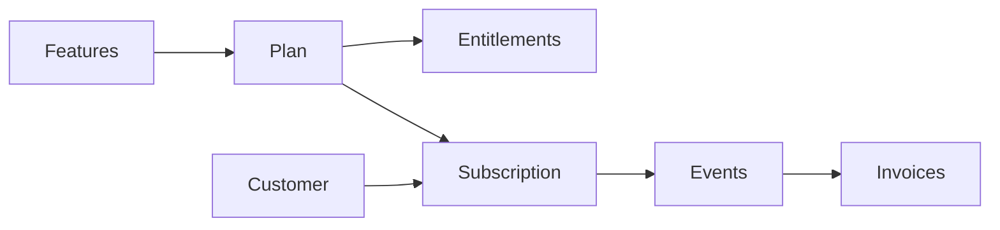

## Overview

**Hybrid pricing** = **subscription** (recurring fee) + **metered usage** (pay for what you use) + **entitlements** (which features and limits each plan gets). Plans differ by price, volume, and gated features (e.g. analytics, support).

Resend does this with tiers (Free, Pro, Scale, Enterprise): each tier has a recurring fee, usage charges (emails sent or contacts stored), and feature gating (retention, domains, support, analytics). In Flexprice you use one plan with recurring + usage-based charges and features linked via entitlements.

**Who this is for:** Product and billing engineers, PMs.

## Pricing Breakdown

<Frame>
  
</Frame>

## 1. Key Chargeable Features in Resend

Resend charges by **usage** (emails sent or contacts stored) and **gates features by plan** (data retention, domains, support, analytics, dedicated IP). Two tracks run in parallel; this cookbook uses the **Transactional** track for the Flexprice setup.

### A. Transactional Emails

**How pricing is applied:** You are charged by **emails sent per month**. Plans scale by volume; unit cost drops at higher tiers. Each tier also defines how many domains you can use, data retention for logs, support channel, and whether dedicated IP is available.

**Pricing (volume tiers):**

- **Transactional Scale:** 100,000 emails = $90 → **$0.90 per 1,000 emails**
- **Transactional Scale:** 1,000,000 emails/month = $650 → **$0.65 per 1,000 emails**
- **Transactional Pro:** e.g. $20/mo for 50k emails (common entry point)

| Tier     | Example volume | Effective rate   |
| -------- | -------------- | ---------------- |
| Pro      | 50k emails     | $0.90/1k overage |
| Scale    | 100k emails    | $0.90/1k         |
| Scale    | 1M emails      | $0.65/1k         |

Transactional emails are API-triggered (password resets, verification, order confirmations). In Flexprice you model this as a **metered feature** (e.g. Emails Sent) with event name and aggregation.

### B. Marketing Emails

**How pricing is applied:** You are charged by **contacts stored** (not by emails sent). Sends can be unlimited; cost scales with contact list size. Tiers control number of audiences, analytics, and dedicated IP (e.g. included on Enterprise for Marketing).

| Dimension     | Unit        | Notes                    |
| ------------- | ----------- | ------------------------ |
| Contacts      | count       | Billed by list size      |
| Emails sent   | unlimited* | *Within plan/limits       |

Marketing use cases include newsletters, onboarding campaigns, and promotions. For Flexprice, add a second metered feature (e.g. **Contacts Stored**) with its own event name if you model the Marketing track.

---

## 2. Subscription and Entitlement Model

Plan tiers (Free, Pro, Scale, Enterprise) control both **volume/price** and **which features** the customer can use. Features and limits vary by tier:

| Feature          | Free   | Pro     | Scale         | Enterprise   |
| ---------------- | ------ | ------- | ------------- | ------------ |
| Data retention   | 1 day  | 3 days  | 7 days        | Custom       |
| Domains (Tx)     | 1      | 10      | 1,000         | Flexible     |
| Support          | Ticket | Ticket  | Slack + Ticket| Priority     |
| Analytics (Mktg) | No     | Yes     | Yes           | Yes          |
| Dedicated IP     | —      | Add-on  | Add-on        | Included (Mktg) |

In Flexprice you control this by **linking features to plans** (entitlements): set included quantity, usage reset, and soft or hard limits for metered features; grant or restrict boolean/static features per plan. See [Linking features to plans](/docs/product-catalogue/features/linking-to-plans).

---

## 3. Overage and Upgrade Logic

Resend does **not** automatically charge for excess usage. When you exceed your monthly quota, you are notified and prompted to upgrade; if you repeatedly exceed limits without upgrading, Resend may temporarily pause sending.

In Flexprice you can choose **soft limit** (overage allowed, with or without extra charge) or **hard limit** (strict cap). Configure limits and overage per plan when [linking features to plans](/docs/product-catalogue/features/linking-to-plans).

---

## 4. When to Use Which Plan

| Scenario                    | Recommended plan | Reason                          |
| --------------------------- | ---------------- | ------------------------------- |
| Side project, low volume    | Free             | Cost-free validation            |
| Startup scaling to 100k+    | Pro / Scale      | Balance of features and cost    |
| Multi-brand / agency        | Scale            | Domain and audience flexibility |
| Enterprise (compliance, etc.) | Enterprise     | Deliverability and support      |

Transactional Pro at $20/mo with 50k emails is a common entry point; Scale unlocks Slack support and higher domain limits.

---

## Concepts and Terms

- **Subscription:** A customer attached to a plan. The subscription determines billing and which entitlements the customer has.
- **Plan:** A set of pricing rules: **recurring charges** (flat fee per billing period) and optionally **usage-based charges** (metered). A plan that has both is **hybrid** in Flexprice.
- **Feature:** Something you track or gate—**Metered** (usage, e.g. emails sent), **Boolean** (on/off access), or **Static** (fixed attribute).
- **Entitlement:** A feature linked to a plan with access rules: for metered features, included quantity, reset period, and soft or hard limit; for boolean/static, grant or restrict.

For more detail, see [Linking features to plans](/docs/product-catalogue/features/linking-to-plans) and [Plans overview](/docs/product-catalogue/plans/overview).

## Complete Flow Summary

The end-to-end flow for hybrid (subscription + entitlement) pricing in Flexprice:

<Steps>
  <Step title="Create metered features">
    Define the usage dimensions (e.g. Emails Sent) as **metered features** with event names and aggregation.
  </Step>
  <Step title="Create plan with hybrid charges">
    Create a **plan** (e.g. Transactional Pro). Add a **recurring charge** (e.g. $20/month) and **usage-based charge(s)** for the metered feature(s) (e.g. included 50k emails, then overage or tiered pricing).
  </Step>
  <Step title="Set entitlements">
    **Link features to the plan.** Set included quantity, usage reset (e.g. monthly), and soft or hard limit for metered features. Add boolean/static features if you gate capabilities by tier.
  </Step>
  <Step title="Create customer">
    Create a **customer** (name, External ID) in Customer Management.
  </Step>
  <Step title="Create subscription">
    **Add subscription** for the customer and select the plan. Start date determines billing and when entitlements apply.
  </Step>
  <Step title="Usage and billing">
    Send **usage events** that match the metered feature event names. Usage is billed per the plan’s usage-based charges and respects entitlements. Invoices are generated per billing cycle.
  </Step>
</Steps>

## Flexprice Set-up

To implement Resend-style hybrid pricing in Flexprice (Transactional track), follow these steps in order.

<Steps>
  <Step title="Step 1: Create metered features">
    Navigate to **Flexprice Dashboard** → **Product Catalog** → **Features**

    <Frame>
      
    </Frame>

    Click **Create Feature** (or **Add**) to create a metered feature. Enter **Name** and **Lookup Key**; the Lookup Key is immutable and unique.

    **Feature 1: Emails Sent (Transactional)**
    - **Feature Name**: `Emails Sent`
    - **Feature Lookup Key**: `emails_sent` (immutable, unique)
    - **Feature Type**: `Metered`
    - **Event Name**: e.g. `emails.sent` (must match exactly when sending events)
    - **Aggregation**: `Sum` (e.g. over `count` or `emails`)
    - **Unit**: `email` or `emails`

    > **Note:** The Event Name must match exactly when you send usage events via API. Save it for later use.

    For a second track (Marketing), add a feature such as **Contacts Stored** with its own event name and aggregation. This guide uses one metered feature: **Emails Sent**.

    For more, see [Creating a feature](/docs/product-catalogue/features/create).

  </Step>

  <Step title="Step 2: Create plan with hybrid charges">
    Navigate to **Flexprice Dashboard** → **Product Catalog** → **Plans**

    Click **Add** at the top-right to create a new plan. Enter plan details, then click **Next** to configure charges.

    **Plan details:**
    - **Plan Name**: `Transactional Pro`
    - **Lookup Key**: e.g. `transactional_pro` (immutable, unique)
    - **Billing period**: e.g. Monthly

    **Add hybrid charges:**
    1. **Recurring charge:** Add a **recurring** charge (e.g. $20/month). This is the base subscription fee for the tier. Click **Add** to save.
    2. **Usage-based charge:** Add a **usage-based** charge for the metered feature **Emails Sent**. Set pricing (e.g. flat fee per email, or package/tiered with included quantity and overage). Example: first 50,000 emails included, then $0.90 per 1,000 emails. Click **Add**, then **Save** to finalize the plan.

    For more, see [Creating a Plan](/docs/product-catalogue/plans/create) and [Plans pricing](/docs/product-catalogue/plans/pricing) (recurring and hybrid charges).

  </Step>

  <Step title="Step 3: Set entitlements">
    Open the plan you created → **Entitlements** section. Click **Add** to link features to the plan.

    <Frame>
      
    </Frame>

    **Link the metered feature** (Emails Sent) to the plan:
    - Set **included quantity** (e.g. 50,000 emails per month) or leave uncapped.
    - Set **usage reset** (e.g. monthly) so limits reset each billing period.
    - Choose **soft limit** (overage allowed, with billing per plan) or **hard limit** (strict cap).

    If you created **boolean or static features** (e.g. Analytics, Slack support), add them to the plan and set grant/restrict so higher tiers get access. Click **Save**.

    For more, see [Linking features to plans](/docs/product-catalogue/features/linking-to-plans).

  </Step>

  <Step title="Step 4: Create customer">
    Navigate to **Flexprice Dashboard** → **Customer Management** → **Customers**

    Click **Add Customer**. Enter **Customer Name** and **External ID** (your system’s identifier; use this in APIs for usage and lookups).

    **Required:**
    - **Customer Name**: e.g. `flexprice organisation`
    - **External ID**: e.g. `cust_acme_001`

    Click **Save** to create the customer. For more, see [Customer Management](/docs/customers/create).

  </Step>

  <Step title="Step 5: Create subscription">
    Open the customer you created, then click **Add Subscription**.

    <Frame>
      
    </Frame>

    - **Select plan**: Choose **Transactional Pro** (or the plan you created).
    - **Start date**: Set subscription start (billing and entitlements apply from this date).

    Click **Save** (or **Add Subscription**). The customer now has the plan’s recurring charge and entitlement to the linked features and usage limits. For more, see [Create Subscription](/docs/subscriptions/customers-create-subscription).

  </Step>

  <Step title="Step 6: Usage and billing">
    Send **usage events** to Flexprice with the same **event name** as the metered feature (e.g. `emails.sent`). Usage is aggregated and billed according to the plan’s usage-based charges and respects the entitlements (included quantity, soft/hard limit).

    - **Verify events:** Use the Event Debugger or usage views to confirm events are received and attributed to the customer.
    - **Invoices:** Generated at the end of each billing cycle; they include the recurring fee and usage-based line items.

    For more, see [Connecting to Billing](/docs/event-ingestion/connecting-to-billing) and your API reference for sending usage events.

  </Step>
</Steps>

## Next Steps

- **Map your app to Flexprice:** Emit usage events that match the metered feature event names (e.g. `emails.sent`) and associate them with the customer (e.g. via External ID).
- **Configure overage and limits:** Use [Linking features to plans](/docs/product-catalogue/features/linking-to-plans) to set soft vs hard limits and overage pricing per plan.
- **Add more plans:** Create Free, Scale, and Enterprise plans with different recurring fees, usage tiers, and entitlements (e.g. analytics, retention) to mirror Resend’s tiers.
- **Second track (Marketing):** Repeat the same pattern with a **Contacts Stored** metered feature and a separate plan or same plan with multiple usage-based charges.

For event ingestion and billing flow, see [Connecting to Billing](/docs/event-ingestion/connecting-to-billing). For plan and charge configuration, see [Creating a Plan](/docs/product-catalogue/plans/create) and [Linking features to plans](/docs/product-catalogue/features/linking-to-plans).
