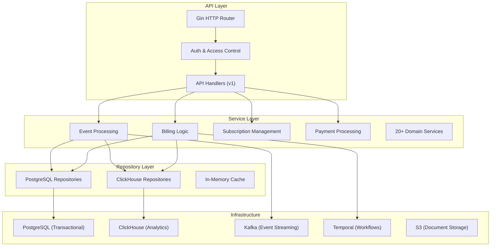
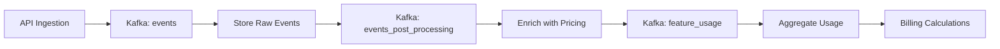

## Overview

Flexprice is a comprehensive **usage-based billing and subscription management platform** built in Go. The system handles the complete billing lifecycle from event ingestion through invoice generation and payment processing, designed for B2B SaaS companies requiring flexible pricing models.

## High-Level Architecture

Flexprice implements a **three-tier layered architecture** with clear separation of concerns, bootstrapped using **Uber FX dependency injection framework**: 

### Architecture Layers



## Technology Stack

### Core Technologies

Flexprice uses a modern Go stack with specialized components:

**Key Dependencies:**
- **Gin** - HTTP routing and middleware
- **Ent** - Type-safe ORM for PostgreSQL
- **Uber FX** - Dependency injection framework
- **ClickHouse** - Columnar database for analytics
- **Kafka (Sarama)** - Event streaming platform
- **Temporal** - Workflow orchestration engine
- **Stripe** - Payment processing integration

## Dual-Database Strategy

Flexprice employs a **specialized database strategy** for different workloads:

### PostgreSQL (Transactional Data)
- **Purpose**: ACID transactions, relational data
- **Data**: Subscriptions, invoices, customers, plans, prices, wallets
- **Access Pattern**: Read-write, complex joins, referential integrity
- **ORM**: Ent for type-safe queries

### ClickHouse (Analytical Data)
- **Purpose**: High-volume inserts, aggregation queries
- **Data**: Events (raw), processed_events, feature_usage
- **Access Pattern**: Append-only writes, time-series queries
- **Tables**: Optimized for usage metering and analytics 

## Event Processing Pipeline

The core of Flexprice's usage-based billing is an **asynchronous event processing pipeline** powered by Kafka:

### Pipeline Stages



### 1. Event Ingestion
Events are ingested via REST API and published to Kafka:

### 2. Event Consumption & Storage
Consumers process events from Kafka and store in ClickHouse:

### 3. Event Post-Processing
Events are enriched with subscription context and pricing data:

### 4. Feature Usage Tracking
Usage metrics are aggregated by meter and feature for billing:

### Kafka Topics Configuration 

## Deployment Modes

Flexprice supports **multiple deployment configurations** to separate concerns and scale independently:

### Available Modes

| Mode | Components | Purpose |
|------|-----------|---------|
| **`local`** | API + Consumer + Worker | Development environment |
| **`api`** | API Server only | Handle HTTP requests |
| **`consumer`** | Event processing only | Process Kafka messages |
| **`temporal_worker`** | Background workers only | Execute workflows |

## Service Layer Architecture

The service layer implements business logic through 30+ domain services organized by domain:

### Core Services
- **Billing Service**: Handles invoice generation, usage calculations, and billing cycles
- **Event Service**: Processes incoming usage events and manages event lifecycle
- **Subscription Service**: Manages customer subscriptions, upgrades, and downgrades
- **Customer Service**: Customer management and tenant operations
- **Payment Service**: Payment processing and gateway integrations
- **Plan Service**: Pricing plan management and feature configuration
- **Wallet Service**: Prepaid credits and wallet balance management

### Service Factory Pattern

All services are instantiated through factory functions that receive a centralized `ServiceParams` struct containing shared dependencies:

```go
type ServiceParams struct {
    PostgresRepository *repository.PostgresRepository
    ClickHouseRepository *repository.ClickHouseRepository
    KafkaProducer kafka.Producer
    TemporalClient temporal.Client
    Config *config.Config
    Logger *logger.Logger
}

func NewBillingService(params ServiceParams) *BillingService {
    return &BillingService{
        repo: params.PostgresRepository,
        analytics: params.ClickHouseRepository,
        kafka: params.KafkaProducer,
        // ...
    }
}
```

## API Layer & Routing

The API layer uses **Gin framework** with a comprehensive middleware stack for security, logging, and request processing:

### Middleware Stack
1. **Recovery Middleware**: Panic recovery and graceful error handling
2. **CORS Middleware**: Cross-origin resource sharing configuration
3. **Rate Limiting**: Request throttling per API key/tenant
4. **Authentication**: JWT and API key validation
5. **Tenant Isolation**: Multi-tenant context enforcement
6. **Request Logging**: Structured logging for all requests
7. **Metrics Collection**: Prometheus metrics for observability

### Authentication & Authorization

Flexprice supports multiple authentication methods:

- **API Keys**: Tenant-scoped keys for programmatic access
- **JWT Tokens**: User session tokens with role-based permissions
- **Webhook Signatures**: HMAC verification for incoming webhooks

### API Endpoints Structure

```
/v1
├── /auth                    # Authentication endpoints
├── /customers              # Customer management
├── /plans                  # Pricing plans and features
├── /subscriptions          # Subscription lifecycle
├── /events                 # Event ingestion
├── /invoices              # Invoice generation and retrieval
├── /usage                 # Usage queries and aggregations
├── /payments              # Payment processing
└── /webhooks              # Webhook management
```

## Multi-Tenancy Architecture

Flexprice implements **row-level multi-tenancy** with environment isolation enforced at multiple architectural layers:

### Tenant Isolation Strategy
- **Database Level**: All tables include `tenant_id` and `environment` columns
- **Middleware Level**: Request context includes tenant/environment validation
- **Service Level**: All business logic operations are tenant-scoped
- **Repository Level**: Automatic filtering on all database queries

### Middleware Enforcement

```go
func TenantMiddleware() gin.HandlerFunc {
    return func(c *gin.Context) {
        // Extract tenant from API key or JWT
        tenantID := extractTenantFromAuth(c)
        environment := extractEnvironmentFromAuth(c)
        
        // Set tenant context
        ctx := context.WithValue(c.Request.Context(), "tenant_id", tenantID)
        ctx = context.WithValue(ctx, "environment", environment)
        c.Request = c.Request.WithContext(ctx)
        
        c.Next()
    }
}
```

### Authentication Methods

API keys are configured with tenant and user association:
- **Tenant API Keys**: Scoped to specific tenant and environment
- **User Tokens**: Associated with user permissions within tenant
- **System Keys**: Cross-tenant access for administrative operations

## Repository Layer

The repository layer provides data access abstraction with automatic tenant/environment filtering:

### Repository Interface
```go
type Repository interface {
    // All methods automatically filter by tenant/environment from context
    GetCustomer(ctx context.Context, customerID string) (*Customer, error)
    CreateInvoice(ctx context.Context, invoice *Invoice) error
    GetUsageEvents(ctx context.Context, filters EventFilters) ([]Event, error)
}
```

### Automatic Tenant Filtering
All repositories automatically append tenant and environment filters to queries:
```go
func (r *PostgresRepository) GetCustomer(ctx context.Context, customerID string) (*Customer, error) {
    tenantID := getTenantFromContext(ctx)
    environment := getEnvironmentFromContext(ctx)
    
    return r.db.Customer.
        Query().
        Where(customer.ID(customerID)).
        Where(customer.TenantID(tenantID)).
        Where(customer.Environment(environment)).
        Only(ctx)
}
```

All repositories are created through factory functions that receive shared dependencies like database connections, caching layers, and configuration.

## Message Processing with PubSub Router

Flexprice uses **Watermill** for message routing with built-in retry mechanisms and rate limiting:

### Kafka Integration
```go
router := message.NewRouter(message.RouterConfig{}, logger)

// Event processing pipeline
router.AddHandler(
    "events_processor",
    "events",
    subscriber,
    "events_post_processing",
    publisher,
    eventProcessingHandler,
)

// Usage aggregation
router.AddHandler(
    "usage_aggregator",
    "events_post_processing", 
    subscriber,
    "feature_usage",
    publisher,
    usageAggregationHandler,
)
```

### Message Processing Features
- **Dead Letter Queues**: Failed messages are routed to error topics
- **Retry Logic**: Exponential backoff for transient failures
- **Rate Limiting**: Configurable processing rates per topic
- **Metrics**: Built-in monitoring for message processing

## Temporal Workflow Orchestration

Background jobs and scheduled tasks use **Temporal** for reliable execution and workflow management:

### Workflow Types
- **Billing Workflows**: Monthly/annual invoice generation
- **Usage Aggregation**: Periodic usage calculations
- **Payment Processing**: Async payment collection workflows
- **Data Exports**: Large dataset exports to S3
- **Webhook Delivery**: Reliable event notifications

### Workflow Registration

```go
func RegisterWorkflows(worker worker.Worker) {
    // Billing workflows
    worker.RegisterWorkflow(billing.GenerateInvoiceWorkflow)
    worker.RegisterWorkflow(billing.ProcessPaymentWorkflow)
    
    // Usage workflows  
    worker.RegisterWorkflow(usage.AggregateUsageWorkflow)
    
    // Export workflows
    worker.RegisterWorkflow(export.ExportDataWorkflow)
}
```

### Worker Lifecycle

Workers are deployed separately and can be scaled independently:
```go
func StartTemporalWorker(config *config.Config) {
    client := temporal.NewClient()
    worker := worker.New(client, "billing-queue", worker.Options{})
    
    RegisterWorkflows(worker)
    RegisterActivities(worker)
    
    worker.Run(worker.InterruptCh())
}
```

## External Integrations

### Payment Gateway Abstraction

Flexprice uses a factory pattern for payment integrations supporting multiple providers:

```go
type PaymentGateway interface {
    CreatePaymentIntent(amount int64, currency string) (*PaymentIntent, error)
    ProcessPayment(paymentID string) (*Payment, error)
    CreateCustomer(customerData CustomerData) (*Customer, error)
    HandleWebhook(payload []byte, signature string) (*WebhookEvent, error)
}

// Supported gateways
func NewPaymentGateway(provider string, config GatewayConfig) PaymentGateway {
    switch provider {
    case "stripe":
        return NewStripeGateway(config)
    case "adyen":
        return NewAdyenGateway(config)
    default:
        return NewMockGateway()
    }
}
```

### Webhook Delivery

Webhooks are delivered through **Svix** for reliable event notification with automatic retries and delivery guarantees:

```go
type WebhookService struct {
    svixClient *svix.Client
    eventStore EventStore
}

func (w *WebhookService) DeliverEvent(event *Event, endpoints []WebhookEndpoint) error {
    // Svix handles retries, signatures, and delivery tracking
    return w.svixClient.Message.Create(event.TenantID, &svix.MessageIn{
        EventType: event.Type,
        Payload:   event.Data,
    })
}
```

## Infrastructure Services

### Monitoring & Observability

**Sentry** for error tracking and performance monitoring:
```go
sentry.Init(sentry.ClientOptions{
    Dsn: config.SentryDSN,
    Environment: config.Environment,
    TracesSampleRate: 0.1,
})

// Error tracking in handlers
if err != nil {
    sentry.CaptureException(err)
    return gin.Error{Err: err, Type: gin.ErrorTypePublic}
}
```

**Pyroscope** for continuous profiling and performance analysis:
```go
pyroscope.Start(pyroscope.Config{
    ApplicationName: "flexprice-api",
    ServerAddress:   config.PyroscopeURL,
    ProfileTypes: []pyroscope.ProfileType{
        pyroscope.ProfileCPU,
        pyroscope.ProfileAllocObjects,
        pyroscope.ProfileAllocSpace,
    },
})
```

### Document Storage

Invoice PDFs are stored in **S3** with presigned URL generation for secure access:
```go
func (s *S3Service) StoreInvoice(invoiceID string, pdfData []byte) (string, error) {
    key := fmt.Sprintf("invoices/%s/%s.pdf", s.tenantID, invoiceID)
    
    _, err := s.client.PutObject(&s3.PutObjectInput{
        Bucket: aws.String(s.bucket),
        Key:    aws.String(key), 
        Body:   bytes.NewReader(pdfData),
    })
    
    // Return presigned URL for download
    return s.GeneratePresignedURL(key, 24*time.Hour)
}
```

### Caching Layer

In-memory caching for performance optimization using Redis and local caches:
```go
type CacheService struct {
    redis    *redis.Client
    local    *bigcache.BigCache
    ttl      time.Duration
}

func (c *CacheService) GetPlan(planID string) (*Plan, error) {
    // Try local cache first
    if data, err := c.local.Get(planID); err == nil {
        return unmarshalPlan(data)
    }
    
    // Fall back to Redis
    if data, err := c.redis.Get(planID).Bytes(); err == nil {
        c.local.Set(planID, data) // Populate local cache
        return unmarshalPlan(data)
    }
    
    // Cache miss - fetch from database
    plan, err := c.repo.GetPlan(planID)
    if err == nil {
        c.SetPlan(planID, plan)
    }
    return plan, err
}
```

## Configuration Management

Configuration is loaded from YAML files with environment variable overrides for deployment flexibility:

```yaml
# config.yaml
server:
  port: 8080
  host: "0.0.0.0"
  
database:
  postgres:
    host: ${DB_HOST:localhost}
    port: ${DB_PORT:5432}
    database: ${DB_NAME:flexprice}
  clickhouse:
    host: ${CLICKHOUSE_HOST:localhost}
    port: ${CLICKHOUSE_PORT:9000}

kafka:
  brokers: ${KAFKA_BROKERS:localhost:29092}
  topics:
    events: "events"
    processed_events: "events_post_processing"
    feature_usage: "feature_usage"

temporal:
  host: ${TEMPORAL_HOST:localhost:7233}
  namespace: ${TEMPORAL_NAMESPACE:default}
```

### Configuration Structure

```go
type Config struct {
    Server     ServerConfig     `yaml:"server"`
    Database   DatabaseConfig   `yaml:"database"`
    Kafka      KafkaConfig      `yaml:"kafka"`
    Temporal   TemporalConfig   `yaml:"temporal"`
    Redis      RedisConfig      `yaml:"redis"`
    S3         S3Config         `yaml:"s3"`
    Payment    PaymentConfig    `yaml:"payment"`
}
```

## Application Lifecycle

The application lifecycle is managed by **Uber FX** with hooks for startup and shutdown:

```go
func main() {
    fx.New(
        // Configuration
        fx.Provide(config.Load),
        fx.Provide(logger.New),
        
        // Infrastructure
        fx.Provide(database.NewPostgres),
        fx.Provide(database.NewClickHouse),
        fx.Provide(kafka.NewProducer),
        fx.Provide(temporal.NewClient),
        
        // Services  
        fx.Provide(service.NewBillingService),
        fx.Provide(service.NewEventService),
        
        // HTTP Server
        fx.Provide(server.New),
        fx.Invoke(server.RegisterRoutes),
        
        // Lifecycle hooks
        fx.Invoke(func(lc fx.Lifecycle, server *server.Server) {
            lc.Append(fx.Hook{
                OnStart: server.Start,
                OnStop:  server.Stop,
            })
        }),
    ).Run()
}
``` 

## Notes

**Key Architectural Decisions:**

1. **Dual-Database Strategy**: PostgreSQL for transactional consistency, ClickHouse for high-volume analytics
2. **Event-Driven Architecture**: Kafka enables asynchronous processing, scalability, and fault tolerance
3. **Microservices-Ready**: Deployment modes allow splitting components into separate services
4. **Strong Multi-Tenancy**: Enforced at middleware, service, and repository layers
5. **Workflow Orchestration**: Temporal provides reliable background job execution
6. **Open Integration**: Factory pattern allows multiple payment gateway implementations

The architecture is designed for **high scalability**, **reliability**, and **flexibility** to support diverse pricing models while maintaining clean separation of concerns across all layers.