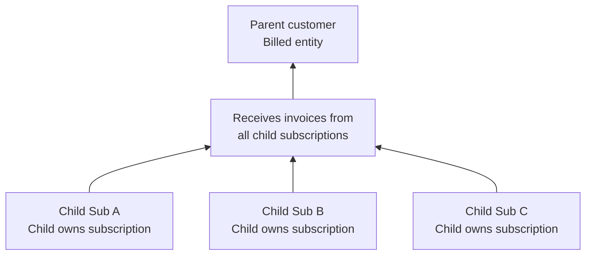
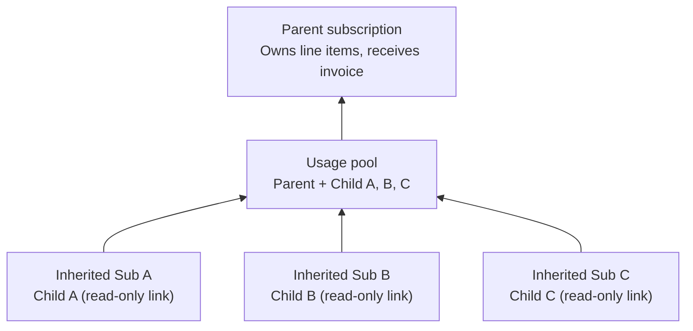

**Customer Hierarchy** decouples **who uses the service** from **who pays for it**. It enables enterprises with subsidiaries, reseller partnerships, and multi-department organizations to bill centrally while tracking usage granularly per entity.

> In Flexprice, a parent customer is a **billing entity**. A child customer is a **usage entity**. Customer hierarchy defines which children's usage a parent is responsible for paying.

## Two Billing Models

Flexprice supports two distinct hierarchy billing models. They are **mutually exclusive**: a single subscription uses one or the other, not both.

### Model A: Invoice Delegation

Each child customer owns its own subscription. When the subscription is created with `invoice_billing: invoice_to_parent`, Flexprice routes all invoices for that subscription to the parent customer. The child retains full ownership of the subscription and its lifecycle.

**Use when**: Children have different plans, pricing, or need independent subscription lifecycles.

---

### Model B: Usage Aggregation

The parent customer owns a single subscription. The `usage_customer_ids` field tells Flexprice which child customers to aggregate usage from. Flexprice automatically creates lightweight **inherited subscriptions** for each child. These are read-only records that link child usage to the parent's billing pool.

**Use when**: Children share the same plan, and you want centralized volume aggregation, for example to qualify for higher-tier pricing based on combined usage.

---

### Comparison

| | Model A: Invoice Delegation | Model B: Usage Aggregation |
|---|---|---|
| **API field** | `invoice_billing: invoice_to_parent` | `usage_customer_ids: [...]` |
| **Subscription ownership** | Each child owns their subscription | Parent owns one subscription |
| **Child subscriptions** | Independent, fully managed | Auto-created, read-only `INHERITED` skeletons |
| **Usage aggregation** | Per-child tracked separately | Pooled across parent + all children |
| **Lifecycle cascading** | Children are independent | Parent pause/cancel cascades to all children |
| **Best for** | Different plans per child; independent lifecycles | Shared plan with volume aggregation |

---

## Key Capabilities

- **Consolidated Invoicing**: All charges billed to a single parent invoice regardless of how many children contribute usage
- **Usage Aggregation** (Model B): Child usage rolls up into the parent subscription, enabling volume pricing tiers that span the entire org
- **Lifecycle Cascading** (Model B): Pausing, resuming, or cancelling the parent subscription automatically applies to all inherited children
- **Flexible Billing**: Use Model A for heterogeneous plans per child, Model B for homogeneous org-wide contracts
- **Wallet & Credits**: Parent's prepaid wallet and credit ledger apply to all hierarchy invoices; children's wallets are not used
- **Per-Child Analytics**: Usage Analytics API returns per-child breakdowns alongside aggregated totals for chargeback and reporting

---

## Use Cases

### Enterprise with Multiple Subsidiaries

A global corporation wants centralized billing while tracking usage per business unit.

- **Model A**: Each subsidiary is on its own plan (potentially different), but invoices flow to HQ.
- **Model B**: All subsidiaries share one enterprise contract, and combined volume unlocks better rates.

### Reseller & Partner Models

A channel partner resells your product to their clients and handles all billing centrally.

- **Recommended**: Model A: each end customer has their own subscription, the reseller receives all invoices.

### Multi-Tenant SaaS with Org-Level Contracts

A SaaS vendor sells to enterprises where each team is a separate customer entity but the enterprise has negotiated a single org-wide volume contract.

- **Recommended**: Model B: parent subscription with all teams' external customer IDs in `usage_customer_ids`.

### Departmental Billing

A company's central IT department manages all vendor contracts while individual teams use the product.

- Either model works. Use Model A if teams have different plans; use Model B if all teams are under one shared plan.

---

## Constraints & Limits

<Note>
**Hierarchy depth**: Maximum 1 level. Nested hierarchies (grandparent → parent → child) are not supported and will be rejected.
</Note>

<Note>
**Hierarchy breadth**: A parent customer can have at most **100** direct child customers. For Model B, `usage_customer_ids` on a parent subscription is capped at **100** customers. That subscription limit is the same as the hierarchy limit and is enforced accordingly.
</Note>

- A customer can only belong to one hierarchy: one `parent_customer_id`
- `invoice_to_parent` (Model A) and `usage_customer_ids` (Model B) are mutually exclusive on a single subscription
- `invoice_billing` cannot be changed after a subscription is created
- Model B: children cannot be removed from an active parent subscription; you must cancel and recreate

---

## Next Steps

<CardGroup cols={2}>
  <Card title="Workflows & Behavior" icon="arrows-split-up-and-left" href="/docs/customers/customer-hierarchy-workflows">
    Step-by-step setup guides, lifecycle behavior, usage processing, advanced scenarios, and edge cases
  </Card>
  <Card title="Create a Customer" icon="user-plus" href="/docs/customers/create">
    Learn how to create parent and child customers with the `parent_customer_id` field
  </Card>
</CardGroup>
