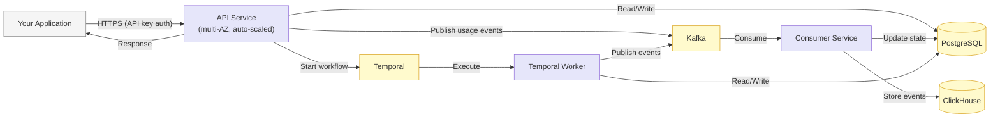
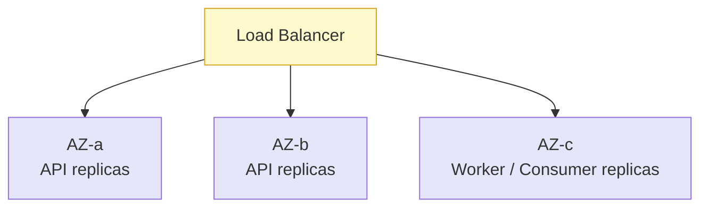

Flexprice sits in the critical path of your revenue. Every usage event you send, every invoice we generate, and every entitlement check your product makes depends on this platform being correct and available. This page is a transparent, engineering-level overview of how **Flexprice Cloud** is built and operated, written for the technical leaders evaluating whether to trust us with their monetization stack.

We've deliberately kept this honest and concrete rather than aspirational. If you need deeper detail for a security review or vendor assessment, reach out to [support@flexprice.io](mailto:support@flexprice.io) and we'll walk your team through it.

## Design Principles

Every architectural decision in Flexprice Cloud is measured against four goals.

<CardGroup cols={2}>
  <Card title="Safe" icon="shield-check">
    Strict tenant isolation, encryption in transit and at rest, private-by-default networking, least-privilege access, and automated backups. Your data is never exposed to the public internet at the database layer.
  </Card>
  <Card title="Robust" icon="heart-pulse">
    Durable workflow orchestration, automatic retries, multi-AZ redundancy, and zero-downtime deployments with automatic rollback. The system is designed to keep running through node failures and traffic spikes.
  </Card>
  <Card title="Scalable" icon="arrows-up-down-left-right">
    A decoupled, event-driven design where each service scales independently and horizontally. Usage ingestion, billing, and analytics grow without re-architecting.
  </Card>
  <Card title="Maintainable" icon="wrench">
    Everything is defined as code and deployed through GitOps. Infrastructure is reproducible, auditable, and recoverable — no snowflake servers, no manual configuration drift.
  </Card>
</CardGroup>

## Platform at a Glance

Flexprice Cloud runs entirely on **Amazon Web Services**, using managed and battle-tested building blocks rather than bespoke infrastructure. The platform is containerized, runs across multiple Availability Zones, and is provisioned end-to-end through infrastructure-as-code.

| Concern | What we use | Why it matters to you |
|---|---|---|
| **Cloud provider** | AWS (multiple regions) | Mature security, compliance, and durability guarantees from the underlying platform |
| **Compute** | Containerized services on AWS ECS, ARM/Graviton instances across multiple AZs | Resilient to single-node and single-AZ failures; cost-efficient and energy-efficient |
| **Transactional data** | PostgreSQL | ACID-compliant store for customers, plans, subscriptions, and invoices |
| **Usage analytics** | ClickHouse | Column-store built for billions of usage events and real-time aggregation |
| **Event streaming** | Kafka | Decouples ingestion from processing and absorbs traffic spikes |
| **Workflow orchestration** | Temporal | Durable, retryable execution for billing cycles and long-running jobs |
| **Delivery** | GitOps (Argo CD) + Terraform/Terragrunt | Every change is version-controlled, reviewed, and reproducible |
| **Backups** | Automated AWS Backup snapshots, hourly | Point-in-time recovery of analytical data |

## Request Lifecycle

The platform is split into independently deployable services, each with a single responsibility. A request never blocks on slow downstream work — anything that can be asynchronous is handed off to Kafka or Temporal.

- **API Service** — the only internet-facing tier. It authenticates requests, validates input, persists transactional state to PostgreSQL, and hands heavy or asynchronous work to Kafka and Temporal so client latency stays low.
- **Consumer Service** — drains usage events from Kafka, writes them to ClickHouse for analytics, and updates derived state. Because it is decoupled, a burst of usage traffic queues safely instead of overwhelming the system.
- **Temporal Worker** — executes durable workflows such as billing cycles, invoice generation, and scheduled jobs. Temporal guarantees these run to completion with automatic retries, even across deploys or node restarts.

This separation means each tier scales on its own signal: the API tier on request rate, the consumer on event backlog, and the worker on workflow load.

## Where Your Data Lives

Flexprice Cloud is deployed as **fully isolated stacks in multiple AWS regions**, today including the **United States (Oregon)** and **India (Mumbai)**, with additional regions provisioned on request. Each region is a self-contained deployment with its own compute, databases, and networking — data does not cross regional boundaries, which helps you meet data-residency requirements.

<Card title="Data residency" icon="earth-americas">
  Choose the region your customer and usage data is stored and processed in. Each region runs an independent copy of the full Flexprice stack inside its own isolated network (VPC).
</Card>

Within a region, every Flexprice entity is scoped to a **tenant** and an **environment** (for example, production vs. sandbox). This tenancy boundary is enforced at the application layer on every query, so one customer can never read or write another customer's data.

## Compute & Deployments

Flexprice services run as containers on AWS ECS, spread across multiple Availability Zones using a mix of on-demand and spot capacity for resilience and cost efficiency.

- **Multi-AZ by design** — services are distributed across Availability Zones, so the loss of any single zone does not take the platform down.
- **Horizontal auto-scaling** — each service runs multiple replicas and scales out under load. Stateless services can be added or removed without disruption.
- **Zero-downtime deployments** — releases roll out gradually with health checks. A built-in **deployment circuit breaker automatically rolls back** any release that fails to come up healthy, so a bad deploy never reaches your customers.
- **Self-healing** — unhealthy or terminated tasks are automatically rescheduled onto healthy capacity.

## Data Layer

Flexprice uses the right datastore for each job and protects both.

#### PostgreSQL — system of record

The transactional store for customers, plans, subscriptions, entitlements, invoices, and payments. PostgreSQL gives us ACID guarantees, so financial state transitions are consistent and correct. It is reached only from inside the private network.

#### ClickHouse — usage at scale

A purpose-built column store for high-volume usage events. ClickHouse lets Flexprice ingest and aggregate billions of events and answer real-time usage and billing queries that a traditional database could not.

Both databases are:

- **Private by default** — reachable only through internal load balancers inside the VPC, in private subnets. There is **no public internet path to your data at the database layer**.
- **Encrypted at rest** — backed by encrypted storage volumes.
- **Backed up automatically** — analytical storage is snapshotted hourly via AWS Backup with retained recovery points, and storage volumes use a *retain* policy so data survives infrastructure changes.

## Reliability & Resilience

We assume failure will happen and design so that it is survivable and recoverable.

<CardGroup cols={2}>
  <Card title="Durable workflows" icon="rotate">
    Billing runs and invoice generation execute on Temporal, which persists every step. Interruptions resume exactly where they left off — no lost or double-billed cycles.
  </Card>
  <Card title="Buffered ingestion" icon="layer-group">
    Usage events flow through Kafka, so a downstream slowdown or spike is absorbed by the queue instead of dropping data or rejecting requests.
  </Card>
  <Card title="Automated backups" icon="floppy-disk">
    Hourly snapshots of analytical data with documented restore runbooks. Storage volumes retain data through node replacement and upgrades.
  </Card>
  <Card title="Redundant compute" icon="server">
    Multiple replicas of every service across Availability Zones, with automatic rescheduling and rollback on failure.
  </Card>
</CardGroup>

We are actively rolling out **real-time database replication** for the analytics tier to add automatic failover on top of today's snapshot-based recovery — part of a continuously hardening reliability roadmap.

## Scalability

The architecture scales by adding capacity, not by rewriting code.

- **Decoupled services** — ingestion, processing, billing, and analytics are separate tiers connected by Kafka and Temporal. Each scales independently against its own workload.
- **Stateless application tier** — API and worker services hold no local state, so scaling out is as simple as adding replicas.
- **Stream-based ingestion** — Kafka smooths spikes and lets the consumer tier process at a sustainable rate without backpressure on your application.
- **Analytics built for volume** — ClickHouse is engineered for high-cardinality, high-throughput usage data, so metering performance holds as your event volume grows.

## Security

Security is layered from the network edge down to individual queries.

| Layer | Control |
|---|---|
| **Network** | Isolated VPC per region; databases in private subnets with no public route; internal-only load balancers for data services |
| **Transport** | TLS/HTTPS for all client traffic |
| **Storage** | Encryption at rest for databases and backups |
| **Authentication** | API-key authentication on every request; keys are scoped and revocable |
| **Tenant isolation** | Every entity is scoped to tenant + environment, enforced on every read and write |
| **Access control** | Least-privilege IAM roles; protected/guarded critical infrastructure resources |
| **Auditability** | Infrastructure and application changes are version-controlled and reviewed before they ship |

<Warning>
  Treat your Flexprice API keys like passwords. Use server-side keys, never expose them in client-side code or public repositories, and rotate them if you suspect exposure.
</Warning>

## Operations & Observability

A mature platform is one you can reason about and recover.

- **Infrastructure as code** — the entire platform is defined in Terraform/Terragrunt and Kubernetes manifests. Environments are reproducible and there are no undocumented, hand-built servers.
- **GitOps delivery** — changes are applied through Argo CD from version control, giving a complete, auditable history of what is running and why.
- **Monitoring** — services are instrumented and observed through Grafana and error-tracking tooling, so we detect and respond to issues quickly.
- **Documented runbooks** — recovery procedures (restore from snapshot, scaling, upgrades) are written down and rehearsed, not improvised during an incident.

## Want Full Control? Self-Host.

Flexprice is open source. If your requirements call for running the platform inside your own cloud account or on-premises, you can deploy the exact same architecture yourself.

<CardGroup cols={2}>
  <Card title="Self-Hosting Guide" icon="book" href="/docs/getting-started/self-hosting-guide">
    Run the full Flexprice stack with Docker Compose.
  </Card>
  <Card title="Self-Hosting on AWS" icon="aws" href="/docs/getting-started/self-hosting-aws">
    A production reference deployment on AWS.
  </Card>
</CardGroup>

## Talk to Us

We're happy to go deeper — network diagrams, data handling, incident process, or a vendor security questionnaire. Reach the team at [support@flexprice.io](mailto:support@flexprice.io).
