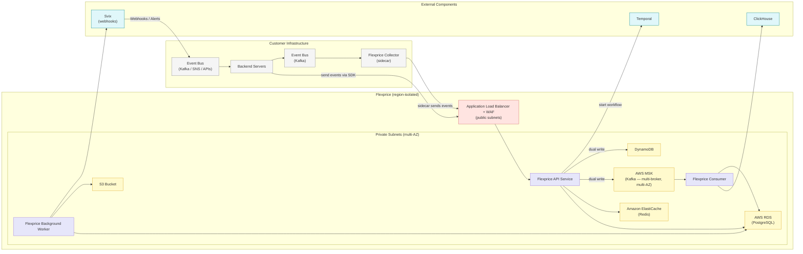

Flexprice is a usage metering, pricing, and billing engine that sits between your application and your payment providers. You stream usage events in, configure how each event, feature, or model is priced, and Flexprice handles everything downstream — metering, credit balances, entitlements, invoicing, and settlement — then plugs into your gateway of choice.

This document describes how the platform is built: its components, how data moves through them, what happens when something fails, and how the system recovers. It is written for the engineers and architects who need to satisfy themselves that Flexprice can carry production billing traffic.

## Design principles

The architecture is shaped by a small set of decisions that hold across every layer.

<CardGroup cols={2}>
  <Card title="Events are the source of truth" icon="database">
    Every billing outcome is derived from raw usage events. Those events are persisted redundantly and retained for replay, so any downstream state can be rebuilt from first principles.
  </Card>
  <Card title="Redundancy at every hop" icon="shield-halved">
    No single component failure causes data loss. Each stage of the pipeline has an independent durable store that absorbs the failure of the stage after it.
  </Card>
  <Card title="Region isolation by default" icon="globe">
    Every component is region-restricted. Data for a region never leaves it, and each region runs an independent stack.
  </Card>
  <Card title="Self-hostable by construction" icon="cube">
    The same artifacts that run Flexprice Cloud ship as Helm charts. Every dependency is open source and swappable, so a dedicated deployment is the cloud architecture, not a fork.
  </Card>
</CardGroup>

## System architecture

The platform is fully containerized. A single codebase runs in three modes — **API**, **Consumer**, and **Background Worker** — behind a load balancer, with a private data tier (multi-AZ) and a set of external components for analytics, orchestration, and webhook delivery.

Only the API service is exposed to the internet. It sits behind an Application Load Balancer and a WAF in public subnets; every database, broker, and cache lives in private subnets, across multiple availability zones, with no inbound internet route.

### Runtime services

All three services are the same image, started in different roles. This keeps deployment, versioning, and operational tooling uniform.

| Service | Responsibility |
| --- | --- |
| **API** | The only internet-facing component. Authenticates and validates requests, serves the 200+ REST endpoints, writes transactional state to PostgreSQL, and publishes events to Kafka. |
| **Consumer** | Reads from Kafka and processes events asynchronously — usage ingestion, enrichment against PostgreSQL, writes to ClickHouse, alerting, and webhook fan-out. |
| **Background Worker** | Executes durable, long-running workflows on Temporal: billing cycles, scheduled jobs, retries, and multi-step operations that require state and guaranteed completion. |

### Data stores

Each store is chosen for one job and isolated to it. Nothing in the list depends on a managed-cloud-only feature — every component has an open-source equivalent that ships in the self-hosted charts.

| Store | Role | Why this choice |
| --- | --- | --- |
| **PostgreSQL** (RDS) | System of record: customers, subscriptions, plans, pricing, entitlements, invoices, audit log. | Strong consistency and transactional integrity for configuration and financial state. |
| **ClickHouse** | Event store and analytics engine: raw events, enriched events, aggregations. | Column-oriented OLAP built for high-volume ingestion and sub-second aggregation over billions of rows. |
| **Kafka** (MSK) | Event backbone between API and Consumer. Multi-broker, multi-AZ. | Decouples ingestion from processing, buffers traffic spikes, and guarantees ordered, replayable delivery. |
| **Redis** (ElastiCache) | Hot-path cache for balances and frequently read configuration. | Sub-millisecond reads that keep latency-sensitive checks off the primary databases. |
| **DynamoDB** | Durable ingestion buffer for replay and recovery. | A simple, always-available key-value sink that survives even when the rest of the pipeline is degraded. |
| **S3** | Invoice PDFs, generated reports, scheduled exports, and long-term event archival. | Cheap, durable object storage for artifacts and cold data. |

## Event ingestion pipeline

Ingestion is the most infrastructure-heavy part of the system, because it is the part that must never lose data. Everything downstream — balances, invoices, analytics, reconciliation — is reconstructable as long as the events survive.

### Ingestion modes

You choose how events reach Flexprice based on how your systems are already built.

<CardGroup cols={3}>
  <Card title="SDK" icon="code">
    Server-side SDKs in all popular languages send events directly. The SDK runs in sync mode with configurable retries and fallback handling built in.
  </Card>
  <Card title="Collector (sidecar)" icon="box">
    A Flexprice collector runs inside your infrastructure, pulls from your existing event bus, applies custom transformations to your internal format, and forwards to Flexprice.
  </Card>
  <Card title="Direct API" icon="plug">
    For systems that prefer to call Flexprice directly, every ingestion path is also a plain authenticated REST endpoint.
  </Card>
</CardGroup>

### Ingestion flow

The receive path is deliberately lightweight. The API performs only static validation — a well-formed payload on an authenticated endpoint — then **dual-writes** the event to DynamoDB and Kafka before acknowledging. Heavier work (enrichment, aggregation, ClickHouse writes) happens asynchronously off the Kafka stream, so a spike in volume never slows the acknowledgement path.

```mermaid
graph LR
    classDef client fill:#f5f5f5,stroke:#888888
    classDef edge fill:#ffe4e1,stroke:#cd5c5c
    classDef services fill:#e6e6fa,stroke:#9370db
    classDef infrastructure fill:#fffacd,stroke:#daa520
    classDef external fill:#e0f7fa,stroke:#00838f
    classDef job fill:#f0fff0,stroke:#2e8b57

    sdk["Flexprice SDK /<br/>Collector"]:::client
    retry{"4 retries"}:::client
    waf["Flexprice<br/>(WAF)"]:::edge
    api["Flexprice API Service"]:::services
    s3["S3 Bucket"]:::infrastructure
    s3job["Retry Job<br/>(configure S3 access)"]:::job
    dynamo["DynamoDB"]:::infrastructure
    dynjob["Retry Job"]:::job
    msk["AWS MSK<br/>(Kafka — multi-broker, multi-AZ)"]:::infrastructure
    consumer["Flexprice Consumer"]:::services
    ch["ClickHouse"]:::external

    sdk -- "/events async" --> retry
    retry -- "2XX" --> waf
    waf --> api
    retry -- "non-2xx /<br/>retries exhausted" --> s3
    s3 --> s3job
    s3job -- "periodic job to<br/>retry and clear S3" --> s3
    s3job -- "re-ingest" --> waf
    api -- "event dump" --> dynamo
    api -- "event dump" --> msk
    dynamo --> dynjob
    dynjob -- "replay" --> consumer
    msk --> consumer
    consumer -- "enrich + aggregate" --> ch
```

On the consumer side, events land in ClickHouse twice: a **raw events** table that is the immutable base for replay and reconciliation, and a **processed events** table where each event is enriched with the customer, subscription, feature, meter, price, and line item it maps to. Every event is traceable end to end, down to the exact entities it was billed against.

## Reliability and failure modes

The pipeline is designed so that the failure of any one component degrades gracefully and loses nothing. Each stage is backed by an independent durable store that absorbs the failure of the stage after it.

| Scenario | Behavior | Recovery |
| --- | --- | --- |
| **Kafka unavailable** | The event is still durably persisted to DynamoDB. The API surfaces the failure honestly rather than silently dropping. | Replay jobs drain DynamoDB back into the pipeline once Kafka recovers. |
| **ClickHouse unavailable** | Events accumulate in Kafka; the consumer pauses. | The consumer resumes and replays the backlog from Kafka when ClickHouse returns. |
| **Flexprice fully unreachable** | After SDK retries are exhausted, an optional degraded mode writes each event to a customer-owned S3 bucket, keyed by event ID with the exact payload. | Server-to-server retry jobs read the bucket and re-ingest every event, then clear it. |
| **Duplicate delivery** | Events are idempotent on event ID, so retries and replays converge to the same state. | No manual intervention — deduplication is intrinsic. |
| **Bad data from upstream** | Raw events are retained untouched, separate from processed state. | Affected events can be corrected and replayed from the retained history. |

### Data recovery and replay

Because events are the currency of the system, they are retained well beyond their processing lifetime. Events held in DynamoDB are retained for up to one year and then archived to S3, giving **point-in-time replay** across the entire window. If any downstream store is lost or corrupted, it can be rebuilt by replaying the retained events — no derived state is ever the only copy of anything.

<Note>
The degraded-mode S3 fallback and its retry jobs are an opt-in, per-customer configuration deployed for enterprise workloads. It requires granting Flexprice server-to-server read access to the bucket.
</Note>

## Real-time balances and alerting

The most latency-sensitive question in usage billing is *does this customer have balance to perform this action?* Flexprice answers it without forcing you onto its critical path.

### How balances are computed

Balances are never stored as a separate mutable number — they are derived from usage in ClickHouse. Every incoming event is rolled up into materialized views and pre-aggregated tables, so the current balance is a fast aggregation query rather than a running counter that can drift.

The **fetch-balance API** lets the caller decide the freshness it needs. Rather than a fixed server-side TTL, the caller specifies a maximum acceptable age per request: if the cached value is within that age it is returned immediately from cache; if it is staler, the value is recomputed from ClickHouse. Critical surfaces — the billing page, the customer portal — always read the live value.

### Push-based alerts

Most customers never query Flexprice in their hot path at all. Every event enqueues a per-customer aggregation that fires at most **once per customer per minute**, and that single trigger drives:

- Low-balance alerts
- Auto top-ups
- Entitlement-exhaustion alerts

These are pushed back to your event bus — API, Kafka, SNS, or SMS — as they happen. The common pattern is for customers to maintain a simple `has_balance` flag per customer in their own Redis, updated from these alerts, and gate actions on that flag. **Flexprice is never in the critical path of the decision.**

### Freshness guarantees

| Tier | Guarantee | How |
| --- | --- | --- |
| **Standard** | Balances reconciled within 5 minutes | A fallback cron sweeps the trailing 5-minute window and triggers alerts. |
| **Enterprise (dedicated)** | Sub-minute SLA, tuned to requirement | Achieved by scaling ingestion parallelism and ClickHouse compute — the two levers that set end-to-end latency. |

## Multi-region and data residency

The architecture is multi-region by default, with stacks in **US, India, and EU**. Every component in a region is restricted to that region, and the managed dependencies are configured against the matching regional cloud. Data for a region is processed and stored only within it, which lets enterprise deployments satisfy residency requirements without bespoke engineering.

## Observability

The entire platform is OpenTelemetry-native and streams both traces and logs. You can point it at your own OTel-compatible provider, so Flexprice telemetry lands alongside the rest of your stack rather than in a silo. For enterprise deployments, the internal dashboards are shared as exportable definitions so you start with the same operational view the Flexprice team uses.

## Analytics and reconciliation

Billing systems live or die on whether their numbers can be independently verified. Flexprice exposes its data at several levels so you can reconcile however you prefer.

<AccordionGroup>
  <Accordion title="Direct query access">
    ClickHouse (real-time event data) and PostgreSQL (subscriptions, invoices, configuration) are exposed over read-only connections to a BI tool such as Metabase, giving you full SQL access to build any reconciliation or analytics workflow.
  </Accordion>
  <Accordion title="Analytics API">
    A summarized customer-level view — usage, wallet balance, and the subscription, price, meter, feature, and line item every figure derives from — available out of the box without standing up a BI stack. The same API powers the built-in customer portal.
  </Accordion>
  <Accordion title="Scheduled exports">
    Hourly exports of processed event rows, fully enriched with their meter, feature, and price mappings, delivered to your S3 as CSV or JSON for ingestion into your own systems.
  </Accordion>
  <Accordion title="Full CRUD API surface">
    Every entity — meters, prices, features, customers, and more — exposes complete CRUD APIs. Any workflow Flexprice runs internally can be rebuilt on your side.
  </Accordion>
</AccordionGroup>

Invoices act as immutable checkpoints: each generated invoice snapshots aggregate usage and charges per customer and feature, so historical periods never require re-scanning the full event history. In parallel, every state change — entity created, updated, deleted — is written to a system-events audit table, streamed through Kafka, and delivered as webhooks via Svix to whatever endpoints you subscribe.

## Deployment models

The same architecture is delivered three ways, with no divergence in code between them.

<CardGroup cols={3}>
  <Card title="Cloud" icon="cloud">
    Fully managed, multi-region SaaS. Flexprice operates the entire stack.
  </Card>
  <Card title="Dedicated" icon="server">
    A single-tenant deployment in your own infrastructure, operated to an agreed SLA. Identical architecture, isolated to you.
  </Card>
  <Card title="Self-hosted" icon="download">
    Deploy with public Helm charts on Kubernetes, or on ECS. Open-source dependencies are bundled and can be swapped for your existing managed services.
  </Card>
</CardGroup>

Releases are versioned and tagged, so upgrades are explicit and reversible. Because every deployment model runs the same containers against the same dependencies, what is validated in the cloud is exactly what runs in a dedicated or self-hosted environment.
