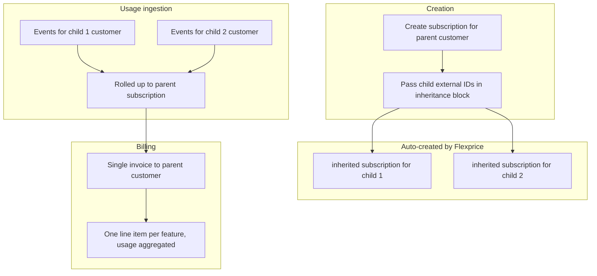

## Overview

Consolidated billing lets an enterprise or holding company purchase one plan that covers multiple subsidiary teams or entities. Each child customer generates usage independently, but all usage aggregates under the parent subscription, producing a single invoice for the parent.

`subscription_type` results:

- Parent subscription: **`parent`**
- Each child: **`inherited`** (auto-created skeleton, no line items)

## How it works



| Property | Where it lives |
| -------- | -------------- |
| Plan and line items | Parent subscription |
| Usage tracking (billing) | Parent subscription (rolled up from all children) |
| Usage tracking (analytics) | Per child customer (use `include_children` to aggregate) |
| Invoice | Parent customer only |
| Wallet | Parent customer |
| Entitlements | Parent subscription |
| Child subscriptions | Skeleton only: no line items, no independent invoice |

## When to use consolidated billing

- **Enterprise with subsidiaries**: Global HQ purchases an enterprise plan. Regional divisions (APAC, EMEA, Americas) each generate usage independently. HQ receives one consolidated invoice.
- **Holding company**: A holding company owns multiple brands. Each brand operates as a customer. Finance at HQ handles all invoices.
- **Internal chargeback**: A company tracks usage per department for internal reporting, but the central IT team is invoiced.

## Prerequisites

- Parent customer created in Flexprice
- Each child customer created in Flexprice (with a known `external_id`)
- A plan created in the product catalogue
- Child customers must **not** already have an active `inherited` subscription under another parent

<Note>
  On create, you cannot combine `inheritance.external_customer_ids_to_inherit_subscription` with `invoicing_customer_external_id` or `subscriptions_ids_for_grouped_invoicing` in the same request.
</Note>

## Configure

### Step 1: Create customers

Create the parent customer and each child customer through the Dashboard or API. Customer records have no hierarchy fields; they stay flat.

### Step 2: Create the parent subscription with child inheritance

<Tabs>
  <Tab title="Dashboard">
    1. Navigate to **Subscriptions** and click **Create Subscription**
    2. Select the **parent customer** and choose a plan
    3. In the **Customer Hierarchy** section, enter the external IDs of the child customers who will inherit this subscription
    4. Click **Create Subscription**

    <Frame>
      
    </Frame>
  </Tab>
  <Tab title="API">
    ```bash
    curl -X POST https://api.flexprice.io/v1/subscriptions \
      -H "Authorization: Bearer YOUR_API_KEY" \
      -H "Content-Type: application/json" \
      -d '{
        "external_customer_id": "ext-global-hq",
        "plan_id": "plan_enterprise_monthly",
        "currency": "usd",
        "billing_period": "month",
        "billing_period_count": 1,
        "start_date": "2026-06-01T00:00:00Z",
        "inheritance": {
          "external_customer_ids_to_inherit_subscription": [
            "ext-apac-team",
            "ext-emea-team"
          ]
        }
      }'
    ```

    Response (abbreviated):

    ```json
    {
      "id": "sub_01parent",
      "subscription_type": "parent",
      "customer_id": "cus_hq",
      "status": "active"
    }
    ```

    Flexprice automatically creates an `inherited` skeleton subscription for each child external ID. Verify by calling `GET /subscriptions` filtered by the child customer.
  </Tab>
</Tabs>

### Step 3: Verify

Open the parent subscription's detail page. Child skeleton subscriptions appear under it.

## Post-creation changes

You can add additional child customers to an existing parent subscription using the modify API.

<Tabs>
  <Tab title="API">
    ```bash
    curl -X POST https://api.flexprice.io/v1/subscriptions/{parent_subscription_id}/modify/execute \
      -H "Authorization: Bearer YOUR_API_KEY" \
      -H "Content-Type: application/json" \
      -d '{
        "type": "inheritance",
        "inheritance_params": {
          "external_customer_ids_to_inherit_subscription": ["ext-latam-team"]
        }
      }'
    ```

    Replace `{parent_subscription_id}` with the `id` of the parent subscription.

    You can preview the modify operation without committing changes using `POST /subscriptions/{id}/modify/preview` with the same request body.
  </Tab>
</Tabs>

## Analytics: per-child and aggregated

Inherited children do **not** appear in billing usage summaries. All billable usage is attributed to the parent subscription. For analytics (non-billing), use `POST /events/analytics`.

**Aggregate all children under the parent:**

```bash
curl -X POST https://api.flexprice.io/v1/events/analytics \
  -H "Authorization: Bearer YOUR_API_KEY" \
  -H "Content-Type: application/json" \
  -d '{
    "external_customer_id": "ext-global-hq",
    "start_time": "2026-06-01T00:00:00Z",
    "end_time": "2026-06-30T23:59:59Z",
    "include_children": true
  }'
```

**Per-child usage breakdown:**

```bash
curl -X POST https://api.flexprice.io/v1/events/analytics \
  -H "Authorization: Bearer YOUR_API_KEY" \
  -H "Content-Type: application/json" \
  -d '{
    "external_customer_id": "ext-apac-team",
    "start_time": "2026-06-01T00:00:00Z",
    "end_time": "2026-06-30T23:59:59Z"
  }'
```

<Note>
  `include_children: true` aggregates all inherited children's usage into the parent's response. Query each child's `external_customer_id` individually to see per-child contribution.
</Note>

<Warning>
  [**Get customer usage summary**](/api-reference/customers/get-customer-usage-summary) for a child that only has an **inherited** subscription returns **no billable usage** on that child. This is expected. Confirm totals on the **parent** customer or use analytics as above.
</Warning>

## Validations and constraints

<Warning>
  **Child already has an inherited subscription.** A customer that already has an `inherited` subscription under another parent cannot be added as a child here. Error: `"customer already has an inherited subscription"`. Resolve: cancel the existing inherited subscription or use a different child customer.
</Warning>

<Warning>
  **Inherited subscriptions cannot be cancelled directly.** Calling cancel on an `inherited` subscription returns an error: `"inherited subscription cannot be cancelled directly"`. Cancel the **parent** subscription instead. All inherited children are cancelled automatically at the same time.
</Warning>

<Note>
  **Cascade behavior.** When the parent subscription is paused, resumed, or cancelled, all inherited children are updated to match automatically.
</Note>

<Note>
  **Wallet balance.** The parent customer's wallet is used for all settlement. Inherited children have no independent wallet balance for this subscription.
</Note>

<Note>
  **Mutual exclusion.** The `inheritance.external_customer_ids_to_inherit_subscription` field cannot be combined with `invoicing_customer_external_id` or `subscriptions_ids_for_grouped_invoicing` in the same request.
</Note>

## Frequently asked questions

<AccordionGroup>
  <Accordion title="Can parent and child subscriptions use different currencies?">
    No. Currency is set on the parent subscription and applies to all invoices. Inherited children use the parent's currency.
  </Accordion>

  <Accordion title="What happens to inherited subscriptions when the parent is upgraded?">
    Plan changes apply to the parent subscription only. Inherited skeleton subscriptions keep routing usage events to the updated parent.
  </Accordion>

  <Accordion title="Why does getCustomerUsageSummary return zero usage for my child customer?">
    Billable usage for inherited subscriptions is attributed to the **parent** subscription. A child with only an inherited subscription has no independent billing usage ledger. This is expected. Use `POST /events/analytics` for per-child breakdowns.
  </Accordion>
</AccordionGroup>

## Related workflows

<CardGroup cols={2}>
  <Card title="Delegated Invoicing" icon="arrow-right-arrow-left" href="/docs/subscriptions/billing-workflows/delegated-invoicing">
    When children need their own subscriptions but a third party pays
  </Card>
  <Card title="Grouped Invoicing" icon="layer-group" href="/docs/subscriptions/billing-workflows/grouped-invoicing">
    When separate subscriptions should merge into one invoice
  </Card>
</CardGroup>
