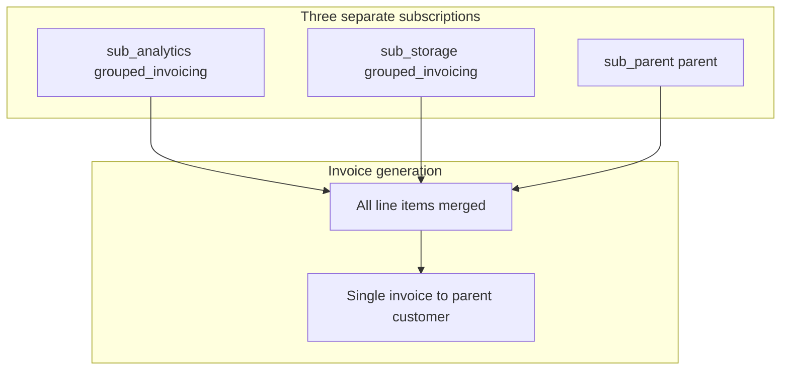

## Overview

Grouped invoicing lets a customer with multiple separate subscriptions receive a single invoice that combines all line items from every subscription in the group. Each subscription retains its own plan, line items, usage tracking, and entitlements. Only the invoice consolidation changes.

`subscription_type` results:

- Parent (invoice anchor): **`parent`**
- Each grouped child subscription: **`grouped_invoicing`**

<Note>
  A standalone subscription acting as the parent is **automatically promoted** to `parent` type when the first child is added.
</Note>

## How it works



| Property | Where it lives |
| -------- | -------------- |
| Plan and line items | Each child's own subscription |
| Usage tracking | Each child's own subscription |
| Entitlements | Each child's own subscription |
| Invoice | **Single consolidated invoice** to the parent subscription's customer |
| Wallet | Parent subscription's customer |

## When to use grouped invoicing

- **Multi-product company**: A company uses analytics, storage, and compute as three separate Flexprice subscriptions. Finance wants a single monthly invoice instead of three.
- **Department consolidation**: Different teams each have their own subscription. A central account manager wants one invoice per billing cycle.
- **Simplify payment**: A customer manages multiple subscriptions independently but wants to reduce invoice processing overhead.

## Prerequisites

Before adding a subscription to a grouped invoicing group, all of the following must be true:

| Requirement | What to check |
| ----------- | ------------- |
| Child subscription type | Must be `standalone` |
| Child subscription status | Must be `active` or `trialing` |
| Child has no existing parent | `parent_subscription_id` must be null |
| Parent subscription type | Must be `parent` or `standalone` (auto-promoted on first child add) |
| Parent subscription status | Must be `active` or `trialing` |
| Billing period | Child and parent must have the **same** `billing_period` (for example both `month`) |
| Billing period count | Child and parent must have the **same** `billing_period_count` (for example both `1`) |
| Billing anchor | Child and parent must share the **same** day-of-month and time-of-day billing anchor |
| Currency | Child and parent must use the **same** currency |
| Start date | Child `start_date` must be **on or after** parent `start_date` |

<Warning>
  Flexprice validates all of these requirements before adding a subscription to a group. A single mismatch returns a validation error with a specific hint. Check the error's `hint` field for which constraint failed.
</Warning>

## Configure

### Option A: Create a parent subscription and group existing subscriptions at creation time

Use this when you already have standalone subscriptions that you want to group under a new parent.

<Tabs>
  <Tab title="API">
    ```bash
    curl -X POST https://api.flexprice.io/v1/subscriptions \
      -H "Authorization: Bearer YOUR_API_KEY" \
      -H "Content-Type: application/json" \
      -d '{
        "external_customer_id": "ext-acme-corp",
        "plan_id": "plan_base_monthly",
        "currency": "usd",
        "billing_period": "month",
        "billing_period_count": 1,
        "start_date": "2026-06-01T00:00:00Z",
        "inheritance": {
          "subscriptions_ids_for_grouped_invoicing": [
            "sub_analytics",
            "sub_storage"
          ]
        }
      }'
    ```

    This creates a new `parent` subscription and converts `sub_analytics` and `sub_storage` from `standalone` to `grouped_invoicing` type.

    Response (abbreviated):

    ```json
    {
      "id": "sub_01parent",
      "subscription_type": "parent",
      "customer_id": "cus_acme",
      "status": "active"
    }
    ```
  </Tab>
</Tabs>

<Note>
  At creation, `subscriptions_ids_for_grouped_invoicing` cannot be combined with `external_customer_ids_to_inherit_subscription`, `invoicing_customer_external_id`, or `parent_subscription_id` in the same request.
</Note>

### Option B: Add a subscription to an existing group

Use this when the parent already exists and you want to add more subscriptions to the group.

<Tabs>
  <Tab title="API (preview first)">
    Preview before executing to confirm all constraints will pass:

    ```bash
    curl -X POST https://api.flexprice.io/v1/subscriptions/{parent_subscription_id}/modify/preview \
      -H "Authorization: Bearer YOUR_API_KEY" \
      -H "Content-Type: application/json" \
      -d '{
        "type": "grouped_invoicing",
        "grouped_invoicing_params": {
          "action": "add",
          "parent_subscription_id": "{parent_subscription_id}",
          "child_subscription_ids": ["sub_compute"]
        }
      }'
    ```
  </Tab>
  <Tab title="API (execute)">
    ```bash
    curl -X POST https://api.flexprice.io/v1/subscriptions/{parent_subscription_id}/modify/execute \
      -H "Authorization: Bearer YOUR_API_KEY" \
      -H "Content-Type: application/json" \
      -d '{
        "type": "grouped_invoicing",
        "grouped_invoicing_params": {
          "action": "add",
          "parent_subscription_id": "{parent_subscription_id}",
          "child_subscription_ids": ["sub_compute"]
        }
      }'
    ```

    Replace `{parent_subscription_id}` with the parent subscription's `id`. The same ID goes in both the URL and `grouped_invoicing_params.parent_subscription_id`.

    On success, `sub_compute` is converted from `standalone` to `grouped_invoicing` and linked to the parent.
  </Tab>
</Tabs>

### Option C: Remove a subscription from the group

<Tabs>
  <Tab title="API">
    ```bash
    curl -X POST https://api.flexprice.io/v1/subscriptions/{parent_subscription_id}/modify/execute \
      -H "Authorization: Bearer YOUR_API_KEY" \
      -H "Content-Type: application/json" \
      -d '{
        "type": "grouped_invoicing",
        "grouped_invoicing_params": {
          "action": "remove",
          "child_subscription_ids": ["sub_compute"]
        }
      }'
    ```

    On success, `sub_compute` reverts from `grouped_invoicing` back to `standalone` and its `parent_subscription_id` is cleared.
  </Tab>
</Tabs>

## Post-creation changes

Adding or removing group membership is done with the modify API (`Option B` and `Option C` above). There is no separate PATCH on the subscription resource for grouped invoicing membership beyond these flows.

## Timing behavior

<Note>
  **Adding a subscription to a group** takes effect at the **next billing period boundary**. For the current period, any advance charges on the child have already been invoiced independently. Only usage accrued after the period rolls over appears on the consolidated parent invoice.
</Note>

<Note>
  **Removing a subscription from a group** applies to the **entire current billing period**. The child's invoice for the full current period (all usage and charges) is raised directly against the child customer's subscription, regardless of when during the period the removal occurred.
</Note>

## Analytics

Each subscription in the group has its own usage tracking. Query each subscription owner's `external_customer_id` individually. There is no `include_children` flag for grouped invoicing; that flag is for consolidated billing and inherited subscriptions only.

## Validations and constraints

<Warning>
  **Billing period, billing period count, billing anchor, and currency must all match exactly.** The billing anchor comparison uses the day-of-month plus time-of-day (hour:minute:second). Year and month are ignored, so a child added later in the year is accepted when its intra-cycle cadence aligns.
</Warning>

<Warning>
  **Cannot combine with consolidated billing at creation.** `subscriptions_ids_for_grouped_invoicing` cannot be used in the same request as `external_customer_ids_to_inherit_subscription`, `invoicing_customer_external_id`, or `parent_subscription_id`.
</Warning>

<Note>
  **Standalone parent auto-promotion.** If the parent subscription is currently `standalone`, it is automatically promoted to `parent` type when the first child is added via the modify API. No manual type change is needed.
</Note>

## Frequently asked questions

<AccordionGroup>
  <Accordion title="Can I preview whether a subscription can be added to a group?">
    Yes. Use `POST /subscriptions/{id}/modify/preview` with `type: "grouped_invoicing"` and `action: "add"`. The preview validates constraints and returns what would change without making writes.
  </Accordion>

  <Accordion title="What happens if I cancel one child subscription in the group?">
    The cancelled child generates its own final invoice for the current period. The remaining children and the parent continue their normal billing cycle.
  </Accordion>

  <Accordion title="Can I have both grouped invoicing children and inherited children under the same parent subscription?">
    No. A subscription has one type. Grouped invoicing and consolidated billing use different mechanisms and cannot be mixed on the same parent subscription.
  </Accordion>
</AccordionGroup>

## Related workflows

<CardGroup cols={2}>
  <Card title="Consolidated Billing" icon="building-columns" href="/docs/subscriptions/billing-workflows/consolidated-billing">
    When one parent plan should cover multiple customers
  </Card>
  <Card title="Delegated Invoicing" icon="arrow-right-arrow-left" href="/docs/subscriptions/billing-workflows/delegated-invoicing">
    When a third party should receive the invoice for a standalone subscription
  </Card>
</CardGroup>
