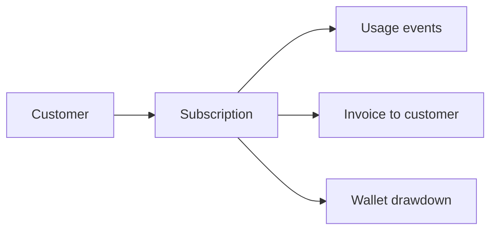

## Overview

Standalone is the default `subscription_type` in Flexprice. Every subscription is standalone unless you explicitly configure one of the other billing workflows. Use it whenever customers are fully independent: each has their own plan, usage ledger, invoice, and wallet.

`subscription_type` result: **`standalone`**

## How it works



Each subscription is self-contained:

| Property | Where it lives |
| -------- | -------------- |
| Plan and line items | Subscription |
| Usage tracking | Customer |
| Invoice | Customer (the subscription owner) |
| Wallet | Customer |
| Entitlements | Subscription |

## When to use standalone

- **Direct SaaS**: Your customers sign up directly. Each company or user is an independent billing entity with no relationship to other customers.
- **Multi-product**: One customer uses several of your products, each as a separate subscription. Each subscription invoices independently.
- **Default**: You are not sure which workflow to use yet. Start here and migrate later.

## Prerequisites

- A customer created in Flexprice (`POST /customers` or Dashboard)
- A plan created in the product catalogue

## Configure

<Tabs>
  <Tab title="Dashboard">
    1. Navigate to **Subscriptions** and click **Create Subscription**
    2. Select the customer
    3. Choose a plan
    4. Set start date, billing period, and any overrides
    5. Click **Create Subscription**

    No additional configuration is needed. A subscription created without any `inheritance` fields is automatically standalone.
  </Tab>
  <Tab title="API">
    ```bash
    curl -X POST https://api.flexprice.io/v1/subscriptions \
      -H "Authorization: Bearer YOUR_API_KEY" \
      -H "Content-Type: application/json" \
      -d '{
        "external_customer_id": "cust-acme",
        "plan_id": "plan_enterprise_monthly",
        "currency": "usd",
        "billing_period": "month",
        "billing_period_count": 1,
        "start_date": "2026-06-01T00:00:00Z"
      }'
    ```

    Response (abbreviated):

    ```json
    {
      "id": "sub_01abc",
      "subscription_type": "standalone",
      "customer_id": "cus_acme",
      "status": "active"
    }
    ```
  </Tab>
</Tabs>

## Post-creation changes

Standalone subscriptions support the standard subscription lifecycle and modification APIs (plan changes, pauses, overrides, and so on). There is no hierarchy or invoicing redirect to update. If you later need consolidated billing, delegated invoicing, or grouped invoicing, use the workflows in those guides and create or modify subscriptions accordingly.

## Analytics

Usage analytics behave like any normal subscription. Call [**Get usage analytics**](/api-reference/events/get-usage-analytics) (`POST /events/analytics`) with the subscriber's `external_customer_id`. You do not need `include_children` (that flag applies to consolidated billing rollups only).

## Validations and constraints

<Note>
  A customer that already has an **inherited** subscription (from a consolidated billing parent) cannot create a standalone subscription. If you need a standalone subscription for such a customer, remove them from the parent hierarchy first.
</Note>

## Related workflows

<CardGroup cols={2}>
  <Card title="Consolidated Billing" icon="building-columns" href="/docs/subscriptions/billing-workflows/consolidated-billing">
    When one parent contract should cover multiple customers
  </Card>
  <Card title="Delegated Invoicing" icon="arrow-right-arrow-left" href="/docs/subscriptions/billing-workflows/delegated-invoicing">
    When a third party should receive the invoice
  </Card>
  <Card title="Grouped Invoicing" icon="layer-group" href="/docs/subscriptions/billing-workflows/grouped-invoicing">
    When separate subscriptions should merge into one invoice
  </Card>
</CardGroup>
