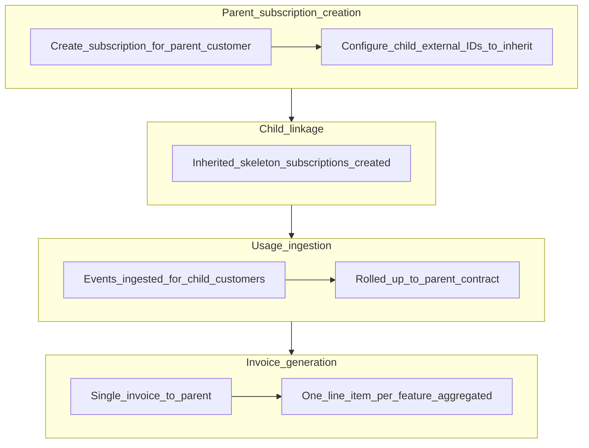

<Tip>
  **Customer = identity, Subscription = contract, Hierarchy = subscription
  configuration**
</Tip>

## Overview

**Customer Hierarchy** is an enterprise feature for configuring billing relationships on each subscription. Flexprice keeps **customers** flat (no parent fields on customer records). All hierarchy behavior lives on the **subscription**, so you can mix models per contract without restructuring customer data.

With Customer Hierarchy you can:

- Send invoices to a different customer than the one using the service (**delegated payer**)
- Cover many customers with one parent subscription and roll up usage into a single invoice (**consolidated subscription**)
- Change how a subscription bills without editing customer records

## Two ways to use Customer Hierarchy

Customer Hierarchy supports two independent patterns. Pick one based on who owns the plan and line items:

|                                    | Consolidated subscription                                             | Delegated payer                                                                  |
| ---------------------------------- | --------------------------------------------------------------------- | -------------------------------------------------------------------------------- |
| **Plan & line items**              | Owned by the parent subscription                                      | Owned by the child's subscription                                                |
| **Billing, usage summary, wallet** | **Parent** customer (rolled up from all inherited children)           | **Child** subscription; invoices settle against the **delegated payer's** wallet |
| **Usage events & identity**        | Still associated with **child** customers for ingestion and analytics | Child customer (their own subscription)                                          |
| **Invoice goes to**                | Parent customer                                                       | A specified billing customer (bill-to)                                           |
| **Best for**                       | Enterprise: one plan, many subsidiaries                               | Reseller: each customer has their own plan, a central payer                      |
| **API field**                      | `inheritance.external_customer_ids_to_inherit_subscription`           | `inheritance.invoicing_customer_external_id`                                     |

<Note>
  These two modes are mutually exclusive. You cannot combine
  `external_customer_ids_to_inherit_subscription` and
  `invoicing_customer_external_id` in the same subscription.
</Note>

## How it works

Every subscription has a `subscription_type` that describes its role in a hierarchy:

| Type         | Description                                                                                                                                |
| ------------ | ------------------------------------------------------------------------------------------------------------------------------------------ |
| `standalone` | A regular subscription with no hierarchy relationship (default)                                                                            |
| `parent`     | Owns the plan and line items; usage from child subscriptions rolls up here                                                                 |
| `inherited`  | A skeleton subscription auto-created for each child customer; it carries no line items, and events are matched via the parent subscription |

Customers remain flat entities. There are no parent fields on a customer record; hierarchy is configured only on subscriptions.

<Note>
  **Key design principles (consolidated mode)** Hierarchy lives at the
  **subscription** layer, not on customer records. That gives you **clear
  billing ownership**, **centralized wallet management**, and **scalable
  multi-tenant usage tracking** on a single parent contract. The tradeoff:
  **child-level isolation is logical** (you can still break out analytics per
  child), **not financial**. Children with only inherited subscriptions are not
  separate billing entities for usage summary, wallet balance, or invoices.
</Note>

## Visual flow (consolidated subscription)

The diagrams and screenshots below apply to **consolidated subscription** mode: a `parent` subscription plus `inherited` skeleton subscriptions for each child.

### End-to-end flow



### Dashboard: add customers to inherit

Use the **Add customers to inherit** flow when linking child customers to the parent subscription (wording and entry point may vary slightly by dashboard version).

<Frame>
  
</Frame>

### Dashboard: inherited subscription on a child

On a **child** customer, the **Inherited subscriptions** view shows the parent they inherit from, the plan, and key dates.

<Frame>
  
</Frame>

The **parent subscription** creation screen (with inheritance configured) is shown in [Step 2: Create the parent subscription](#step-2-create-the-parent-subscription) below.

## Usage tracking behavior (inherited subscriptions)

For **consolidated subscription** setups only (not delegated payer):

- **Usage for billing** is tracked at the **parent** subscription. Inherited children do **not** keep a separate billing usage ledger.
- [**Get customer usage summary**](/api-reference/customers/get-customer-usage-summary) (`getCustomerUsageSummary`, `GET /customers/usage`) for a **child** customer that only has an **inherited** subscription returns **no billable usage** on that child. Usage is attributed to the **parent** contract.
- [**Get wallet balance**](/api-reference/wallets/get-wallet-balance) (`getWalletBalance`, `GET /wallets/{id}/balance/real-time`) does **not** represent an independent prepaid balance for inherited-only children. Query the **parent** customer's wallet for consolidated billing state.

<Warning>
  A child customer showing **zero** usage in usage-summary APIs while events are
  ingested for that customer is **expected** for inherited subscriptions.
  Confirm totals on the **parent** customer or use **analytics** (next section)
  for per-child breakdowns.
</Warning>

## Analytics behavior

Analytics are more flexible than billing aggregates:

- **Per-child contribution:** call [**Get usage analytics**](/api-reference/events/get-usage-analytics) (`getUsageAnalytics`, `POST /events/analytics`) with the **child** `external_customer_id` (and any filters you already use, such as time range or `group_by`).
- **Aggregated view at the parent:** use the same endpoint scoped to the **parent** and include child usage in the aggregation:

```json
{
  "include_children": true
}
```

Add this alongside the other fields your request already sends (for example `external_customer_id`, `start_time`, `end_time`, and `group_by`).

## Wallet and balance semantics (consolidated mode)

In **consolidated subscription** mode:

- The **wallet** used for settlement is the **parent** customer's wallet (the invoicing customer for the parent subscription).
- **Balance** reflects credits and drawdowns **aggregated across all children** covered by that parent subscription.
- Wallet-related APIs therefore reflect **global parent-level state**, not a separate financial balance per inherited child.

## Invoice behavior (consolidated mode)

In **consolidated subscription** mode:

- Invoices are generated **only** for the **parent** customer.
- The invoice structure is **one line item per feature** (or priced line), with **usage from all children aggregated** into that line item.
- There are **no child-level invoices** for inherited skeleton subscriptions.

## Consolidated subscription

Use this when **one plan** covers multiple customers and you want **one invoice** to the parent (usage roll-up on a single contract).

Flexprice implements this with a **parent** subscription plus **inherited** skeleton subscriptions for each child. Inherited subscriptions have no line items of their own; usage from child customers is matched and aggregated through the parent.

**Example:** Global Corp HQ purchases an enterprise plan. APAC Team and EMEA Team each generate usage, but HQ receives one invoice.

### Step 1: Create customers

Create the parent customer and each child customer through the Dashboard or API. Customer records have no hierarchy fields; they stay flat.

### Step 2: Create the parent subscription

<Tabs>
  <Tab title="Dashboard">
    1. Navigate to **Subscriptions** and click **Create Subscription**
    2. Select the **parent customer** and choose a plan
    3. In the **Customer Hierarchy** section, add the external IDs of the child customers who will inherit this subscription
    4. Click **Create Subscription**

    <Frame>
      
    </Frame>

  </Tab>
  <Tab title="API">
    ```http
    POST /subscriptions
    {
      "customer_id": "cus_hq_internal_id",
      "external_customer_id": "ext-global-hq",
      "plan_id": "plan_enterprise",
      "currency": "usd",
      "billing_period": "month",
      "billing_period_count": 1,
      "inheritance": {
        "external_customer_ids_to_inherit_subscription": [
          "ext-apac-team",
          "ext-emea-team"
        ]
      }
    }
    ```
  </Tab>
</Tabs>

### What Flexprice creates

When you submit the request above, Flexprice:

1. Creates the **parent subscription** with `subscription_type: parent` for the HQ customer
2. Auto-creates an **inherited skeleton subscription** (`subscription_type: inherited`) for each child external ID
3. Keeps inherited subscriptions free of plan line items; usage events from child customers are matched and aggregated via the parent subscription

### Step 3: Verify

Open the parent subscription's detail page. Child skeleton subscriptions appear under it.

## Delegated payer

Use this when each end customer has their **own** subscription (plan, line items, and usage on the child), but a **different customer** should be the **bill-to** party: invoices, tax, and wallet drawdown follow that **delegated payer** (for example a parent company or reseller).

**Example:** A reseller manages 10 end customers, each on their own starter plan. The reseller receives and pays all related invoices centrally.

### Step 1: Create customers

Create the subscription owner (child) and the billing customer separately. Neither customer record has hierarchy fields.

### Step 2: Create the subscription with a delegated payer

<Tabs>
  <Tab title="Dashboard">
    1. Navigate to **Subscriptions** and click **Create Subscription**
    2. Select the **child customer** as the subscription owner
    3. Choose a plan
    4. In the **Invoice To** field, select or enter the delegated payer's external ID (the customer who will receive the invoice)
    5. Click **Create Subscription**

  </Tab>
  <Tab title="API">
    ```http
    POST /subscriptions
    {
      "customer_id": "cus_child_internal_id",
      "external_customer_id": "ext-end-customer",
      "plan_id": "plan_starter",
      "currency": "usd",
      "billing_period": "month",
      "billing_period_count": 1,
      "inheritance": {
        "invoicing_customer_external_id": "ext-reseller"
      }
    }
    ```
  </Tab>
</Tabs>

### What Flexprice creates

- Subscription is created with `subscription_type: standalone` on the child customer
- Plan, line items, entitlements, and usage tracking all remain on the child
- Invoices are issued to the delegated payer (`ext-reseller`)
- The delegated payer's wallet and payment methods are used for settlement

<Note>
  The invoicing customer is set at subscription creation and cannot be changed
  afterwards. If you need to change it, cancel the subscription and create a new
  one.
</Note>

## Invoice and payment behavior

|                           | Consolidated subscription                                                                     | Delegated payer                         |
| ------------------------- | --------------------------------------------------------------------------------------------- | --------------------------------------- |
| **Usage for billing**     | **Parent** subscription (rolled up; child usage-summary APIs show no isolated billable usage) | Child customer (their own subscription) |
| **Invoice generated for** | Parent customer only (one line item per feature, usage aggregated across children)            | Delegated payer (billing customer)      |
| **Wallet deducted from**  | Parent customer                                                                               | Delegated payer                         |
| **Tax based on**          | Parent customer's billing details                                                             | Delegated payer's billing details       |
| **Currency**              | Set at the parent subscription                                                                | Set at the child subscription           |

## Use cases

**Enterprise with subsidiaries** _(Consolidated subscription)_

Global HQ purchases a plan. Regional divisions (APAC, EMEA, Americas) each generate usage independently, but HQ receives **one consolidated invoice** to the parent, typically **one line item per feature** with usage **aggregated across divisions** (use analytics with `include_children` or per-child queries to see each division's contribution).

**Reseller / partner model** _(Delegated payer)_

A reseller signs up their clients as separate customers in Flexprice. Each client has their own subscription and usage tracking, but the reseller receives and pays all invoices.

**Department-level billing** _(Consolidated subscription or delegated payer)_

A company's central IT or Finance team handles vendor payments. Engineering, Marketing, and Sales each track their own usage, and invoices roll up to the central team (or the central team is set as the delegated payer, depending on your model).

**Multi-brand holding company** _(Consolidated subscription)_

A holding company owns multiple brands. Each brand operates independently as a customer with its own subscriptions. The holding company's finance department receives all invoices.

## Frequently asked questions

<AccordionGroup>
  <Accordion title="Can parent and child subscriptions use different currencies?">
    In **consolidated subscription** mode, currency is set on the parent subscription and applies to all invoices generated for it. Child inherited subscriptions use the parent's currency.

    In **delegated payer** mode, each subscription sets its own currency independently, since each child owns a full subscription.

  </Accordion>

<Accordion title="How does tax work?">
  Tax uses the **invoicing customer's** billing details: the parent customer in
  consolidated subscription mode, or the delegated payer in delegated payer
  mode. The subscription owner's billing address is not used for tax in either
  pattern.
</Accordion>

<Accordion title="How does wallet drawdown work?">
  The wallet is deducted from the invoicing customer's balance, not the
  subscription owner's. In consolidated subscription mode, the parent customer's
  wallet is drawn down (balance reflects aggregated usage across inherited
  children). In delegated payer mode, the delegated payer's wallet is used.
</Accordion>

<Accordion title="Why does getCustomerUsageSummary show no usage for my child customer?">
  In **consolidated subscription** mode, billable usage is attributed to the
  **parent** subscription. A child with only an **inherited** subscription does
  not have a separate billing usage ledger, so usage-summary APIs for that child
  can correctly return **no usage**. Use the **parent** customer for billing
  summaries, or use [**Get usage
  analytics**](/api-reference/events/get-usage-analytics) for per-child
  breakdowns (and `include_children` when querying the parent for a rolled-up
  analytics view).
</Accordion>

<Accordion title="What happens when the parent subscription is upgraded or downgraded?">
  Plan changes apply to the parent subscription only. Inherited skeleton
  subscriptions are not directly affected; they keep routing usage events to the
  updated parent. (This applies to **consolidated subscription** setups with a
  `parent` subscription.)
</Accordion>

<Accordion title="What happens when the parent subscription is cancelled?">
  A final invoice is generated for the invoicing customer. Inherited skeleton
  subscriptions linked to the parent are cancelled at the same time. (This
  applies to **consolidated subscription** mode.)
</Accordion>

  <Accordion title="Can I change the invoicing customer after a subscription is created?">
    No. The invoicing customer is set at creation time and is immutable. To change it, cancel the existing subscription and create a new one with the correct `invoicing_customer_external_id`.
  </Accordion>
</AccordionGroup>
