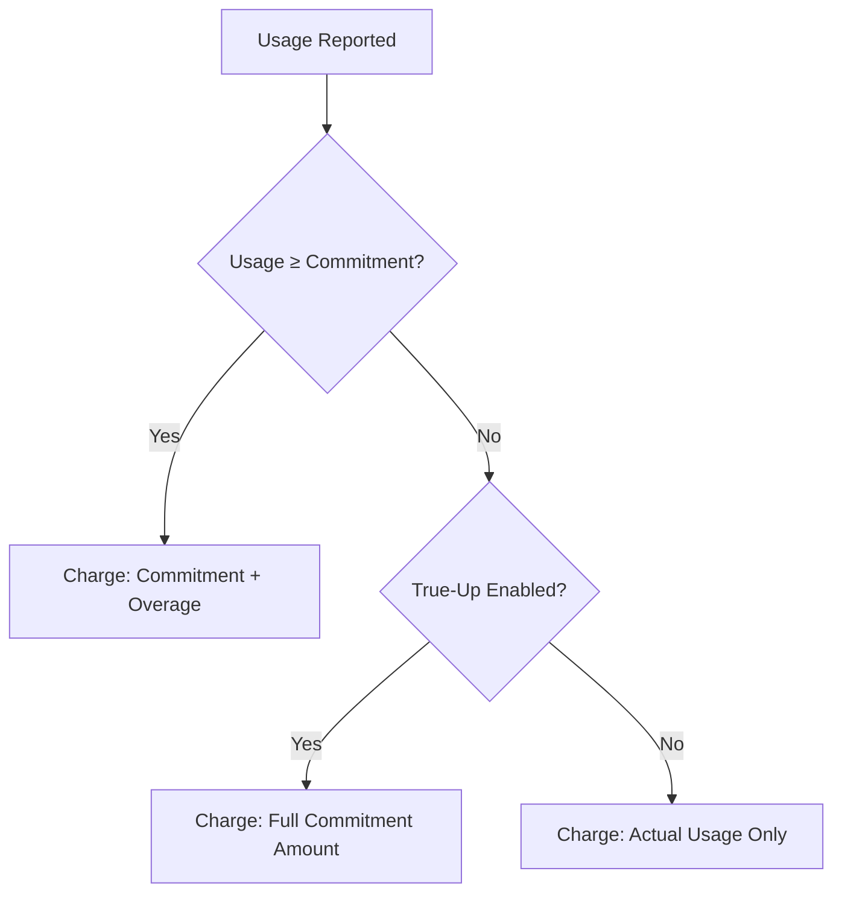

Reservation discount (also called **commitment discount**) lets you guarantee a minimum spend or usage level on any metered charge, charge a premium for usage above that level, and optionally enforce the minimum even when actual usage falls short all configurable per charge, per subscription.

### Who is it for?

- **Cloud infrastructure** — GPU/CPU reservations, storage commitments
- **AI / ML platforms** — inference-hour commitments, training-job minimums
- **SaaS & API providers** — API-call or data-transfer commitments

---

## Key Terminology

|  |  |
|------|-----------|
| **Commitment** | The guaranteed minimum a customer agrees to for a billing period. Can be expressed as a currency amount (e.g. $1,000/month) or a unit quantity (e.g. 500 GPU-hours/month). |
| **Overage** | Usage above the commitment. Charged at **unit price × overage factor** — the factor can add a premium (1.5×), keep the same rate (1.0×), or even discount excess (0.8×). |
| **Overage Factor** | A multiplier applied to the excess cost beyond the commitment. 1.5× = 50% premium, 1.0× = no premium, 0.8× = 20% discount on excess. |
| **True-Up** | When enabled, the customer always pays at least the full commitment amount — even if actual usage is lower. The shortfall is added as a true-up fee. When disabled, the customer pays only for what they used. |
| **Commitment Type: Amount** | Customer commits to a minimum **amount** per period. |
| **Commitment Type: Quantity** | Customer commits to a minimum **number of units** per period. The commitment cost is derived as quantity × unit price. |

---

## How Billing Works

For each billing period, Flexprice evaluates one of two outcomes:



- **Usage ≥ Commitment →** Total = Commitment + (Usage Cost − Commitment) × Overage Factor. The customer pays the committed amount at standard rate, plus a premium on everything above it.
- **Usage < Commitment, True-Up enabled →** Customer pays the full commitment amount (shortfall added as true-up fee).
- **Usage < Commitment, True-Up disabled →** Customer pays only for actual usage.

---

## Example 1 — AI Inference Platform (Per-Period Commitment)

An AI platform sells inference compute at **$2 / vCPU-hour**. They want customers to commit to a minimum of **500 vCPU-hours/month** and charge a **1.5× premium** on any usage above that.

<Steps>
  <Step title="Requirement">
    | Parameter | Value |
    |-----------|-------|
    | Metered charge | vCPU-hours |
    | Unit price | $2 / vCPU-hour |
    | Commitment | 500 vCPU-hours/month (= $1,000/month) |
    | Overage factor | 1.5× |
    | True-up | Enabled |
  </Step>

  <Step title="Pricing in the plan">
    The vCPU-hours line item is configured with a unit price of $2 / vCPU-hour in the pricing plan.

    <Frame>
      
    </Frame>
  </Step>
  <Step title="Configure commitment from the line item">
    Navigate to **Customers** → Select a customer → **Add Subscription**, and select your pricing plan. Once the plan is loaded, click the three-dot menu (`...`) next to the vCPU-hours charge and select **Configure Commitment**.

    <Frame>
      
    </Frame>
  </Step>

  <Step title="Configure the commitment details">
    In the configuration modal, set the commitment type to **Quantity** with a value of **500**, apply an overage factor of **1.5x**, and enable **True Up**. Save the commitment and proceed to create the subscription.

    <Frame>
      
    </Frame>
  </Step>

  <Step title="Scenario 1 — Usage exceeds commitment (700 vCPU-hours)">
    ```
    Usage:              700 vCPU-hours
    Usage cost:         700 × $2        = $1,400
    Commitment cost:    500 × $2        = $1,000
    Overage:            $1,400 − $1,000 = $400
    Overage charge:     $400 × 1.5      = $600

    Total Invoice:      $1,000 + $600   = $1,600
    ```

    {/* <Frame>
      
    </Frame> */}
  </Step>

  <Step title="Scenario 2 — Usage below commitment, true-up enabled (300 vCPU-hours)">
    True-up is enabled so the full commitment is enforced.

    ```
    Usage:              300 vCPU-hours
    Usage cost:         300 × $2        = $600
    Commitment cost:                      $1,000
    Shortfall:          $1,000 − $600   = $400
    True-up fee:                          $400

    Total Invoice:                        $1,000 (commitment enforced)
    ```

    {/* <Frame>
      
    </Frame> */}
  </Step>

  <Step title="Scenario 3 — Usage below commitment, true-up disabled (300 vCPU-hours)">
    Same usage but with true-up turned off. The customer pays only for what they consumed.

    ```
    Usage:              300 vCPU-hours
    Usage cost:         300 × $2        = $600

    Total Invoice:                        $600 (actual usage only)
    ```
  </Step>
</Steps>

---

## Example 2 — Cloud Infra Company (Windowed Commitment)

A cloud infrastructure company sells GPU compute at **$2 / GPU-hour**. Instead of a single monthly commitment, they want to commit customers on an **hourly basis** — a minimum of **10 GPU-hours every hour**. Each hour settles independently and the totals are summed at the end of the billing period.

<Note>
  Windowed commitment is available only on **bucketed** features. The window size is inherited from the meter's bucket configuration.
</Note>

<Steps>
  <Step title="Requirement">
    | Parameter | Value |
    |-----------|-------|
    | Metered charge | GPU-hours |
    | Unit price | $2 / GPU-hour |
    | Commitment | 10 GPU-hours per hour (= $20/hour) |
    | Overage factor | 1.5× |
    | True-up | Enabled |
    | Window | Hourly |
  </Step>

  <Step title="Pricing in the plan">
    The GPU-hours line item is configured with a unit price of $2 / GPU-hour in the pricing plan.

    <Frame>
      
    </Frame>
  </Step>

  <Step title="Configure commitment from the line item">
    Navigate to **Customers** → Select a customer → **Add Subscription**, and select your pricing plan. Once the plan is loaded, click the three-dot menu (`...`) next to the GPU-hours charge and select **Configure Commitment**.

    <Frame>
      
    </Frame>
  </Step>

  <Step title="Configure the windowed commitment details">
    In the configuration modal, set the commitment type to **Quantity** with a value of **10**. Apply a **1.5x** overage factor, enable both **True Up** and **Windowed Commitment**, and save your changes before creating the subscription.

    <Frame>
      
    </Frame>
  </Step>

  <Step title="Hour 1 — Usage exceeds commitment (15 GPU-hours)">
    ```
    Usage cost:      15 × $2 = $30
    Commitment:      10 × $2 = $20
    Overage:         ($30 − $20) × 1.5 = $15
    Hour 1 charge:   $20 + $15 = $35
    ```
  </Step>

  <Step title="Hour 2 — Usage below commitment, true-up kicks in (6 GPU-hours)">
    ```
    Usage cost:      6 × $2 = $12
    Commitment:      $20
    True-up fee:     $20 − $12 = $8
    Hour 2 charge:   $20
    ```
  </Step>

  <Step title="Hour 3 — Usage matches commitment exactly (10 GPU-hours)">
    ```
    Usage cost:      10 × $2 = $20
    Commitment:      $20
    Hour 3 charge:   $20
    ```
  </Step>

  <Step title="Billing period total">
    ```
    Total:  $35 + $20 + $20 = $75
    ```

    {/* <Frame>
      
    </Frame> */}
  </Step>
</Steps>

---

<Note>
  Reservation discount applies per-charge commitment and overage. For a single minimum spend across the **entire subscription**, see [Commitment](/docs/subscriptions/commitment).
</Note>

