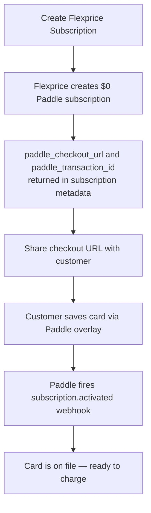
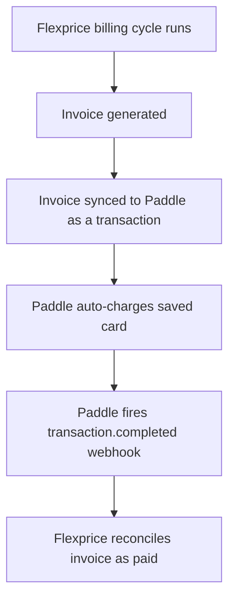

# Paddle Integration Docs Revamp Implementation Plan

> **For agentic workers:** REQUIRED SUB-SKILL: Use superpowers:subagent-driven-development (recommended) or superpowers:executing-plans to implement this plan task-by-task. Steps use checkbox (`- [ ]`) syntax for tracking.

**Goal:** Revamp the Paddle integration docs to reflect the new subscription-sync + checkout-based payment flow across two pages: an updated `connection-setup.mdx` and a new `integration-workflow.mdx`.

**Architecture:** Update one existing MDX file and create one new MDX file, then update `docs.json` nav. No code changes — docs only. Follow Mintlify MDX conventions (Frame, Steps, Step, Note components; Mermaid diagrams).

**Tech Stack:** Mintlify MDX, Mermaid diagrams, Flexprice docs patterns (same as Stripe integration docs).

**Spec:** `docs/superpowers/specs/2026-05-22-paddle-docs-revamp-design.md`

---

### Task 1: Update `connection-setup.mdx` — Overview & Webhook Events

**Files:**
- Modify: `integrations/paddle/connection-setup.mdx`

- [ ] **Step 1: Update the Overview bullet list**

Replace lines 8–14 in `integrations/paddle/connection-setup.mdx`:

Old:
```
A Paddle connection in Flexprice stores encrypted credentials that allow the system to interact with your Paddle account for:

- Creating customers and addresses in Paddle
- Syncing invoices to Paddle as transactions
- Processing payments via Flexprice Checkout (Paddle-hosted overlay)
- Receiving webhook notifications from Paddle
- Automatic reconciliation of payments between Paddle and Flexprice
```

New:
```
A Paddle connection in Flexprice stores encrypted credentials that allow the system to interact with your Paddle account for:

- Creating customers and addresses in Paddle
- Syncing subscriptions to Paddle for payment method collection via hosted checkout
- Syncing invoices to Paddle as transactions for automatic charging
- Receiving webhook notifications from Paddle
- Automatic reconciliation of payments between Paddle and Flexprice
```

- [ ] **Step 2: Update the webhook events table**

Find the **Required Webhook Events** section (currently around line 99–108). Replace the entire table:

Old:
```markdown
| Event Type | Purpose |
|------------|---------|
| `transaction.completed` | Track successful payment completions and reconcile invoices |
| `customer.created` | Sync customers created in Paddle to Flexprice |
| `address.created` | Update customer address mapping for invoice sync |
```

New:
```markdown
| Event Type | Purpose |
|------------|---------|
| `transaction.completed` | Track successful payment completions and reconcile invoices |
| `subscription.activated` | Detect when a customer has saved their payment method via checkout |
```

- [ ] **Step 3: Update the Next Steps section**

Find the **Next Steps** section at the bottom of the file. Replace it with:

```markdown
## Next Steps

After setting up your Paddle connection:

1. **Follow the Integration Workflow**: See the [Paddle Integration Workflow](/integrations/paddle/integration-workflow) for the complete end-to-end guide — subscription creation, customer checkout, and invoice auto-charge.
2. **Test in Sandbox**: Use `pdl_sdbx_` keys and Paddle's sandbox environment before going live.
3. **Monitor Webhooks**: Ensure `transaction.completed` and `subscription.activated` events are being received.

For detailed API documentation, see the [API Reference](/api-reference/introduction).
```

- [ ] **Step 4: Commit**

```bash
git add integrations/paddle/connection-setup.mdx
git commit -m "docs(paddle): update connection-setup with new webhook events and overview"
```

---

### Task 2: Create `integration-workflow.mdx`

**Files:**
- Create: `integrations/paddle/integration-workflow.mdx`

- [ ] **Step 1: Create the file with the full content**

Create `integrations/paddle/integration-workflow.mdx` with the following complete content:

```mdx
---
title: 'Paddle Integration Workflow'
description: 'End-to-end guide to the Paddle integration: subscription sync, customer checkout, and invoice auto-charge'
---

## Overview

This guide walks you through the complete Paddle integration workflow in Flexprice.

**Division of responsibilities:**

- **Flexprice** handles usage metering, billing logic, plan configuration, and invoice generation.
- **Paddle** handles payment method collection, secure card storage, and automatic charging.

**What you'll achieve:**

- Subscriptions created in Flexprice automatically sync to Paddle as $0 subscriptions
- Customers save their payment method via a Paddle-hosted checkout overlay
- Every invoice Flexprice generates is automatically charged against the saved card via Paddle

## Prerequisites

Before following this guide:

1. Complete the [Paddle Connection Setup](/integrations/paddle/connection-setup) — you need an active Paddle connection in your Flexprice environment.
2. Ensure your Paddle webhook destination is configured with both required events: `transaction.completed` and `subscription.activated`.

---

## How It Works

The integration runs in two phases:

**Phase 1 — Subscription & Card Setup**



**Phase 2 — Invoice Auto-Charge**



---

## Step 1: Create a Subscription

Create a subscription in Flexprice as you normally would. Flexprice automatically creates a corresponding $0 subscription in Paddle and returns the checkout URL in the response metadata.

```bash
curl -X POST https://api.flexprice.io/v1/subscriptions \
  -H "Authorization: Bearer YOUR_API_KEY" \
  -H "Content-Type: application/json" \
  -d '{
    "customer_id": "cust_01abc",
    "plan_id": "plan_01xyz",
    "currency": "USD",
    "billing_cadence": "RECURRING",
    "billing_period": "MONTHLY",
    "billing_period_count": 1,
    "start_date": "2025-06-01T00:00:00Z"
  }'
```

**Response** (abbreviated):

```json
{
  "id": "sub_01def456",
  "status": "active",
  "customer_id": "cust_01abc",
  "plan_id": "plan_01xyz",
  "metadata": {
    "paddle_checkout_url": "https://checkout.paddle.com/checkout/custom/...",
    "paddle_transaction_id": "txn_01abc123def"
  }
}
```

The same metadata fields are also included in the `subscription.created` webhook payload.

<Note>
  `paddle_checkout_url` and `paddle_transaction_id` are only present when your Flexprice environment has an active Paddle connection. If these fields are missing, verify the connection in **Integrations → Paddle**.
</Note>

### With a Trial Period

To give the customer a free trial before billing begins, pass `trial_period_days`:

```bash
curl -X POST https://api.flexprice.io/v1/subscriptions \
  -H "Authorization: Bearer YOUR_API_KEY" \
  -H "Content-Type: application/json" \
  -d '{
    "customer_id": "cust_01abc",
    "plan_id": "plan_01xyz",
    "currency": "USD",
    "billing_cadence": "RECURRING",
    "billing_period": "MONTHLY",
    "billing_period_count": 1,
    "start_date": "2025-06-01T00:00:00Z",
    "trial_period_days": 14
  }'
```

The `paddle_checkout_url` is still returned immediately. Prompt the customer to save their card during the trial window — if no card is on file when the trial ends and the first invoice is generated, the auto-charge will fail.

For full details on trial behavior, see [Trialing](/docs/subscriptions/workflows/trialing).

---

## Step 2: Customer Saves Their Card

Extract `paddle_checkout_url` from the subscription response and share it with your customer — embed it in your app, send it via email, or redirect to it after signup.

When the customer opens the URL, they see a Paddle-hosted overlay to enter and save their payment method. No card data passes through Flexprice or your servers.

Once the card is saved:

- Paddle fires a `subscription.activated` webhook to your Flexprice webhook endpoint.
- Flexprice records that the payment method is on file.
- The customer is ready to be charged automatically on the next invoice.

<Note>
  `subscription.activated` here is a **Paddle webhook event** — it fires when the Paddle-side $0 subscription is activated after card capture. This is separate from the Flexprice `subscription.activated` event, which fires when a Flexprice subscription transitions from `trialing` to `active`.
</Note>

---

## Step 3: Invoice Auto-Charge

No action is required from you for recurring charges. When Flexprice generates an invoice on the billing cycle:

1. The invoice is synced to Paddle as a transaction against the customer's account.
2. Paddle automatically charges the saved card.
3. Paddle fires a `transaction.completed` webhook to Flexprice.
4. Flexprice marks the invoice as paid and reconciles the amounts.

<Note>
  If Paddle applies tax on top of the invoice amount and the charged total exceeds the invoice total, Flexprice marks the invoice as **overpaid**. To avoid this, align your Paddle tax mode (internal vs. external) with your Flexprice pricing setup.
</Note>

---

## Customer & Address Sync

Customer sync is **on-demand** and **Flexprice → Paddle** only. Customers are synced to Paddle automatically when a subscription or invoice operation requires it.

Paddle requires a customer address (at minimum: a country code) to create transactions. If a customer is missing a country, invoice sync will fail with `"Paddle address ID not found"`. Add the country to the customer record in Flexprice before creating a subscription.

---

## Troubleshooting

| Issue | Cause | Solution |
|-------|-------|----------|
| No `paddle_checkout_url` in subscription metadata | No active Paddle connection in environment | Verify connection in **Integrations → Paddle** |
| `transaction.completed` webhook not received | Webhook destination not configured or wrong events | Go to Paddle → Developers → Notifications and confirm both `transaction.completed` and `subscription.activated` are selected |
| Invoice not charged automatically | Customer hasn't saved card yet (`subscription.activated` not received) | Share the `paddle_checkout_url` with the customer; wait for card save before expecting auto-charges |
| Invoice sync fails — "Paddle address ID not found" | Customer missing country on their address | Add country to the customer's address in Flexprice |
| Invoice marked overpaid | Paddle applied tax on top of the invoice amount | Align tax mode (internal vs. external) in Paddle settings with your Flexprice pricing |
| Checkout URL expired or invalid | Paddle transaction expired | Re-create the subscription or contact Flexprice support to re-sync the Paddle subscription |
```

- [ ] **Step 2: Self-review the file**

Read through `integrations/paddle/integration-workflow.mdx` and verify:
- Both mermaid diagrams render correctly (valid `graph TD` syntax, no unclosed brackets)
- All internal links resolve: `/integrations/paddle/connection-setup`, `/docs/subscriptions/workflows/trialing`, `/api-reference/introduction`
- The Note callout distinguishing Paddle `subscription.activated` vs Flexprice `subscription.activated` is present
- JSON response example includes both `paddle_checkout_url` and `paddle_transaction_id` fields
- The trial period section is present with the card-saving timing warning

- [ ] **Step 3: Commit**

```bash
git add integrations/paddle/integration-workflow.mdx
git commit -m "docs(paddle): add integration-workflow page with subscription sync and checkout flow"
```

---

### Task 3: Update `docs.json` Navigation

**Files:**
- Modify: `docs.json` (line 370 area — the Paddle group)

- [ ] **Step 1: Add integration-workflow to the Paddle nav group**

Find the Paddle group in `docs.json` (currently line ~368–372):

Old:
```json
{
  "group": "Paddle",
  "icon": "credit-card",
  "pages": [
    "integrations/paddle/connection-setup"
  ]
}
```

New:
```json
{
  "group": "Paddle",
  "icon": "credit-card",
  "pages": [
    "integrations/paddle/connection-setup",
    "integrations/paddle/integration-workflow"
  ]
}
```

- [ ] **Step 2: Commit**

```bash
git add docs.json
git commit -m "docs(paddle): add integration-workflow to nav"
```

---

### Task 4: Final Review

- [ ] **Step 1: Verify the complete set of changes**

```bash
git log --oneline -5
```

Confirm you see three commits: connection-setup update, new integration-workflow page, docs.json nav update.

- [ ] **Step 2: Check for broken internal links**

Verify these paths exist as files:
```bash
ls integrations/paddle/connection-setup.mdx
ls integrations/paddle/integration-workflow.mdx
ls docs/subscriptions/workflows/trialing.mdx
```

All three should exist.

- [ ] **Step 3: Verify webhook events are consistent across both files**

```bash
grep -n "subscription.activated\|transaction.completed" integrations/paddle/connection-setup.mdx integrations/paddle/integration-workflow.mdx
```

Expected: both events appear in `connection-setup.mdx` (webhook table) and both are referenced in `integration-workflow.mdx` (troubleshooting + step 2).

- [ ] **Step 4: Final commit if any last fixes were made**

```bash
git add integrations/paddle/
git commit -m "docs(paddle): fix review items from final pass"
```
