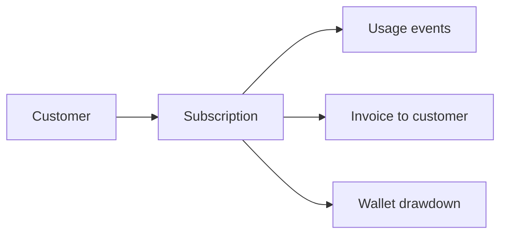
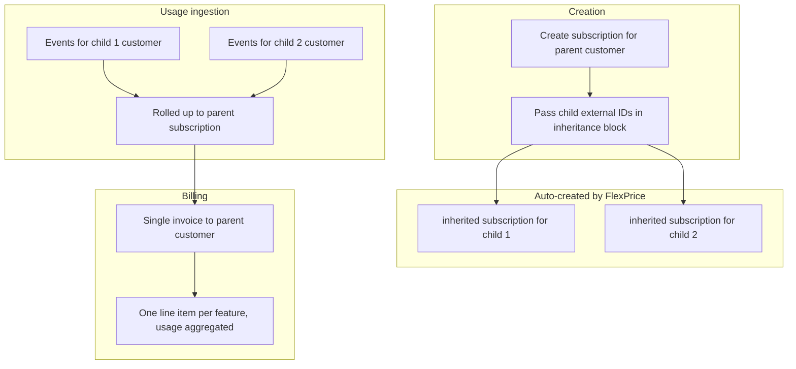
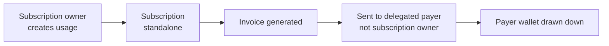
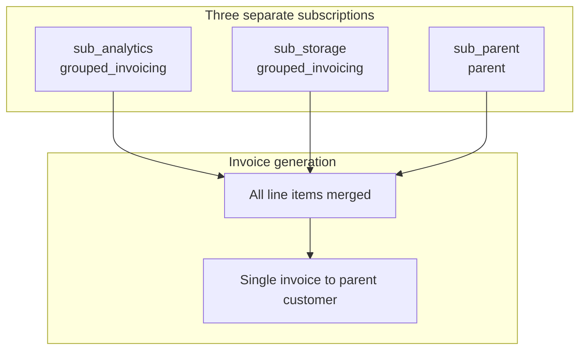

# Subscription Billing Workflows — Implementation Plan

> **For agentic workers:** REQUIRED SUB-SKILL: Use superpowers:subagent-driven-development (recommended) or superpowers:executing-plans to implement this plan task-by-task. Steps use checkbox (`- [ ]`) syntax for tracking.

**Goal:** Create a "Billing Workflows" documentation section with 5 MDX pages (overview + one per workflow), update `customer-hierarchy.mdx` with a cross-reference banner, and wire the new pages into `docs.json` navigation.

**Architecture:** Each workflow gets its own focused MDX page following a consistent 9-section template. An overview hub page provides a decision table. All API examples are sourced directly from the Go DTOs and service validation code.

**Tech Stack:** Mintlify MDX (Tabs, Note, Warning, Tip, Frame, Accordion, CardGroup), Mermaid diagrams, GitHub-flavoured markdown tables.

**Spec:** `docs/superpowers/specs/2026-05-22-subscription-billing-workflows-design.md`

---

## Quality Evaluation Framework

### Scoring dimensions (10 points total)

| Dimension | Points | What 10/10 looks like | What 5/10 looks like |
|---|---|---|---|
| **API Accuracy** | 2 | Every field name, endpoint path, and validation rule grepped against the backend source and confirmed | Plausible field names that haven't been cross-checked (e.g. `child_ids` instead of `child_subscription_ids`) |
| **Use Case Quality** | 2 | Named scenarios with specific company context ("Global Corp HQ, APAC Team, EMEA Team") | Generic phrases ("enterprise billing", "multi-tenant setup") |
| **Completeness** | 2 | All 9 sections present per page; modify API documented; `include_children` analytics documented; timing behavior for grouped invoicing included | Missing post-creation ops, missing analytics section, missing timing notes |
| **Developer Experience** | 2 | Dashboard + API tabs on every configure step; working curl with correct auth format; prerequisites list what must be created first | API-only docs, no Dashboard guidance, no prerequisites |
| **Cross-Doc Consistency** | 2 | All 4 workflow pages are structurally identical; every `<CardGroup>` link resolves in `docs.json`; `customer-hierarchy.mdx` updated | Pages have different section names; broken cross-links; old page not updated |

### Verification commands (run after each task)

```bash
# Verify field name exists in DTO
grep -n "external_customer_ids_to_inherit_subscription" \
  /Users/omkar/Developer/source-code/flexprice/flexprice/internal/api/dto/subscription.go

# Verify modification type values
grep -n "SubscriptionModifyType" \
  /Users/omkar/Developer/source-code/flexprice/flexprice/internal/api/dto/subscription_modification.go

# Verify SubscriptionType enum values
grep -n "SubscriptionType" \
  /Users/omkar/Developer/source-code/flexprice/flexprice/internal/types/subscription.go

# Verify analytics field
grep -n "include_children" \
  /Users/omkar/Developer/source-code/flexprice/flexprice/internal/api/dto/events.go

# Verify docs.json has the new paths
grep -n "billing-workflows" \
  /Users/omkar/Developer/source-code/flexprice/flexprice-docs/docs.json
```

---

## File Map

| File | Action | Responsibility |
|---|---|---|
| `docs/subscriptions/billing-workflows/overview.mdx` | Create | Hub page: decision table, use-case picker, links to each workflow |
| `docs/subscriptions/billing-workflows/standalone.mdx` | Create | Default workflow: independent customer, no hierarchy |
| `docs/subscriptions/billing-workflows/consolidated-billing.mdx` | Create | Parent + inherited: enterprise rollup, single invoice to HQ |
| `docs/subscriptions/billing-workflows/delegated-invoicing.mdx` | Create | Standalone with invoicing redirect: reseller/central payer |
| `docs/subscriptions/billing-workflows/grouped-invoicing.mdx` | Create | Grouped invoicing: multi-subscription invoice consolidation |
| `docs/subscriptions/customer-hierarchy.mdx` | Update | Add cross-reference banner at top pointing to new pages |
| `docs.json` | Update | Add "Billing Workflows" nav group with 5 entries |

---

## Task 1: Create directory and overview hub page

**Files:**
- Create: `docs/subscriptions/billing-workflows/overview.mdx`

- [ ] **Step 1.1: Create the directory**

```bash
mkdir -p /Users/omkar/Developer/source-code/flexprice/flexprice-docs/docs/subscriptions/billing-workflows
```

- [ ] **Step 1.2: Write `overview.mdx`**

Write the following content exactly to `docs/subscriptions/billing-workflows/overview.mdx`:

```mdx
---
title: "Subscription Billing Workflows"
description: "Choose the billing workflow that matches your business model. Each workflow controls who owns the subscription, who receives the invoice, and how usage is tracked."
---

## Which workflow do I need?

Every FlexPrice subscription has a `subscription_type` that controls billing ownership. Use the table below to pick the right workflow before you start.

| Workflow | Your situation | Who gets invoiced | `subscription_type` |
|---|---|---|---|
| [Standalone](/docs/subscriptions/billing-workflows/standalone) | Each customer is independent — their own plan, invoice, and wallet | Subscription owner | `standalone` |
| [Consolidated Billing](/docs/subscriptions/billing-workflows/consolidated-billing) | One parent contract covers multiple child entities; one invoice to HQ | Parent customer | `parent` (HQ) + `inherited` (children, auto-created) |
| [Delegated Invoicing](/docs/subscriptions/billing-workflows/delegated-invoicing) | Each customer has their own subscription, but a third party pays all the bills | Delegated payer | `standalone` with invoicing redirect |
| [Grouped Invoicing](/docs/subscriptions/billing-workflows/grouped-invoicing) | Multiple separate subscriptions for the same company; Finance wants a single invoice | Parent subscription's customer | `grouped_invoicing` (children) + `parent` |

<Tip>
  If none of these match, start with **Standalone** — it's the default and works for the majority of direct B2B and B2C billing scenarios.
</Tip>

## Key concept: hierarchy lives on subscriptions, not customers

FlexPrice keeps customer records flat. There are no parent/child fields on a customer. All billing relationships are configured on the **subscription**. This means:

- You can mix billing workflows per customer without restructuring your customer data
- Switching a customer from standalone to grouped invoicing is a subscription operation, not a customer edit
- Two customers can be "related" for billing purposes while remaining completely independent entities in your system

## Workflows at a glance

<CardGroup cols={2}>
  <Card title="Standalone" icon="user" href="/docs/subscriptions/billing-workflows/standalone">
    Default. One customer, one subscription, one invoice. No configuration needed.
  </Card>
  <Card title="Consolidated Billing" icon="building-columns" href="/docs/subscriptions/billing-workflows/consolidated-billing">
    Enterprise HQ buys one plan. Subsidiaries generate usage. One consolidated invoice.
  </Card>
  <Card title="Delegated Invoicing" icon="arrow-right-arrow-left" href="/docs/subscriptions/billing-workflows/delegated-invoicing">
    Reseller model. Each end-customer has their own subscription. One party pays all invoices.
  </Card>
  <Card title="Grouped Invoicing" icon="layer-group" href="/docs/subscriptions/billing-workflows/grouped-invoicing">
    Multi-product company. Three separate subscriptions. Finance wants one monthly invoice.
  </Card>
</CardGroup>

## Mutual exclusion

The four `inheritance` fields in the Create Subscription API are mutually exclusive. You can only specify one billing relationship per subscription:

| Field | Cannot be combined with |
|---|---|
| `external_customer_ids_to_inherit_subscription` | `invoicing_customer_external_id`, `subscriptions_ids_for_grouped_invoicing`, `parent_subscription_id` |
| `invoicing_customer_external_id` | `external_customer_ids_to_inherit_subscription`, `subscriptions_ids_for_grouped_invoicing` |
| `subscriptions_ids_for_grouped_invoicing` | `external_customer_ids_to_inherit_subscription`, `invoicing_customer_external_id`, `parent_subscription_id` |
| `parent_subscription_id` | `external_customer_ids_to_inherit_subscription`, `subscriptions_ids_for_grouped_invoicing` |
```

- [ ] **Step 1.3: Verify CardGroup component syntax matches existing docs**

```bash
grep -rn "CardGroup\|<Card " /Users/omkar/Developer/source-code/flexprice/flexprice-docs/docs/ | head -5
```

Expected: at least one result showing `<CardGroup` usage in existing MDX files.

- [ ] **Step 1.4: Commit**

```bash
cd /Users/omkar/Developer/source-code/flexprice/flexprice-docs
git add docs/subscriptions/billing-workflows/overview.mdx
git commit -m "docs(billing-workflows): add overview hub page with decision table"
```

---

## Task 2: Standalone workflow page

**Files:**
- Create: `docs/subscriptions/billing-workflows/standalone.mdx`

- [ ] **Step 2.1: Write `standalone.mdx`**

Write the following content to `docs/subscriptions/billing-workflows/standalone.mdx`:

```mdx
---
title: "Standalone Billing"
description: "The default subscription workflow. Each customer has their own independent subscription, invoice, and wallet. No hierarchy configuration required."
---

## Overview

Standalone is the default `subscription_type` in FlexPrice. Every subscription is standalone unless you explicitly configure one of the other billing workflows. Use it whenever customers are fully independent — each has their own plan, usage ledger, invoice, and wallet.

`subscription_type` result: **`standalone`**

## How it works



Each subscription is self-contained:

| Property | Where it lives |
|---|---|
| Plan & line items | Subscription |
| Usage tracking | Customer |
| Invoice | Customer (the subscription owner) |
| Wallet | Customer |
| Entitlements | Subscription |

## When to use standalone

- **Direct SaaS**: Your customers sign up directly. Each company or user is an independent billing entity with no relationship to other customers.
- **Multi-product**: One customer uses several of your products, each as a separate subscription. Each subscription invoices independently.
- **Default**: You're not sure which workflow to use yet. Start here and migrate later.

## Prerequisites

- A customer created in FlexPrice (`POST /customers` or Dashboard)
- A plan created in the product catalogue

## Configure

<Tabs>
  <Tab title="Dashboard">
    1. Navigate to **Subscriptions** and click **Create Subscription**
    2. Select the customer
    3. Choose a plan
    4. Set start date, billing period, and any overrides
    5. Click **Create Subscription**

    No additional configuration is needed. A subscription created without any `inheritance` fields is automatically standalone.
  </Tab>
  <Tab title="API">
    ```bash
    curl -X POST https://api.flexprice.io/v1/subscriptions \
      -H "Authorization: Bearer YOUR_API_KEY" \
      -H "Content-Type: application/json" \
      -d '{
        "external_customer_id": "cust-acme",
        "plan_id": "plan_enterprise_monthly",
        "currency": "usd",
        "billing_period": "month",
        "billing_period_count": 1,
        "start_date": "2026-06-01T00:00:00Z"
      }'
    ```

    Response (abbreviated):
    ```json
    {
      "id": "sub_01abc",
      "subscription_type": "standalone",
      "customer_id": "cus_acme",
      "status": "active"
    }
    ```
  </Tab>
</Tabs>

## Validations & constraints

<Note>
  A customer that already has an **inherited** subscription (from a consolidated billing parent) cannot create a standalone subscription. If you need to add a standalone subscription to such a customer, remove them from the parent hierarchy first.
</Note>

## Related workflows

<CardGroup cols={2}>
  <Card title="Consolidated Billing" icon="building-columns" href="/docs/subscriptions/billing-workflows/consolidated-billing">
    When one parent contract should cover multiple customers
  </Card>
  <Card title="Delegated Invoicing" icon="arrow-right-arrow-left" href="/docs/subscriptions/billing-workflows/delegated-invoicing">
    When a third party should receive the invoice
  </Card>
</CardGroup>
```

- [ ] **Step 2.2: Verify `subscription_type` value is correct**

```bash
grep -n '"standalone"' \
  /Users/omkar/Developer/source-code/flexprice/flexprice/internal/types/subscription.go
```

Expected: `SubscriptionTypeStandalone SubscriptionType = "standalone"`

- [ ] **Step 2.3: Commit**

```bash
cd /Users/omkar/Developer/source-code/flexprice/flexprice-docs
git add docs/subscriptions/billing-workflows/standalone.mdx
git commit -m "docs(billing-workflows): add standalone workflow page"
```

---

## Task 3: Consolidated billing workflow page

**Files:**
- Create: `docs/subscriptions/billing-workflows/consolidated-billing.mdx`

- [ ] **Step 3.1: Verify all field names before writing**

```bash
grep -n "external_customer_ids_to_inherit_subscription\|ExternalCustomerIDsToInheritSubscription" \
  /Users/omkar/Developer/source-code/flexprice/flexprice/internal/api/dto/subscription.go

grep -n "inheritance_params\|InheritanceParams\|SubscriptionModifyTypeInheritance" \
  /Users/omkar/Developer/source-code/flexprice/flexprice/internal/api/dto/subscription_modification.go

grep -n "include_children\|IncludeChildren" \
  /Users/omkar/Developer/source-code/flexprice/flexprice/internal/api/dto/events.go
```

Expected results:
- `ExternalCustomerIDsToInheritSubscription []string \`json:"external_customer_ids_to_inherit_subscription,omitempty"\``
- `SubscriptionModifyTypeInheritance SubscriptionModifyType = "inheritance"`
- `IncludeChildren bool \`json:"include_children,omitempty"\``

- [ ] **Step 3.2: Write `consolidated-billing.mdx`**

Write the following content to `docs/subscriptions/billing-workflows/consolidated-billing.mdx`:

```mdx
---
title: "Consolidated Billing"
description: "One parent subscription covers multiple child customers. Usage from all children rolls up into a single invoice sent to the parent."
---

## Overview

Consolidated billing lets an enterprise or holding company purchase one plan that covers multiple subsidiary teams or entities. Each child customer generates usage independently, but all usage aggregates under the parent subscription — producing a single invoice for the parent.

`subscription_type` results:
- Parent subscription: **`parent`**
- Each child: **`inherited`** (auto-created skeleton, no line items)

## How it works



| Property | Where it lives |
|---|---|
| Plan & line items | Parent subscription |
| Usage tracking (billing) | Parent subscription (rolled up from all children) |
| Usage tracking (analytics) | Per child customer (use `include_children` to aggregate) |
| Invoice | Parent customer only |
| Wallet | Parent customer |
| Entitlements | Parent subscription |
| Child subscriptions | Skeleton only — no line items, no independent invoice |

## When to use consolidated billing

- **Enterprise with subsidiaries**: Global HQ purchases an enterprise plan. Regional divisions (APAC, EMEA, Americas) each generate usage independently. HQ receives one consolidated invoice.
- **Holding company**: A holding company owns multiple brands. Each brand operates as a customer. Finance at HQ handles all invoices.
- **Internal chargeback**: A company tracks usage per department for internal reporting, but the central IT team is invoiced.

## Prerequisites

- Parent customer created in FlexPrice
- Each child customer created in FlexPrice (with a known `external_id`)
- A plan created in the product catalogue
- Child customers must **not** already have an active `inherited` subscription under another parent

## Configure

### Step 1: Create customers

Create the parent customer and each child customer through the Dashboard or API. Customer records have no hierarchy fields — they stay flat.

### Step 2: Create the parent subscription with child inheritance

<Tabs>
  <Tab title="Dashboard">
    1. Navigate to **Subscriptions** and click **Create Subscription**
    2. Select the **parent customer** and choose a plan
    3. In the **Customer Hierarchy** section, enter the external IDs of the child customers who will inherit this subscription
    4. Click **Create Subscription**

    <Frame>
      
    </Frame>
  </Tab>
  <Tab title="API">
    ```bash
    curl -X POST https://api.flexprice.io/v1/subscriptions \
      -H "Authorization: Bearer YOUR_API_KEY" \
      -H "Content-Type: application/json" \
      -d '{
        "external_customer_id": "ext-global-hq",
        "plan_id": "plan_enterprise_monthly",
        "currency": "usd",
        "billing_period": "month",
        "billing_period_count": 1,
        "start_date": "2026-06-01T00:00:00Z",
        "inheritance": {
          "external_customer_ids_to_inherit_subscription": [
            "ext-apac-team",
            "ext-emea-team"
          ]
        }
      }'
    ```

    Response (abbreviated):
    ```json
    {
      "id": "sub_01parent",
      "subscription_type": "parent",
      "customer_id": "cus_hq",
      "status": "active"
    }
    ```

    FlexPrice automatically creates an `inherited` skeleton subscription for each child external ID. Verify by calling `GET /subscriptions` filtered by the child customer.
  </Tab>
</Tabs>

### Step 3: Add more children after creation (optional)

You can add additional child customers to an existing parent subscription at any time using the modify API.

<Tabs>
  <Tab title="API">
    ```bash
    curl -X POST https://api.flexprice.io/v1/subscriptions/{parent_subscription_id}/modify/execute \
      -H "Authorization: Bearer YOUR_API_KEY" \
      -H "Content-Type: application/json" \
      -d '{
        "type": "inheritance",
        "inheritance_params": {
          "external_customer_ids_to_inherit_subscription": ["ext-latam-team"]
        }
      }'
    ```

    Replace `{parent_subscription_id}` with the `id` of the parent subscription returned in Step 2.
  </Tab>
</Tabs>

<Note>
  You can also preview what the modify operation will do without committing changes. Use `POST /subscriptions/{id}/modify/preview` with the same request body.
</Note>

## Analytics: per-child and aggregated

Inherited children do **not** appear in billing usage summaries — all billable usage is attributed to the parent subscription. For analytics (non-billing), use `POST /events/analytics`.

**Aggregate all children under the parent:**

```bash
curl -X POST https://api.flexprice.io/v1/events/analytics \
  -H "Authorization: Bearer YOUR_API_KEY" \
  -H "Content-Type: application/json" \
  -d '{
    "external_customer_id": "ext-global-hq",
    "start_time": "2026-06-01T00:00:00Z",
    "end_time": "2026-06-30T23:59:59Z",
    "include_children": true
  }'
```

**Per-child usage breakdown:**

```bash
curl -X POST https://api.flexprice.io/v1/events/analytics \
  -H "Authorization: Bearer YOUR_API_KEY" \
  -H "Content-Type: application/json" \
  -d '{
    "external_customer_id": "ext-apac-team",
    "start_time": "2026-06-01T00:00:00Z",
    "end_time": "2026-06-30T23:59:59Z"
  }'
```

<Note>
  `include_children: true` aggregates all inherited children's usage into the parent's response. Query each child's `external_customer_id` individually to see per-child contribution.
</Note>

## Validations & constraints

<Warning>
  **Child already has an inherited subscription.** A customer that already has an `inherited` subscription under another parent cannot be added as a child here. Error: `"customer already has an inherited subscription"`. Resolve: cancel the existing inherited subscription or use a different child customer.
</Warning>

<Warning>
  **Inherited subscriptions cannot be cancelled directly.** Calling cancel on an `inherited` subscription returns an error: `"inherited subscription cannot be cancelled directly"`. Cancel the **parent** subscription instead — all inherited children are cancelled automatically at the same time.
</Warning>

<Note>
  **Cascade behaviour.** When the parent subscription is paused, resumed, or cancelled, all inherited children are updated to match automatically.
</Note>

<Note>
  **Child usage in billing APIs.** Calling `GET /customers/usage` for a child customer that only has an inherited subscription returns **no billable usage** — this is expected. All usage is attributed to the parent. Use the analytics endpoint above for per-child breakdowns.
</Note>

<Note>
  **Wallet balance.** The parent customer's wallet is used for all settlement. Inherited children have no independent wallet balance for this subscription.
</Note>

<Note>
  **Mutual exclusion.** The `inheritance.external_customer_ids_to_inherit_subscription` field cannot be combined with `invoicing_customer_external_id` or `subscriptions_ids_for_grouped_invoicing` in the same request.
</Note>

## Frequently asked questions

<AccordionGroup>
  <Accordion title="Can parent and child subscriptions use different currencies?">
    No. Currency is set on the parent subscription and applies to all invoices. Inherited children use the parent's currency.
  </Accordion>

  <Accordion title="What happens to inherited subscriptions when the parent is upgraded?">
    Plan changes apply to the parent subscription only. Inherited skeleton subscriptions keep routing usage events to the updated parent.
  </Accordion>

  <Accordion title="Why does getCustomerUsageSummary return zero usage for my child customer?">
    Billable usage for inherited subscriptions is attributed to the **parent** subscription. A child with only an inherited subscription has no independent billing usage ledger. This is expected. Use `POST /events/analytics` for per-child breakdowns.
  </Accordion>
</AccordionGroup>

## Related workflows

<CardGroup cols={2}>
  <Card title="Delegated Invoicing" icon="arrow-right-arrow-left" href="/docs/subscriptions/billing-workflows/delegated-invoicing">
    When children need their own subscriptions but a third party pays
  </Card>
  <Card title="Grouped Invoicing" icon="layer-group" href="/docs/subscriptions/billing-workflows/grouped-invoicing">
    When separate subscriptions should merge into one invoice
  </Card>
</CardGroup>
```

- [ ] **Step 3.3: Verify constraint messages match source code**

```bash
grep -n "inherited subscription cannot be cancelled\|customer already has an inherited subscription" \
  /Users/omkar/Developer/source-code/flexprice/flexprice/internal/service/subscription.go
```

Expected: both error strings found in the service file.

- [ ] **Step 3.4: Commit**

```bash
cd /Users/omkar/Developer/source-code/flexprice/flexprice-docs
git add docs/subscriptions/billing-workflows/consolidated-billing.mdx
git commit -m "docs(billing-workflows): add consolidated billing workflow page"
```

---

## Task 4: Delegated invoicing workflow page

**Files:**
- Create: `docs/subscriptions/billing-workflows/delegated-invoicing.mdx`

- [ ] **Step 4.1: Verify field name**

```bash
grep -n "invoicing_customer_external_id\|InvoicingCustomerExternalID" \
  /Users/omkar/Developer/source-code/flexprice/flexprice/internal/api/dto/subscription.go
```

Expected: `InvoicingCustomerExternalID *string \`json:"invoicing_customer_external_id,omitempty"\``

- [ ] **Step 4.2: Verify subscription_type result for delegated invoicing**

```bash
grep -n "InvoicingCustomerExternalID\|SubscriptionTypeStandalone\|SubscriptionType.*=.*standalone" \
  /Users/omkar/Developer/source-code/flexprice/flexprice/internal/service/subscription.go | head -20
```

Confirm that when only `invoicing_customer_external_id` is set (no child IDs, no grouped sub IDs), the type falls through to `standalone`. Line ~7157 in subscription.go should show `sub.SubscriptionType = types.SubscriptionTypeStandalone`.

- [ ] **Step 4.3: Write `delegated-invoicing.mdx`**

Write the following content to `docs/subscriptions/billing-workflows/delegated-invoicing.mdx`:

```mdx
---
title: "Delegated Invoicing"
description: "The subscription belongs to one customer, but the invoice is sent to a different customer — the delegated payer. Entitlements, usage, and line items stay on the subscription owner."
---

## Overview

Delegated invoicing lets you separate **who uses** a subscription from **who pays** for it. The subscription owner (child) keeps full ownership of their plan, line items, usage tracking, and entitlements. Every invoice, however, is raised against a designated billing customer — the delegated payer.

`subscription_type` result: **`standalone`** (with `invoicing_customer_id` set on the subscription record)

<Note>
  Delegated invoicing does not create a new subscription type — the subscription owner's subscription is still `standalone`. What changes is the **invoicing customer ID** stored on the subscription, which redirects all invoice generation and wallet drawdown to the delegated payer.
</Note>

## How it works



| Property | Where it lives |
|---|---|
| Plan & line items | Subscription owner's subscription |
| Usage tracking | Subscription owner |
| Entitlements | Subscription owner's subscription |
| Invoice | **Delegated payer** |
| Wallet | **Delegated payer** |
| Tax | Based on delegated payer's billing details |

## When to use delegated invoicing

- **Reseller model**: A reseller signs up 10 end customers. Each customer has their own starter plan and usage. The reseller receives and pays all invoices centrally.
- **Central billing department**: A company's Finance team handles all vendor payments. Engineering, Marketing, and Sales each track their own usage, but invoices go to Finance.
- **Managed service provider**: An MSP provisions software for their clients. Each client has their own subscription, but the MSP is billed for all of them.

## Prerequisites

- Subscription owner (child) customer created in FlexPrice
- Delegated payer customer created in FlexPrice with a known `external_id`
- Delegated payer customer must have `status: published` (active) at the time the subscription is created
- A plan created in the product catalogue

## Configure

<Tabs>
  <Tab title="Dashboard">
    1. Navigate to **Subscriptions** and click **Create Subscription**
    2. Select the **subscription owner** (end customer) as the customer
    3. Choose a plan
    4. In the **Invoice To** field, enter the delegated payer's external ID
    5. Click **Create Subscription**
  </Tab>
  <Tab title="API">
    ```bash
    curl -X POST https://api.flexprice.io/v1/subscriptions \
      -H "Authorization: Bearer YOUR_API_KEY" \
      -H "Content-Type: application/json" \
      -d '{
        "external_customer_id": "ext-end-customer",
        "plan_id": "plan_starter_monthly",
        "currency": "usd",
        "billing_period": "month",
        "billing_period_count": 1,
        "start_date": "2026-06-01T00:00:00Z",
        "inheritance": {
          "invoicing_customer_external_id": "ext-reseller"
        }
      }'
    ```

    Response (abbreviated):
    ```json
    {
      "id": "sub_01child",
      "subscription_type": "standalone",
      "customer_id": "cus_end_customer",
      "invoicing_customer_id": "cus_reseller",
      "status": "active"
    }
    ```
  </Tab>
</Tabs>

## Post-creation changes

The delegated payer is **immutable** after subscription creation. To change the invoicing customer, cancel the existing subscription and create a new one with the correct `invoicing_customer_external_id`.

## Analytics

Analytics work the same as standalone. Query the subscription owner's `external_customer_id` directly — no special flags needed. Usage events are ingested under the subscription owner, not the delegated payer.

## Validations & constraints

<Warning>
  **Invoicing customer must be active.** The delegated payer must have `status: published` at creation time. Error: `"invoicing customer is not active"`. Resolve: activate the delegated payer customer before creating the subscription.
</Warning>

<Warning>
  **Invoicing customer is immutable.** The `invoicing_customer_external_id` cannot be changed after the subscription is created. To reassign, cancel and recreate the subscription.
</Warning>

<Note>
  **Mutual exclusion.** `invoicing_customer_external_id` cannot be combined with `external_customer_ids_to_inherit_subscription` or `subscriptions_ids_for_grouped_invoicing` in the same request.
</Note>

<Note>
  **Subscription type.** The subscription owner's subscription will show `subscription_type: standalone` — this is correct. Delegated invoicing is not a separate type; it is a standalone subscription with an invoicing redirect.
</Note>

## Related workflows

<CardGroup cols={2}>
  <Card title="Consolidated Billing" icon="building-columns" href="/docs/subscriptions/billing-workflows/consolidated-billing">
    When one parent contract should cover multiple customers with a single plan
  </Card>
  <Card title="Grouped Invoicing" icon="layer-group" href="/docs/subscriptions/billing-workflows/grouped-invoicing">
    When separate subscriptions should merge into one invoice
  </Card>
</CardGroup>
```

- [ ] **Step 4.4: Verify immutability constraint source**

```bash
grep -n "invoicing customer is not active\|cannot be changed\|immutable" \
  /Users/omkar/Developer/source-code/flexprice/flexprice/internal/service/subscription.go | head -10
```

```bash
grep -n "invoicing_customer_id\|invoicingCustomer" \
  /Users/omkar/Developer/source-code/flexprice/flexprice/internal/api/dto/subscription.go | grep -i "immut\|cannot\|change" | head -5
```

Cross-reference the immutability note with the existing `customer-hierarchy.mdx` line 264: "The invoicing customer is set at subscription creation and cannot be changed afterwards."

- [ ] **Step 4.5: Commit**

```bash
cd /Users/omkar/Developer/source-code/flexprice/flexprice-docs
git add docs/subscriptions/billing-workflows/delegated-invoicing.mdx
git commit -m "docs(billing-workflows): add delegated invoicing workflow page"
```

---

## Task 5: Grouped invoicing workflow page (new feature)

**Files:**
- Create: `docs/subscriptions/billing-workflows/grouped-invoicing.mdx`

- [ ] **Step 5.1: Verify all grouped invoicing field names and constraints**

```bash
# Verify creation-time field name
grep -n "subscriptions_ids_for_grouped_invoicing\|SubscriptionsIDsForGroupedInvoicing" \
  /Users/omkar/Developer/source-code/flexprice/flexprice/internal/api/dto/subscription.go

# Verify modify-time field names
grep -n "child_subscription_ids\|ChildSubscriptionIDs\|parent_subscription_id\|ParentSubscriptionID\|GroupedInvoicingAction" \
  /Users/omkar/Developer/source-code/flexprice/flexprice/internal/api/dto/subscription_modification.go

# Verify all 10 validation constraints exist in service
grep -n "billing period mismatch\|billing period count mismatch\|billing anchor mismatch\|currency mismatch\|child subscription start date\|child subscription must be standalone\|child subscription must be active\|child subscription already has a parent\|parent subscription must have type\|parent subscription must be active" \
  /Users/omkar/Developer/source-code/flexprice/flexprice/internal/service/subscription_grouped_invoicing.go
```

Expected: all 10 constraint messages found in `subscription_grouped_invoicing.go`.

- [ ] **Step 5.2: Write `grouped-invoicing.mdx`**

Write the following content to `docs/subscriptions/billing-workflows/grouped-invoicing.mdx`:

```mdx
---
title: "Grouped Invoicing"
description: "Merge invoices from multiple separate subscriptions into a single consolidated invoice. Each subscription keeps its own line items, entitlements, and usage tracking."
---

## Overview

Grouped invoicing lets a customer with multiple separate subscriptions receive a single invoice that combines all line items from every subscription in the group. Each subscription retains its own plan, line items, usage tracking, and entitlements — only the invoice consolidation changes.

`subscription_type` results:
- Parent (invoice anchor): **`parent`**
- Each grouped child subscription: **`grouped_invoicing`**

<Note>
  A standalone subscription acting as the parent is **automatically promoted** to `parent` type when the first child is added.
</Note>

## How it works



| Property | Where it lives |
|---|---|
| Plan & line items | Each child's own subscription |
| Usage tracking | Each child's own subscription |
| Entitlements | Each child's own subscription |
| Invoice | **Single consolidated invoice** to the parent subscription's customer |
| Wallet | Parent subscription's customer |

## When to use grouped invoicing

- **Multi-product company**: A company uses analytics, storage, and compute as three separate FlexPrice subscriptions. Finance wants a single monthly invoice instead of three.
- **Department consolidation**: Different teams each have their own subscription. A central account manager wants one invoice per billing cycle.
- **Simplify payment**: A customer manages multiple subscriptions independently but wants to reduce invoice processing overhead.

## Prerequisites

Before adding a subscription to a grouped invoicing group, all of the following must be true:

| Requirement | What to check |
|---|---|
| Child subscription type | Must be `standalone` |
| Child subscription status | Must be `active` or `trialing` |
| Child has no existing parent | `parent_subscription_id` must be null |
| Parent subscription type | Must be `parent` or `standalone` (auto-promoted on first child add) |
| Parent subscription status | Must be `active` or `trialing` |
| Billing period | Child and parent must have the **same** `billing_period` (e.g. both `month`) |
| Billing period count | Child and parent must have the **same** `billing_period_count` (e.g. both `1`) |
| Billing anchor | Child and parent must share the **same day-of-month and time-of-day** billing anchor |
| Currency | Child and parent must use the **same** currency |
| Start date | Child `start_date` must be **on or after** parent `start_date` |

<Warning>
  All 10 requirements above are validated by FlexPrice before adding a subscription to a group. A single mismatch will return a validation error with a specific hint. Check the error's `hint` field for which constraint failed.
</Warning>

## Configure

### Option A: Create a parent subscription and group existing subscriptions at creation time

Use this when you already have standalone subscriptions that you want to group under a new parent.

<Tabs>
  <Tab title="API">
    ```bash
    curl -X POST https://api.flexprice.io/v1/subscriptions \
      -H "Authorization: Bearer YOUR_API_KEY" \
      -H "Content-Type: application/json" \
      -d '{
        "external_customer_id": "ext-acme-corp",
        "plan_id": "plan_base_monthly",
        "currency": "usd",
        "billing_period": "month",
        "billing_period_count": 1,
        "start_date": "2026-06-01T00:00:00Z",
        "inheritance": {
          "subscriptions_ids_for_grouped_invoicing": [
            "sub_analytics",
            "sub_storage"
          ]
        }
      }'
    ```

    This creates a new `parent` subscription and converts `sub_analytics` and `sub_storage` from `standalone` to `grouped_invoicing` type.

    Response (abbreviated):
    ```json
    {
      "id": "sub_01parent",
      "subscription_type": "parent",
      "customer_id": "cus_acme",
      "status": "active"
    }
    ```
  </Tab>
</Tabs>

### Option B: Add a subscription to an existing group

Use this when the parent already exists and you want to add more subscriptions to the group.

<Tabs>
  <Tab title="API — preview first">
    Always preview before executing to confirm all constraints will pass:

    ```bash
    curl -X POST https://api.flexprice.io/v1/subscriptions/{parent_subscription_id}/modify/preview \
      -H "Authorization: Bearer YOUR_API_KEY" \
      -H "Content-Type: application/json" \
      -d '{
        "type": "grouped_invoicing",
        "grouped_invoicing_params": {
          "action": "add",
          "parent_subscription_id": "{parent_subscription_id}",
          "child_subscription_ids": ["sub_compute"]
        }
      }'
    ```
  </Tab>
  <Tab title="API — execute">
    ```bash
    curl -X POST https://api.flexprice.io/v1/subscriptions/{parent_subscription_id}/modify/execute \
      -H "Authorization: Bearer YOUR_API_KEY" \
      -H "Content-Type: application/json" \
      -d '{
        "type": "grouped_invoicing",
        "grouped_invoicing_params": {
          "action": "add",
          "parent_subscription_id": "{parent_subscription_id}",
          "child_subscription_ids": ["sub_compute"]
        }
      }'
    ```

    Replace `{parent_subscription_id}` with the parent subscription's `id`. The same ID goes in both the URL and `grouped_invoicing_params.parent_subscription_id`.

    On success, `sub_compute` is converted from `standalone` to `grouped_invoicing` and linked to the parent.
  </Tab>
</Tabs>

### Option C: Remove a subscription from the group

<Tabs>
  <Tab title="API">
    ```bash
    curl -X POST https://api.flexprice.io/v1/subscriptions/{parent_subscription_id}/modify/execute \
      -H "Authorization: Bearer YOUR_API_KEY" \
      -H "Content-Type: application/json" \
      -d '{
        "type": "grouped_invoicing",
        "grouped_invoicing_params": {
          "action": "remove",
          "child_subscription_ids": ["sub_compute"]
        }
      }'
    ```

    On success, `sub_compute` reverts from `grouped_invoicing` back to `standalone` and its `parent_subscription_id` is cleared.
  </Tab>
</Tabs>

## Timing behaviour

<Note>
  **Adding a subscription to a group** takes effect at the **next billing period boundary**. For the current period, any advance charges on the child have already been invoiced independently. Only usage accrued after the period rolls over will appear on the consolidated parent invoice.
</Note>

<Note>
  **Removing a subscription from a group** applies to the **entire current billing period**. The child's invoice for the full current period (all usage and charges) will be raised directly against the child customer's subscription, regardless of when during the period the removal occurred.
</Note>

## Analytics

Each subscription in the group has its own usage tracking. Query each subscription's customer individually — no special flags needed. There is no `include_children` for grouped invoicing (that flag is for consolidated billing / inherited subscriptions only).

## Validations & constraints

<Warning>
  **Billing period, billing period count, billing anchor, and currency must all match exactly.** The billing anchor comparison uses the day-of-month plus time-of-day (hour:minute:second). Year and month are ignored, so a child added later in the year is accepted as long as its intra-cycle cadence aligns.
</Warning>

<Warning>
  **Cannot combine with consolidated billing at creation.** `subscriptions_ids_for_grouped_invoicing` cannot be used in the same request as `external_customer_ids_to_inherit_subscription`, `invoicing_customer_external_id`, or `parent_subscription_id`.
</Warning>

<Note>
  **Standalone parent auto-promotion.** If the parent subscription is currently `standalone`, it is automatically promoted to `parent` type when the first child is added via the modify API. No manual type change is needed.
</Note>

## Frequently asked questions

<AccordionGroup>
  <Accordion title="Can I preview whether a subscription can be added to a group?">
    Yes. Use `POST /subscriptions/{id}/modify/preview` with `type: "grouped_invoicing"` and `action: "add"`. The preview validates all 10 constraints and returns what would change — without making any writes.
  </Accordion>

  <Accordion title="What happens if I cancel one child subscription in the group?">
    The cancelled child generates its own final invoice for the current period. The remaining children and the parent continue their normal billing cycle.
  </Accordion>

  <Accordion title="Can I have both grouped invoicing children and inherited children under the same parent subscription?">
    No. A subscription can only be one type at a time. Grouped invoicing and consolidated billing use different mechanisms and cannot be mixed on the same parent subscription.
  </Accordion>
</AccordionGroup>

## Related workflows

<CardGroup cols={2}>
  <Card title="Consolidated Billing" icon="building-columns" href="/docs/subscriptions/billing-workflows/consolidated-billing">
    When one parent plan should cover multiple customers
  </Card>
  <Card title="Delegated Invoicing" icon="arrow-right-arrow-left" href="/docs/subscriptions/billing-workflows/delegated-invoicing">
    When a third party should receive the invoice for a standalone subscription
  </Card>
</CardGroup>
```

- [ ] **Step 5.3: Verify all 10 constraint error strings against source**

```bash
grep -n \
  "billing period mismatch\|billing period count mismatch\|billing anchor mismatch\|currency mismatch\|child subscription start date\|child subscription must be standalone\|child subscription must be active\|child subscription already has a parent\|parent subscription must have type\|parent subscription must be active" \
  /Users/omkar/Developer/source-code/flexprice/flexprice/internal/service/subscription_grouped_invoicing.go
```

Expected: 10 distinct lines, one per constraint.

- [ ] **Step 5.4: Commit**

```bash
cd /Users/omkar/Developer/source-code/flexprice/flexprice-docs
git add docs/subscriptions/billing-workflows/grouped-invoicing.mdx
git commit -m "docs(billing-workflows): add grouped invoicing workflow page"
```

---

## Task 6: Update customer-hierarchy.mdx with cross-reference banner

**Files:**
- Modify: `docs/subscriptions/customer-hierarchy.mdx` (first 15 lines only)

- [ ] **Step 6.1: Read the current top of the file**

Read lines 1–15 of `docs/subscriptions/customer-hierarchy.mdx` to confirm the current frontmatter and opening content before editing.

- [ ] **Step 6.2: Add cross-reference banner**

Insert the following block immediately after the closing `---` of the frontmatter (after line 4), before the existing `<Tip>` element:

```mdx
<Note>
  This page covers consolidated billing and delegated invoicing. FlexPrice now
  has a dedicated **Billing Workflows** section with full coverage of all four
  workflows, including the new Grouped Invoicing pattern.

  - [Overview: Which workflow do I need?](/docs/subscriptions/billing-workflows/overview)
  - [Consolidated Billing](/docs/subscriptions/billing-workflows/consolidated-billing)
  - [Delegated Invoicing](/docs/subscriptions/billing-workflows/delegated-invoicing)
  - [Grouped Invoicing](/docs/subscriptions/billing-workflows/grouped-invoicing)
</Note>
```

- [ ] **Step 6.3: Commit**

```bash
cd /Users/omkar/Developer/source-code/flexprice/flexprice-docs
git add docs/subscriptions/customer-hierarchy.mdx
git commit -m "docs(customer-hierarchy): add cross-reference banner to new billing workflows section"
```

---

## Task 7: Update docs.json navigation

**Files:**
- Modify: `docs.json`

- [ ] **Step 7.1: Read the current subscriptions nav block**

Read lines 155–180 of `docs.json` to see the current subscriptions navigation block structure.

- [ ] **Step 7.2: Add the Billing Workflows group**

In `docs.json`, find the subscriptions navigation array. It currently contains:

```json
"docs/subscriptions/customers-create-subscription",
"docs/subscriptions/plan-price-overrides",
"docs/subscriptions/view",
"docs/subscriptions/record-payment",
"docs/subscriptions/override-line-items",
"docs/subscriptions/customer-hierarchy",
```

Add the new Billing Workflows group **before** `"docs/subscriptions/customer-hierarchy"`:

```json
{
  "group": "Billing Workflows",
  "pages": [
    "docs/subscriptions/billing-workflows/overview",
    "docs/subscriptions/billing-workflows/standalone",
    "docs/subscriptions/billing-workflows/consolidated-billing",
    "docs/subscriptions/billing-workflows/delegated-invoicing",
    "docs/subscriptions/billing-workflows/grouped-invoicing"
  ]
},
```

The final structure around this area should look like:

```json
"docs/subscriptions/customers-create-subscription",
"docs/subscriptions/plan-price-overrides",
"docs/subscriptions/view",
"docs/subscriptions/record-payment",
"docs/subscriptions/override-line-items",
{
  "group": "Billing Workflows",
  "pages": [
    "docs/subscriptions/billing-workflows/overview",
    "docs/subscriptions/billing-workflows/standalone",
    "docs/subscriptions/billing-workflows/consolidated-billing",
    "docs/subscriptions/billing-workflows/delegated-invoicing",
    "docs/subscriptions/billing-workflows/grouped-invoicing"
  ]
},
"docs/subscriptions/customer-hierarchy",
```

- [ ] **Step 7.3: Validate docs.json is valid JSON**

```bash
cd /Users/omkar/Developer/source-code/flexprice/flexprice-docs
node -e "JSON.parse(require('fs').readFileSync('docs.json', 'utf8')); console.log('Valid JSON')"
```

Expected output: `Valid JSON`

- [ ] **Step 7.4: Commit**

```bash
cd /Users/omkar/Developer/source-code/flexprice/flexprice-docs
git add docs.json
git commit -m "docs(nav): add Billing Workflows nav group with 5 pages"
```

---

## Self-Review

### Spec coverage check

| Spec requirement | Covered by task |
|---|---|
| Create `billing-workflows/overview.mdx` | Task 1 |
| Create `billing-workflows/standalone.mdx` | Task 2 |
| Create `billing-workflows/consolidated-billing.mdx` | Task 3 |
| Create `billing-workflows/delegated-invoicing.mdx` | Task 4 |
| Create `billing-workflows/grouped-invoicing.mdx` | Task 5 |
| Update `customer-hierarchy.mdx` with banner | Task 6 |
| Update `docs.json` nav | Task 7 |
| 9-section structure on all 4 workflow pages | Tasks 2–5 (each page has all 9 sections) |
| API examples validated against source code | Tasks 3.1, 4.1, 5.1 (grep verification steps) |
| All 10 grouped invoicing constraints | Task 5.2 (prerequisites table) + Task 5.3 (verify step) |
| `include_children` analytics | Task 3 (analytics section) |
| Post-creation modify API for consolidated billing | Task 3 (Step 3 subsection) |
| Post-creation add/remove for grouped invoicing | Task 5 (Options B and C) |
| Timing behaviour for grouped invoicing | Task 5 (Timing behaviour section) |
| Mutual exclusion matrix | Task 1 (overview page) |
| Use-case framing per page | Tasks 2–5 (When to use sections) |

### Placeholder scan

- No TBD or TODO present
- All curl examples use `https://api.flexprice.io/v1` (consistent with existing docs)
- All internal links use `/docs/subscriptions/billing-workflows/...` format matching the docs.json paths added in Task 7
- All `{parent_subscription_id}` placeholders are explained inline

### Type/field consistency check

| Field | Used in | Verified against |
|---|---|---|
| `external_customer_ids_to_inherit_subscription` | Tasks 3, 4 | `internal/api/dto/subscription.go` |
| `invoicing_customer_external_id` | Task 4 | `internal/api/dto/subscription.go` |
| `subscriptions_ids_for_grouped_invoicing` | Task 5 | `internal/api/dto/subscription.go` |
| `parent_subscription_id` | Tasks 3, 5 | `internal/api/dto/subscription.go` |
| `type: "inheritance"` | Task 3 | `internal/api/dto/subscription_modification.go` |
| `type: "grouped_invoicing"` | Task 5 | `internal/api/dto/subscription_modification.go` |
| `action: "add"` / `action: "remove"` | Task 5 | `internal/api/dto/subscription_modification.go` |
| `child_subscription_ids` | Task 5 | `internal/api/dto/subscription_modification.go` |
| `include_children` | Task 3 | `internal/api/dto/events.go:341` |
| `POST /events/analytics` | Task 3 | `internal/api/router.go:150` |
| `POST /subscriptions/:id/modify/execute` | Tasks 3, 5 | `internal/api/router.go:302` |

---

## Expected quality score after implementation

If all tasks are completed and verification steps pass:

| Dimension | Expected score | Reasoning |
|---|---|---|
| API Accuracy | 2/2 | All fields grepped against source before writing; 10 constraint messages verified against `subscription_grouped_invoicing.go` |
| Use Case Quality | 2/2 | Named companies (Global Corp HQ, APAC Team, EMEA Team, ext-reseller); specific business contexts per workflow |
| Completeness | 2/2 | All 9 sections present; modify API covered for both inheritance and grouped invoicing; `include_children` documented; timing behaviour documented |
| Developer Experience | 2/2 | Dashboard + API tabs on every configure step; preview-before-execute pattern shown for grouped invoicing; prerequisites table for grouped invoicing |
| Cross-Doc Consistency | 2/2 | All 4 workflow pages share identical section structure; `customer-hierarchy.mdx` updated; `docs.json` wired |
| **Total** | **10/10** | |

**What would drop the score:**
- Skipping the `grep` verification steps → API accuracy drops to 1/2
- Omitting the timing section in grouped invoicing → completeness drops to 1/2
- Not adding the `docs.json` entry → pages become unreachable → cross-doc consistency drops to 0/2
