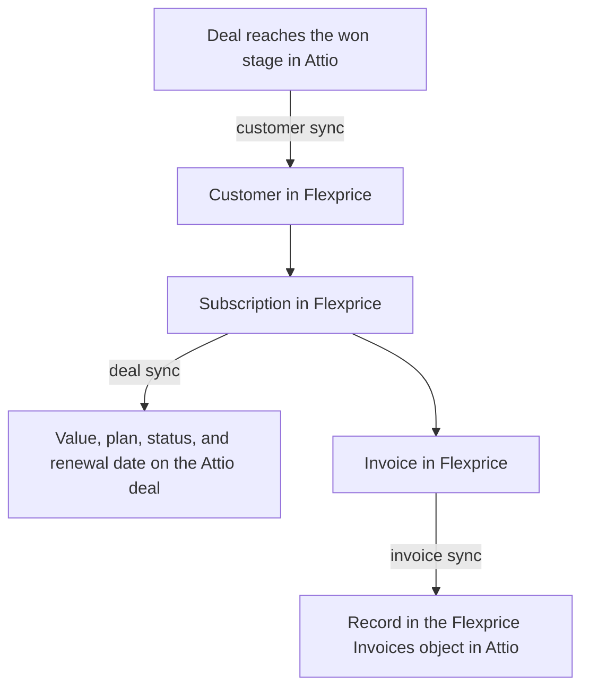

The Attio connection links Flexprice to one Attio workspace through an Attio access token. Flexprice uses the token to read won deals with their companies and people, to write subscription details to deals, and to record invoices in Attio. It also uses the token to register the webhook that tells Flexprice when a deal is won, so the only thing you create in Attio is the token.

## What the Attio integration syncs

| Sync | Direction | Runs when | Turned on by |
|------|-----------|-----------|--------------|
| [Customer sync](/integrations/attio/customer-sync) | Attio to Flexprice | A deal reaches your won stage | The **Customers** toggle |
| [Deal sync](/integrations/attio/deal-sync) | Flexprice to Attio | A subscription is created, activated, or changed | The **Deals** toggle |
| [Invoice sync](/integrations/attio/invoice-sync) | Flexprice to Attio | An invoice is finalized, paid, or voided | The **Invoices** toggle |



Flexprice does not sync plans, prices, or payment methods with Attio, and it does not read deals or invoices back from Attio. Attio has no quote object, so the Attio integration has no quote sync.

## Before you connect Attio

- **Attio admin access.** Only workspace admins can create access tokens.
- **The Deals object turned on in Attio.** Attio turns off Deals in new workspaces. Customer sync and deal sync both work from deals. To turn it on, open **Workspace settings** → **Objects** and click **Activate** next to **Deals**.
- **The Flexprice environment for the connection.** The webhook that Flexprice registers in Attio carries the tenant and environment IDs of that environment, so create the connection in the environment you want customers to land in.
- **A free object slot in your Attio plan**, if you plan to use invoice sync. Flexprice records invoices in a custom object, which counts toward your plan's object limit.

## Step 1: Create an Attio access token

<Steps>
  <Step title="Open the developer settings">
    In Attio, click your workspace name at the top left, select **Workspace settings**, then select **Developers** in the settings sidebar. The **Access tokens** tab opens.
  </Step>
  <Step title="Create the token">
    Click **Create access token**. In the **New access token** dialog, enter a **Name** such as `Flexprice`.
  </Step>
  <Step title="Set the scopes">
    Each scope in the dialog has a dropdown set to **Disabled**. Set the scopes for the syncs you plan to use to the levels in the table below, then click **Save**.

    <Frame>
      
    </Frame>
  </Step>
  <Step title="Copy the token">
    Copy the new token from the **Access tokens** tab. Attio tokens do not expire, so store the token like a password.
  </Step>
</Steps>

### Attio scopes for each Flexprice sync

| Sync | Records | Object Configuration | Webhooks |
|------|---------|----------------------|----------|
| Every connection | Read | Read | Disabled |
| Customer sync | Read | Read | Read-write |
| Deal sync | Read-write | Read-write | Disabled |
| Invoice sync | Read-write | Read-write | Disabled |

Leave every other scope at **Disabled**. In the API, these levels are the scopes `record_permission:read`, `record_permission:read-write`, `object_configuration:read`, `object_configuration:read-write`, and `webhook:read-write`. Deal sync and invoice sync need **Object Configuration** at **Read-write** because Flexprice adds its own attributes to your Deals object and creates its own Flexprice Invoices object. Customer sync needs **Webhooks** at **Read-write** because Flexprice registers its webhook through the Attio API.

The **Required Scopes** panel in the Flexprice connection drawer lists the scopes for the syncs you turn on.

<Frame>
  
</Frame>

## Step 2: Create the Attio connection in Flexprice

### Connecting Attio from the Flexprice dashboard

<Steps>
  <Step title="Open the Attio integration">
    In the Flexprice dashboard, open **Integrations**, select **Attio**, and click **Add a connection**.

    <Frame>
      
    </Frame>
  </Step>
  <Step title="Enter the name and token">
    Fill in **Connection Name**, then paste the **Access Token** from Step 1.
  </Step>
  <Step title="Pick the won stage">
    **Won Stage** lists the stages of your Deals object. Pick the stage that marks a deal as won. It defaults to **Won 🎉**, the won stage Attio creates by default. Flexprice stores the stage's ID, so renaming the stage in Attio later does not break customer sync.

    <Frame>
      
    </Frame>
  </Step>
  <Step title="Choose what syncs">
    Under **Sync Configuration**, turn on **Customers**, **Deals**, and **Invoices** for the syncs you want. All three are off by default.

    <Frame>
      
    </Frame>
  </Step>
  <Step title="Review the webhook">
    Under **Webhook Configuration**, the drawer shows the URL that Flexprice registers in Attio. Expand **Webhook Events** to see the deal events it subscribes to. There is nothing to copy: Flexprice creates the webhook itself when you save the connection with **Customers** turned on.

    <Frame>
      
    </Frame>
  </Step>
  <Step title="Save the connection">
    Click **Create Connection**. The connection appears under **Connected Accounts** on the Attio integration page.

    <Frame>
      
    </Frame>
  </Step>
</Steps>

### What Flexprice checks when you save the connection

1. **The token.** Flexprice calls Attio's `GET /v2/self` to confirm the token is active and holds the scopes for the syncs you turned on. If a scope is missing, Flexprice does not save the connection and names the missing scope.
2. **The won stage.** Flexprice looks up the stage on the `stage` attribute of your Deals object and stores its ID.
3. **The webhook.** When **Customers** is on, Flexprice creates its webhook with Attio's `POST /v2/webhooks` and stores the signing secret that Attio returns, encrypted.

### Creating the Attio connection with the API

```bash
curl -X POST https://api.cloud.flexprice.io/v1/connections \
  -H "x-api-key: <API_KEY>" \
  -H "X-Environment-ID: <ENVIRONMENT_ID>" \
  -H "Content-Type: application/json" \
  -d '{
    "name": "Attio Production",
    "provider_type": "attio",
    "encrypted_secret_data": {
      "access_token": "<ATTIO_ACCESS_TOKEN>"
    },
    "metadata": {
      "won_stage": "Won 🎉"
    },
    "sync_config": {
      "customer": { "inbound": true, "outbound": false },
      "deal": { "inbound": false, "outbound": true },
      "invoice": { "inbound": false, "outbound": true }
    }
  }'
```

| Field | Required | Description |
|-------|----------|-------------|
| `provider_type` | Yes | Always `attio` |
| `encrypted_secret_data.access_token` | Yes | The Attio access token. Flexprice encrypts it at rest. |
| `metadata.won_stage` | No | The title of the deal stage that marks a deal as won. Defaults to `Won 🎉`. |
| `sync_config.customer.inbound` | No | Import the company on each won deal as a customer, and register the Attio webhook |
| `sync_config.deal.outbound` | No | Write the subscription's value, plan, status, and renewal date to the customer's Attio deal |
| `sync_config.invoice.outbound` | No | Record finalized invoices in the Flexprice Invoices object in Attio, and keep their status current |

If you leave out `sync_config`, every sync is off. Customers only sync inbound, and deals and invoices only sync outbound, so Flexprice rejects the other direction for each of them.

## How Flexprice receives Attio deal events

Flexprice registers one webhook for each Attio connection. It points at this URL:

```
https://api.cloud.flexprice.io/v1/webhooks/attio/<tenant_id>/<environment_id>
```

| Event | Filter | What Flexprice does |
|-------|--------|---------------------|
| `record.created` | Deals object | Imports the deal when it is created in the won stage. Ignores deals created in any other stage. |
| `record.updated` | Deals object, `stage` attribute | Imports the deal when its stage changes to the won stage. Ignores other stage changes. |

The filters keep every other Attio change, such as an edited deal name or a new note, from reaching Flexprice. Attio events carry record IDs only, so after each event Flexprice reads the deal, its company, and its people through the Attio API.

Flexprice checks the `Attio-Signature` header on every request, an HMAC-SHA256 of the request body signed with the webhook's secret, and discards requests that fail the check. Attio retries a delivery that does not get a `2xx` response up to 10 times over about three days, so a won deal is not lost when Flexprice is briefly unreachable.

The webhook is listed in Attio under **Workspace settings** → **Developers**, on the **Webhooks** tab. Flexprice manages it, so do not edit or delete it there: customer sync stops if its URL or events change.

## Changing Attio connection settings

To change the connection name, the won stage, or the syncs, open **Integrations** → **Attio** in the Flexprice dashboard and click the pencil icon next to the connection under **Connected Accounts**. The edit drawer does not show the access token field.

<Frame>
  
</Frame>

- **Turning Customers off** deletes the Flexprice webhook from Attio. Turning it back on registers a new one.
- **Turning on Deals or Invoices later** needs the matching scopes. Raise them on the token first, under **Workspace settings** → **Developers** → **Access tokens** in Attio, then turn on the toggle.

To use a different access token, delete the Attio connection and create it again with the new token. Deleting the connection also deletes the Flexprice webhook from Attio. Links between Flexprice customers, subscriptions, and invoices and their Attio records are stored separately from the connection, so they are kept.

## Troubleshooting the Attio connection

| Issue | Cause | Solution |
|-------|-------|----------|
| Saving the connection fails with a missing scope | The token lacks a scope that one of the turned-on syncs needs | Raise the scope on the token in Attio, then save the connection again |
| **Won Stage** lists no stages | The Deals object is turned off in Attio, or the token's **Object Configuration** scope is **Disabled** | Turn on Deals in Attio, and set **Object Configuration** to at least **Read** on the token |
| No customers appear after a deal is won | **Customers** is off, or the deal reached a stage other than the connection's **Won Stage** | Turn on **Customers**, and check **Won Stage** on the connection |
| Customer sync stopped after working before | The webhook was edited or deleted in Attio, or the token was deleted | Turn **Customers** off and on again to register a new webhook, or recreate the connection with a new token |
| Deal values or invoices do not appear in Attio | The **Deals** or **Invoices** toggle is off, or **Records** is still at **Read** on the token | Turn on the toggle, and raise **Records** and **Object Configuration** to **Read-write** |

## Attio sync guides

<CardGroup cols={3}>
  <Card title="Customer sync" icon="users" href="/integrations/attio/customer-sync">
    How the company on a won Attio deal becomes a Flexprice customer.
  </Card>
  <Card title="Deal sync" icon="handshake" href="/integrations/attio/deal-sync">
    How the subscription's value, plan, and status reach the Attio deal.
  </Card>
  <Card title="Invoice sync" icon="file-invoice" href="/integrations/attio/invoice-sync">
    How invoices appear in Attio and follow payments and voids.
  </Card>
</CardGroup>
