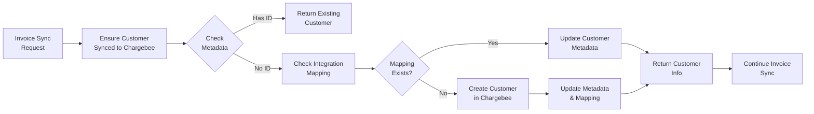

## Overview

Customer synchronization in Flexprice ensures that customers exist in Chargebee before invoice sync. Unlike other integrations, **customers are only synced when an invoice is being synced to Chargebee**, not during payment link creation or other operations.

### Key Concepts

- **On-Demand Sync**: Customers are synced only when invoice sync is triggered
- **Invoice-Triggered**: Sync happens automatically during invoice sync
- **Entity Integration Mapping**: Links Flexprice customers to Chargebee customer IDs
- **Metadata Storage**: Customer metadata stores cross-platform references
- **Duplicate Prevention**: Intelligent checks prevent duplicate customer creation

## Synchronization Flow

Customer sync is **invoice-triggered** and happens automatically:



### When Customer Sync Happens

Customer sync is triggered **only** when:
- An invoice is being synced to Chargebee
- Invoice outbound sync is enabled in the Chargebee connection
- Invoice status changes from `DRAFT` to `FINALIZED`

**Customer sync does NOT happen for:**
- Payment link creation
- Manual customer operations
- Other payment flows

## Customer Data Model

### Flexprice Customer Structure

```json
{
  "id": "cust_1234567890abcdef",
  "external_id": "customer_external_123",
  "name": "John Doe",
  "email": "john@example.com",
  "address_line1": "123 Main St",
  "address_line2": "Apt 4B",
  "address_city": "New York",
  "address_state": "NY",
  "address_postal_code": "10001",
  "address_country": "US",
  "metadata": {
    "chargebee_customer_id": "cust_chargebee123abc"
  },
  "environment_id": "prod",
  "tenant_id": "tenant_123",
  "status": "active",
  "created_at": "2024-01-20T10:30:00Z"
}
```

### Customer Creation in Chargebee

When creating a customer in Chargebee:

**Required Fields:**
- `email`: Customer email address
- `auto_collection`: Set to `"on"` (enables automatic payment collection)

**Optional Fields:**
- `first_name`: Customer name (from Flexprice customer name)
- `billing_address`: Address information if available

**Address Mapping:**
- `line1` → `billing_address.line1`
- `line2` → `billing_address.line2`
- `city` → `billing_address.city`
- `state` → `billing_address.state`
- `postal_code` → `billing_address.zip`
- `country` → `billing_address.country`

## Customer Linking

### Metadata Storage

Customer linking is maintained through metadata fields:

**In Flexprice Customer:**
```json
{
  "metadata": {
    "chargebee_customer_id": "cust_chargebee123abc",
    "chargebee_sync_timestamp": "2024-01-20T10:30:00Z"
  }
}
```

### Entity Integration Mapping

Customer links are also stored in the entity integration mapping table:

- **Entity Type**: `customer`
- **Entity ID**: Flexprice customer ID
- **Provider Type**: `chargebee`
- **Provider Entity ID**: Chargebee customer ID

This provides a reliable lookup mechanism even if metadata is missing.

## Duplicate Prevention

### Email-Based Deduplication

The system prevents duplicate customers using email addresses:

1. **Check Existing**: Look for customers with same email in Chargebee
2. **Reuse Existing**: If found, use existing Chargebee customer
3. **Link Creation**: Create cross-platform links
4. **Audit Trail**: Log all sync operations

### External ID Matching

For customers with external IDs:

1. **Priority Matching**: External ID takes precedence over email
2. **Fallback to Email**: If no external ID match, use email
3. **Manual Resolution**: Conflicts require manual intervention

## Auto Collection

### Automatic Payment Collection

When creating customers in Chargebee, `auto_collection` is set to `"on"`:

**Benefits:**
- Chargebee automatically attempts to collect payment when invoices are due
- Reduces manual payment processing
- Improves cash flow

**Note**: This setting is required for Chargebee to process payments automatically.

## Error Handling

### Common Sync Errors

| Error | Cause | Resolution |
|-------|-------|------------|
| "Customer not found" | Invalid customer ID | Verify customer exists in Flexprice |
| "Email already exists" | Duplicate email in Chargebee | System will reuse existing customer |
| "Invalid email format" | Malformed email address | Fix email format in Flexprice |
| "Chargebee API error" | Chargebee connection issue | Check Chargebee credentials |

### Sync Failure Recovery

When customer sync fails:

1. **Log Error**: Record failure with details
2. **Invoice Sync Fails**: Invoice sync cannot proceed without customer
3. **Manual Intervention**: Admin can retry customer sync
4. **Notification**: Alert on persistent failures

## Testing Customer Sync

### Test Environment Setup

1. **Test Chargebee Account**: Use Chargebee test mode
2. **Test Customers**: Create test customers in Flexprice only
3. **Test Invoice Sync**: Trigger invoice sync to test customer sync

### Testing Flow

1. **Create Test Customer**: Add customer in Flexprice (no sync yet)
2. **Verify No Sync**: Customer should NOT exist in Chargebee initially
3. **Create Invoice**: Create and finalize a test invoice
4. **Sync Invoice**: Trigger invoice sync to Chargebee
5. **Verify Auto-Sync**: Customer should now exist in Chargebee
6. **Verify Reuse**: Sync another invoice - should use existing customer

## Next Steps

After understanding customer sync:

1. **Create Customers**: Create customers in Flexprice as normal
2. **Create Invoices**: Create and finalize invoices
3. **Sync Invoices**: Invoice sync will automatically handle customer sync
4. **Verify Sync**: Check customers in Chargebee dashboard

For detailed information about invoice sync, see [Invoice Sync Documentation](/integrations/chargebee/invoice-sync).

