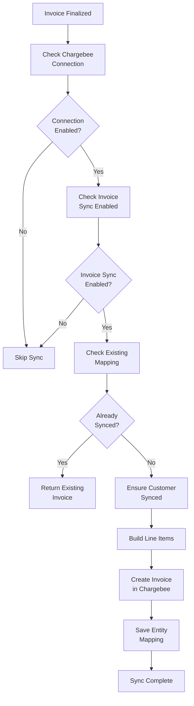

## Overview

Invoice sync in Flexprice sends invoices to Chargebee for payment processing. The sync process handles different pricing models (flat fee, per unit, tiered) with precision-aware amount handling to ensure accurate billing.

### Key Features

- **Automatic Sync**: Invoices sync automatically when finalized
- **Precision Handling**: Different strategies for flat fee vs tiered pricing
- **Customer Auto-Sync**: Customers are synced automatically during invoice sync
- **Webhook Processing**: Payment webhooks update invoice status automatically
- **Amount Accuracy**: Ensures exact amount matching with Flexprice calculations

## Invoice Sync Flow



## Invoice Sync Timing

Invoices are automatically synced to Chargebee when:

1. **Invoice Finalization**: Invoice status changes from `DRAFT` to `FINALIZED`
2. **Invoice Sync Enabled**: Invoice outbound sync is enabled in Chargebee connection
3. **Connection Active**: Chargebee connection exists and is active

**Manual Sync:**
- Invoices can also be synced manually via API if needed

## Line Item Handling

### Critical: Different Strategies by Pricing Model

Flexprice uses **different strategies** for sending line items to Chargebee based on the pricing model. This is crucial for maintaining precision and accuracy.

### Flat Fee / Per Unit / Package Pricing

For **non-tiered** pricing models (flat_fee, per_unit, package):

**Strategy:** Send `quantity=1` + exact `unit_amount`

```json
{
  "item_price_id": "price_123",
  "quantity": 1,
  "unit_amount": 1000  // Exact amount in smallest currency unit (cents)
}
```

**Why This Approach:**
- Chargebee has **2 decimal precision** limitations
- Sending exact amount as `unit_amount` ensures **perfect accuracy**
- Quantity=1 means "charge this exact amount once"
- Prevents rounding errors from quantity × unit_price calculations

**Example:**
- Flexprice amount: $10.50
- Sent to Chargebee: `quantity=1, unit_amount=1050` (cents)
- Result: Exact $10.50 charge

### Tiered Pricing

For **tiered** pricing models (tiered, volume, stairstep):

**Strategy:** Send **only quantity**, let Chargebee calculate amount

```json
{
  "item_price_id": "price_123",
  "quantity": 1500
  // NO unit_amount - Chargebee calculates based on tiers
}
```

**Why This Approach:**
- Tier calculations involve complex multi-tier math
- Chargebee's tier calculation may differ slightly due to rounding
- Sending quantity allows Chargebee to apply its tier logic correctly
- Prevents precision mismatches from manual tier calculations

**Important Notes:**
- **DO NOT** set `unit_amount` for tiered pricing (Chargebee will reject it)
- Chargebee calculates the amount based on tier definitions
- There may be **slight differences** (usually < $0.01) due to rounding
- This is expected and acceptable for tiered pricing

**Example:**
- Flexprice quantity: 1500 units
- Flexprice calculated amount: $125.75
- Sent to Chargebee: `quantity=1500` (no unit_amount)
- Chargebee calculates: $125.74 (may differ slightly)
- Difference: $0.01 (acceptable rounding difference)

### Pricing Model Detection

The system automatically detects the pricing model:

1. **Lookup Item Price**: Retrieves Chargebee item price by Flexprice price ID
2. **Check Pricing Model**: Reads `pricing_model` from Chargebee item price
3. **Determine Strategy**: 
   - If `tiered`, `volume`, or `stairstep` → Send quantity only
   - Otherwise → Send quantity=1 + unit_amount

## Amount Conversion

### Currency Precision

All amounts are converted to smallest currency unit:

| Currency | Precision | Smallest Unit | Example |
|----------|-----------|---------------|---------|
| USD | 2 | Cents | $10.50 → 1050 cents |
| EUR | 2 | Cents | €10.50 → 1050 cents |
| INR | 2 | Paise | ₹10.50 → 1050 paise |
| JPY | 0 | Yen | ¥100 → 100 yen |

**Conversion Formula:**
```
amount_in_smallest_unit = round(amount × 10^precision)
```

### Why 2 Decimal Precision Matters

Chargebee stores all monetary values as integers in the smallest currency unit. This means:

- **2 decimal currencies** (USD, EUR, INR): Stored as cents/paise
- **0 decimal currencies** (JPY): Stored as whole units

**Precision Issues:**
- If we send `quantity × unit_price` for flat fees, rounding errors can occur
- Example: quantity=1, unit_price=10.505 → rounds to 10.51 (wrong!)
- Solution: Send exact amount as `unit_amount` with `quantity=1`

## Invoice Creation

### Request Structure

```json
{
  "customer_id": "cust_chargebee123",
  "auto_collection": "on",
  "line_items": [
    {
      "item_price_id": "price_123",
      "quantity": 1,
      "unit_amount": 1000
    }
  ],
  "invoice_date": 1642680600,
  "due_date": 1642767000
}
```

### Line Item Fields

| Field | Required | Description |
|-------|----------|-------------|
| `item_price_id` | ✅ | Chargebee item price ID (from entity mapping) |
| `quantity` | ✅ | Quantity (1 for flat fees, actual quantity for tiers) |
| `unit_amount` | ❌ | Unit amount in smallest currency unit (only for non-tiered) |
| `date_from` | ❌ | Period start date (Unix timestamp) |
| `date_to` | ❌ | Period end date (Unix timestamp) |
| `description` | ❌ | Line item description |

### Auto Collection

Invoices are created with `auto_collection: "on"`:
- Chargebee automatically attempts payment collection
- Uses customer's default payment method
- Sends payment reminders if needed

## Entity Mapping

### Invoice Mapping Storage

After syncing an invoice, Flexprice stores the mapping:

- **Entity Type**: `invoice`
- **Entity ID**: Flexprice invoice ID
- **Provider Type**: `chargebee`
- **Provider Entity ID**: Chargebee invoice ID

This mapping is used for:
- Webhook processing (finding Flexprice invoice from Chargebee invoice)
- Duplicate prevention (checking if invoice already synced)
- Status updates (updating Flexprice invoice from Chargebee)

## Webhook Handling

### Supported Webhooks

| Event Type | Purpose |
|------------|---------|
| `payment_succeeded` | Track successful payment completions |

### Webhook URL Format

```
https://api.cloud.flexprice.io/v1/webhooks/chargebee/{tenant_id}/{environment_id}
```

### Webhook Authentication

Chargebee webhooks support Basic Authentication:

1. **Configure in Chargebee**: Set username and password in webhook settings
2. **Store in Connection**: Save credentials in Chargebee connection
3. **Verify on Receipt**: Flexprice verifies Basic Auth credentials
4. **Optional**: If not configured, webhooks are still accepted (less secure)

### Payment Succeeded Webhook

When a payment succeeds in Chargebee:

**Webhook Payload:**
```json
{
  "event_type": "payment_succeeded",
  "content": {
    "transaction": {
      "id": "txn_123",
      "amount": 1000,
      "currency_code": "USD",
      "payment_method": "card"
    },
    "invoice": {
      "id": "inv_chargebee123"
    }
  }
}
```

**Processing Flow:**
1. **Receive Webhook**: Flexprice receives the webhook
2. **Verify Auth**: Verify Basic Authentication (if configured)
3. **Find Invoice**: Look up Flexprice invoice ID from Chargebee invoice ID
4. **Check Duplicate**: Verify payment doesn't already exist
5. **Create Payment**: Create payment record in Flexprice
6. **Update Invoice**: Update invoice payment status and amounts
7. **Reconcile**: Reconcile invoice with payment

### Payment Record Creation

When processing a payment webhook:

**Payment Record:**
```json
{
  "id": "pay_123",
  "destination_type": "INVOICE",
  "destination_id": "inv_flexprice123",
  "amount": "10.00",
  "currency": "USD",
  "payment_status": "SUCCEEDED",
  "payment_gateway": "chargebee",
  "gateway_payment_id": "txn_123",
  "succeeded_at": "2024-01-20T10:30:00Z"
}
```

**Idempotency:**
- Payments are checked for duplicates using `gateway_payment_id`
- Prevents duplicate payment records from webhook retries

## Error Handling

### Common Sync Errors

| Error | Cause | Resolution |
|-------|-------|------------|
| "Customer not found" | Customer not synced | Customer sync happens automatically |
| "Item price not found" | Price not synced to Chargebee | Sync plan to Chargebee first |
| "Invalid amount" | Amount precision issue | Check amount conversion |
| "Invoice already synced" | Duplicate sync attempt | Use existing Chargebee invoice |

### Webhook Errors

| Error | Cause | Resolution |
|-------|-------|------------|
| "Authentication failed" | Wrong Basic Auth credentials | Update webhook credentials |
| "Invoice not found" | Invoice mapping missing | Check entity integration mapping |
| "Payment already exists" | Duplicate webhook | Idempotency check prevents duplicates |

## Best Practices

### Invoice Sync

1. **Sync Plans First**: Always sync plans to Chargebee before creating invoices
2. **Verify Items**: Ensure item prices exist in Chargebee
3. **Check Amounts**: Verify amounts match between Flexprice and Chargebee

### Amount Precision

1. **Flat Fees**: Always use quantity=1 + exact unit_amount
2. **Tiered Pricing**: Accept small rounding differences (< $0.01)
3. **Currency Awareness**: Be aware of currency precision (2 vs 0 decimals)
4. **Testing**: Test with various amounts to verify precision

## Testing

### Test Invoice Sync

1. **Create Test Invoice**: Create invoice in Flexprice
2. **Finalize Invoice**: Change status to FINALIZED
3. **Verify Sync**: Check Chargebee dashboard for invoice
4. **Verify Amounts**: Compare amounts between Flexprice and Chargebee
5. **Test Payment**: Process test payment in Chargebee
6. **Verify Webhook**: Check payment record in Flexprice

## Next Steps

After setting up invoice sync:

1. **Sync Plans**: Ensure all plans are synced to Chargebee
2. **Create Invoices**: Create and finalize invoices
3. **Monitor Sync**: Check sync status and logs
4. **Test Payments**: Process test payments and verify webhooks
5. **Go Live**: Switch to production when ready

For detailed information about item sync, see [Item Sync Documentation](/integrations/chargebee/item-sync).

