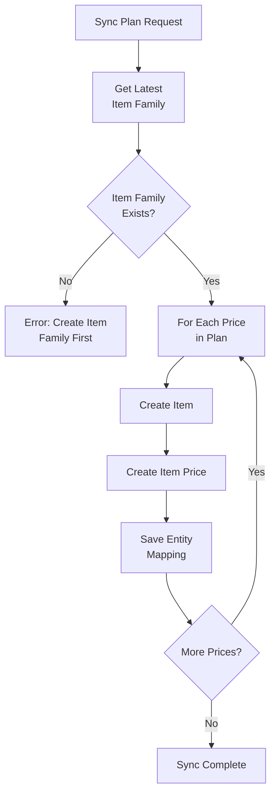

## Overview

Item sync in Flexprice creates the necessary Chargebee infrastructure (item families, items, and item prices) to support invoice synchronization. This enables Flexprice plans and prices to be represented in Chargebee's item-based pricing model.

### Key Concepts

- **Item Family**: A container for related items in Chargebee (required before syncing plans)
- **Item**: Represents a chargeable entity (one per price/currency combination)
- **Item Price**: Defines the pricing model and rates for an item
- **One Item Per Currency**: Chargebee only allows one item price per currency per item, so we create separate items for each price

## Item Family

### Overview

An item family is a container that groups related items together in Chargebee. You must create at least one item family in Chargebee before syncing plans.

### Creating an Item Family

**In Chargebee Dashboard:**
1. Go to Products → Item Families
2. Click **+ Add Item Family**
3. Enter a name (e.g., "Flexprice Charges")
4. Click **Save**

**Via API:**
```json
{
  "id": "item_family_123",
  "name": "Flexprice Charges"
}
```

### Item Family Selection

When syncing plans, Flexprice automatically:
1. Retrieves all item families from Chargebee
2. Selects the **latest** item family (most recently created)
3. Uses it for all synced items

**Note**: Ensure you have at least one item family in Chargebee before syncing plans.

## Item Sync Process

### Plan Sync Flow

When you sync a Flexprice plan to Chargebee:



### Item Creation

For each price in a plan, Flexprice creates:

1. **One Item** (type: `charge`)
   - ID format: `charge_{uuid}`
   - Name: Same as ID (must be unique)
   - Type: `charge` (for one-time/recurring charges)
   - Item Family: Latest item family from Chargebee
   - External Name: `{display_name} - {currency}` (e.g., "API Calls - USD")

2. **One Item Price** (linked to the item)
   - ID: Flexprice price ID (for easy mapping)
   - Item ID: The created item ID
   - External Name: `{display_name} - {currency}`
   - Currency: Price currency
   - Pricing Model: Mapped from Flexprice billing model

### Why Separate Items Per Price?

Chargebee has a limitation: **only one item price per currency per item**. To support multiple currencies or multiple prices per plan, we create separate items for each price.

**Example:**
- Plan: "Pro Plan" with prices in USD and EUR
- Result: 2 items created (`charge_uuid1` for USD, `charge_uuid2` for EUR)

## Item Price Sync

### Pricing Model Mapping

Flexprice billing models are mapped to Chargebee pricing models:

| Flexprice Billing Model | Flexprice Type | Chargebee Pricing Model |
|------------------------|----------------|------------------------|
| `FLAT_FEE` | `FIXED` | `flat_fee` |
| `FLAT_FEE` | `USAGE` | `per_unit` |
| `PACKAGE` | - | `package` |
| `TIERED` | `VOLUME` | `volume` |
| `TIERED` | `SLAB` | `tiered` |

### Flat Fee / Per Unit Pricing

For flat fee and per unit pricing:

```json
{
  "id": "price_123",
  "item_id": "charge_uuid1",
  "pricing_model": "flat_fee",
  "price": 1000,  // Amount in smallest currency unit (cents for USD)
  "currency_code": "USD"
}
```

**Details:**
- `price`: Amount converted to smallest currency unit (cents for USD, paise for INR)
- No tiers required
- Simple fixed pricing

### Package Pricing

For package pricing:

```json
{
  "id": "price_123",
  "item_id": "charge_uuid1",
  "pricing_model": "package",
  "price": 1000,
  "currency_code": "USD",
  "period": 10,  // Optional: package size
  "period_unit": "month"
}
```

**Details:**
- `price`: Package price in smallest currency unit
- `period`: Optional package size (e.g., 10 units per package)
- Used for bulk pricing models

### Tiered Pricing

For tiered/volume pricing:

```json
{
  "id": "price_123",
  "item_id": "charge_uuid1",
  "pricing_model": "volume",
  "currency_code": "USD",
  "tiers": [
    {
      "starting_unit": 1,
      "ending_unit": 1000,
      "price": 100  // Price per unit in this tier (in cents)
    },
    {
      "starting_unit": 1001,
      "ending_unit": 10000,
      "price": 80
    },
    {
      "starting_unit": 10001,
      "ending_unit": null,  // Last tier has no ending
      "price": 60
    }
  ]
}
```

**Details:**
- `tiers`: Array of tier definitions
- `starting_unit`: Minimum quantity for this tier (1-based)
- `ending_unit`: Maximum quantity for this tier (null for last tier)
- `price`: Price per unit in this tier (in smallest currency unit)
- Tiers are converted from Flexprice tier format to Chargebee format

### Tier Conversion

Flexprice tiers are converted to Chargebee format:

**Flexprice Tier:**
```json
{
  "up_to": 1000,
  "unit_amount": 1.00
}
```

**Chargebee Tier:**
```json
{
  "starting_unit": 1,
  "ending_unit": 1000,
  "price": 100  // 1.00 USD = 100 cents
}
```

**Conversion Rules:**
1. `unit_amount` converted to smallest currency unit (e.g., $1.00 → 100 cents)
2. `up_to` becomes `ending_unit`
3. `starting_unit` calculated from previous tier's `ending_unit + 1`
4. First tier always starts at 1
5. Last tier has `ending_unit: null`

## Amount Conversion

### Currency Precision

All amounts are converted to the smallest currency unit based on currency precision:

| Currency | Precision | Smallest Unit | Example |
|----------|-----------|---------------|---------|
| USD | 2 | Cents | $1.00 → 100 cents |
| EUR | 2 | Cents | €1.00 → 100 cents |
| INR | 2 | Paise | ₹1.00 → 100 paise |
| JPY | 0 | Yen | ¥100 → 100 yen |

**Formula:**
```
amount_in_smallest_unit = amount × 10^precision
```

### Why Convert to Smallest Unit?

Chargebee stores all prices as integers in the smallest currency unit to avoid floating-point precision issues. This ensures accurate calculations and prevents rounding errors.

## Entity Mapping

### Mapping Storage

After syncing items and item prices, Flexprice stores entity mappings:

**Price → Item Price Mapping:**
- Entity Type: `item_price`
- Entity ID: Flexprice price ID
- Provider Entity ID: Chargebee item price ID
- Provider Type: `chargebee`

This mapping is used during invoice sync to find the correct Chargebee item price for each Flexprice price.

## Display Names

### External Names

Items and item prices use external names for better invoice display:

**Format:** `{display_name} - {currency}`

**Examples:**
- "API Calls - USD"
- "Pro Plan - EUR"
- "Storage - INR"

**Display Name Priority:**
1. Feature name (if price has a meter/feature)
2. Meter name (if feature not found)
3. Plan name (fallback)

## Error Handling

### Common Sync Errors

| Error | Cause | Solution |
|-------|-------|----------|
| "Item family not found" | No item family in Chargebee | Create an item family first |
| "Item already exists" | Duplicate item ID | Item IDs are auto-generated, should not occur |
| "Invalid pricing model" | Unsupported billing model | Check billing model mapping |
| "Currency not supported" | Invalid currency code | Verify currency is supported by Chargebee |

### Sync Failure Recovery

When item sync fails:
1. **Partial Sync**: Some items may be created even if others fail
2. **Retry**: Re-sync the plan to create missing items
3. **Manual Cleanup**: Remove failed items from Chargebee if needed
4. **Logs**: Check application logs for detailed error messages

## Best Practices

### Item Family Management

1. **Single Family**: Use one item family for all Flexprice items (simplifies management)
2. **Naming**: Use descriptive names (e.g., "Flexprice Charges")
3. **Organization**: Group related items in the same family

### Price Sync Strategy

1. **Sync Before Invoicing**: Always sync plans before creating invoices
2. **Currency Separation**: Each currency requires a separate item
3. **Tier Precision**: Be aware that tier calculations may have slight differences due to rounding

### Testing

1. **Test Environment**: Use Chargebee test mode for development
2. **Verify Items**: Check created items in Chargebee dashboard
3. **Test Invoices**: Create test invoices to verify item prices work correctly

## Next Steps

After syncing items:

1. **Verify Items**: Check created items in Chargebee dashboard
2. **Test Invoice Sync**: Create a test invoice and sync to Chargebee
3. **Monitor Mappings**: Ensure entity mappings are created correctly
4. **Go Live**: Switch to production when ready

For detailed information about invoice sync, see [Invoice Sync Documentation](/integrations/chargebee/invoice-sync).

