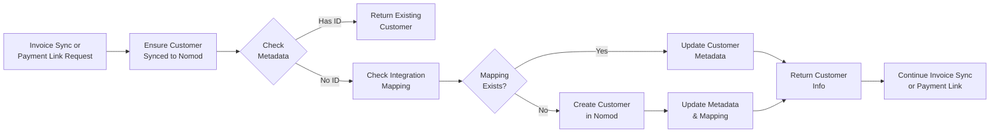
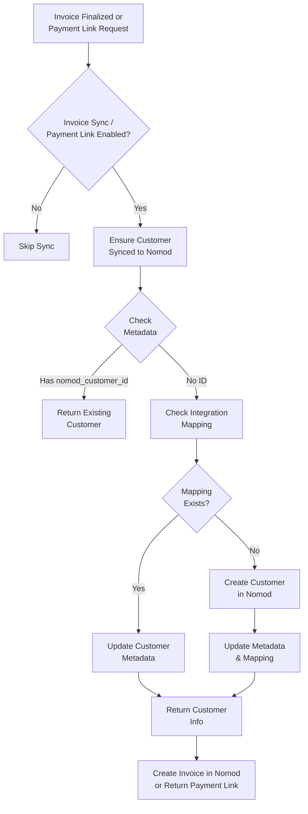

## Overview

Customer synchronization in Flexprice ensures that customers exist in Nomod before invoice sync and payment link. **Customers are synced to Nomod when invoices are being synced**, ensuring proper invoice-to-customer association in Nomod.

### Key Concepts

- **Invoice- and Payment-Link-Triggered Sync**: Customers are synced only when invoice sync or payment link is triggered
- **On-Demand Sync**: Sync happens automatically during invoice sync
- **One-Way Sync**: Customers are synced from Flexprice to Nomod only (not bidirectional)
- **Entity Integration Mapping**: Links Flexprice customers to Nomod customer IDs
- **Metadata Storage**: Customer metadata stores cross-platform references
- **Duplicate Prevention**: Intelligent checks prevent duplicate customer creation in Nomod

## Synchronization Flow

Customer sync is **invoice- or payment-link-triggered** and happens automatically:



### When Customer Sync Happens

Customer sync is triggered **only** when:
- An invoice is being synced to Nomod
- A payment link is requested for an invoice
- Invoice outbound sync is enabled in the Nomod connection (`invoice_sync.outbound = true`) when syncing invoices
- Invoice status changes from `DRAFT` to `FINALIZED` (for invoice sync)

**Customer sync does NOT happen for:**
- Manual customer operations
- Other flows that do not involve invoice sync or payment link

## Customer Data Model

### Flexprice Customer Structure

```json
{
  "id": "cust_1234567890abcdef",
  "name": "John Doe",
  "email": "john@example.com",
  "metadata": {
    "nomod_customer_id": "cust_nomod123abc",
    "nomod_sync_timestamp": "2024-01-20T10:30:00Z"
  },
  "environment_id": "prod",
  "tenant_id": "tenant_123",
  "status": "active",
  "created_at": "2024-01-20T10:30:00Z"
}
```

## Sync Configuration

### Required Fields for Sync

| Field | Flexprice → Nomod | Notes |
|-------|-------------------|-------|
| `name` | ✅ | Customer full name (required for Nomod customer creation) |
| `email` | ✅ | Primary email address (required for Nomod customer creation) |

### Optional Fields

| Field | Description |
|-------|-------------|
| `phone` | Phone number (E.164 format) |
| `address` | Customer address information |
| `external_id` | Your internal customer ID |
| `metadata` | Custom key-value pairs |

## Sync Process Details

### Invoice Sync and Payment Link Flow (Customer-Triggered)



## Customer Linking

### Metadata Storage

Customer linking is maintained through metadata fields:

**In Flexprice Customer:**
```json
{
  "metadata": {
    "nomod_customer_id": "cust_nomod123abc",
    "nomod_sync_timestamp": "2024-01-20T10:30:00Z"
  }
}
```

**In Nomod Customer:**
```json
{
  "metadata": {
    "flexprice_customer_id": "cust_1234567890abcdef",
    "flexprice_environment": "prod",
    "flexprice_sync_timestamp": "2024-01-20T10:30:00Z"
  }
}
```

### Link Verification

You can verify customer links using the API:

**Endpoint:** `GET /api/v1/customers/{customer_id}/integrations`

**Headers:**
```http
Authorization: Bearer your_api_key
X-Tenant-ID: your_tenant_id
X-Environment-ID: your_environment_id
```

**Response:**
```json
{
  "customer_id": "cust_1234567890abcdef",
  "integrations": {
    "nomod": {
      "nomod_customer_id": "cust_nomod123abc",
    }
  }
}
```

## Error Handling

### Common Sync Errors

| Error | Cause | Resolution |
|-------|-------|------------|
| "Customer not found" | Invalid customer ID | Verify customer exists in Flexprice |
| "Email already exists" | Duplicate email in Nomod | Check for existing customer in Nomod dashboard |
| "Invalid email format" | Malformed email address | Fix email format in Flexprice customer |
| "Missing required fields" | Name or email missing | Ensure customer has `name` and `email` in Flexprice |
| "Nomod API error" | Nomod connection issue | Check Nomod connection credentials and status |


## Testing Customer Sync

### Test Environment Setup

<Steps>
  <Step title="Use Nomod Test Mode">
    Configure Nomod connection with test API keys (`sk_test_...`)
  </Step>

  <Step title="Create Test Customers">
    Create test customers in Flexprice with `name` and `email` (no sync yet)
  </Step>

  <Step title="Verify No Initial Sync">
    Customers should NOT exist in Nomod initially
  </Step>
</Steps>

### Invoice Sync Testing Flow

<Steps>
  <Step title="Create Test Customer">
    Add a customer in Flexprice with name and email (no sync yet)
  </Step>

  <Step title="Verify No Sync">
    Customer should NOT exist in Nomod initially
  </Step>

  <Step title="Enable Invoice Sync">
    Ensure invoice outbound sync is enabled in the Nomod connection
  </Step>

  <Step title="Create and Finalize Invoice">
    Create an invoice for the customer and finalize it (status changes to `FINALIZED`)
  </Step>

  <Step title="Verify Auto-Sync">
    Customer should now exist in Nomod with linked metadata (`nomod_customer_id` in Flexprice customer metadata)
  </Step>

  <Step title="Test Duplicate Prevention">
    Create another invoice for the same customer and verify it uses the existing Nomod customer (no duplicate created)
  </Step>
</Steps>


