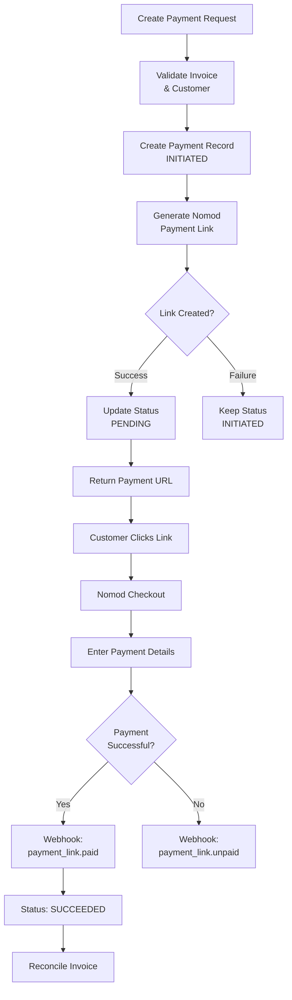

## Overview

Payment links in Flexprice provide a secure, hosted checkout experience powered by Nomod. Customers click a payment URL and are redirected to Nomod's secure checkout page to complete their payment.

### Key Features

- **Secure checkout**: Hosted by Nomod with PCI compliance.
- **Multiple Payment Methods**: Supports various payment methods available in Nomod
- **Real-time Updates**: Webhook-driven status updates
- **Auto-generated Links**: Nomod automatically generates payment link URLs

## Payment Link Lifecycle



## Payment Status Flow

### Status Transitions

```
INITIATED → PENDING → SUCCEEDED
```

### Status Definitions

| Status | Description | Triggers |
|--------|-------------|----------|
| `INITIATED` | Payment record created, Nomod link not yet created | Initial payment creation |
| `PENDING` | Nomod payment link created successfully | Successful Nomod API call |
| `SUCCEEDED` | Payment completed successfully | Nomod webhook: `payment_link.paid` |

## Creating Payment Links

### Prerequisites

1. **Nomod Connection**: Active Nomod connection configured
2. **Invoice Status**: Invoice must be finalized and unpaid
3. **Valid Amount**: Payment amount must match invoice outstanding
4. **Connection Status**: Connection must be in "Published" status

### Recording Payments with Nomod

You can use Nomod to generate payment links when recording payments:

<Steps>
  <Step title="Open Record Payment Dialog">
    Navigate to the invoice or customer page, click **"Record Payment"**, and enter the payment amount.
  </Step>

  <Step title="Select Payment Method">
    In the **Payment Method** dropdown, select **"Payment Link"**. In the **Payment Provider** dropdown, select your Nomod connection. Optionally add a description.
  </Step>

  <Step title="Generate Payment Link">
    Click **"Record"** to create the payment. A payment link will be generated via Nomod and a success dialog will display the payment URL. You can copy the URL to share with the customer, open the link in a new tab, or close the dialog.
  </Step>

  <Step title="Customer Payment">
    Share the payment link with your customer. The customer clicks the link and completes payment through Nomod. Payment status updates automatically via webhooks.
  </Step>
</Steps>

### API Request

**Endpoint:** `POST /api/v1/payments`

**Headers:**
```http
Content-Type: application/json
Authorization: Bearer your_api_key
X-Environment-ID: your_environment_id
```

**Request Body:**
```json
{
  "amount": 100.00,
  "currency": "USD",
  "destination_id": "inv_123",
  "destination_type": "invoice",
  "payment_method_type": "payment_link",
  "payment_gateway": "nomod",
  "metadata": {
    "connection_id": "conn_123",
    "connection_name": "Nomod Production",
    "success_url": "https://app.flexprice.com/billing/invoices/inv_123",
    "cancel_url": "https://app.flexprice.com/billing/invoices/inv_123"
  }
}
```

### Response

```json
{
  "id": "pay_1234567890abcdef",
  "payment_status": "pending",
  "payment_url": "https://nomod.com/pay/abc123",
  "amount": "100.00",
  "currency": "USD",
  "gateway_tracking_id": "plink_1234567890abcdef",
  "created_at": "2024-01-20T10:30:00Z",
  "metadata": {
    "nomod_payment_link_id": "plink_1234567890abcdef"
  }
}
```

**Note**: The `payment_url` is automatically generated by Nomod and returned as a URL.

### Payment Link Configuration

### Required Fields

| Field | Type | Required | Description |
|-------|------|----------|-------------|
| `destination_type` | string | ✅ | Must be `"invoice"` |
| `destination_id` | string | ✅ | Valid invoice ID |
| `payment_method_type` | string | ✅ | Must be `"payment_link"` |
| `payment_gateway` | string | ✅ | Must be `"nomod"` |
| `amount` | string | ✅ | Payment amount (must match invoice) |
| `currency` | string | ✅ | Valid currency code (USD, etc.) |
| `success_url` | string | ❌ | Callback URL after payment (optional) |
| `cancel_url` | string | ❌ | Callback URL after cancellation (optional) |

## Payment Link Features

- **Secure**: All payments processed through Nomod's secure infrastructure
- **Multiple Payment Methods**: Supports various payment methods available in Nomod
- **Automatic Updates**: Payment status updates automatically when customer pays
- **Success/Cancel URLs**: Automatically configured to redirect back to Flexprice

### API reference

**Payment Link:** [Create a new payment](https://docs.flexprice.io/api-reference/payments/create-a-new-payment#create-a-new-payment)

### Invoice Sync


Whenever an invoice is generated in Flexprice it's synced to Nomod in realtime and Nomod generates a payment link for the invoice.

1. **Payment Link Reuse**: If a payment link is requested for a synced invoice, the existing Nomod invoice payment URL is returned
2. **Automatic Association**: Payments made through the URL are automatically associated with the invoice
3. **Metadata**: Once synced, you get the Nomod invoice details and payment URL in the Flexprice invoice metadata


### Invoices are automatically synced to Nomod when:
- Invoice is finalized (status changes from `DRAFT` to `FINALIZED`)
- Invoice outbound sync is enabled in the Nomod connection
- Customer is successfully synced to Nomod (if applicable)


**API reference:** [Get an invoice by ID](https://docs.flexprice.io/api-reference/invoices/get-an-invoice-by-id)

## Error Handling

### Common Payment Errors

| Error | Cause | Resolution |
|-------|-------|------------|
| "Payment links not generating" | Connection not published | Verify connection status is "Published" |
| "Invalid invoice amount" | Amount mismatch | Ensure amount matches invoice |
| "Invoice already paid" | Invoice status issue | Check invoice payment status |
| "Nomod link creation failed" | API error | Check Nomod connection |


## Security Considerations

### Payment Link Security

- **HTTPS Required**: All payment links use HTTPS
- **Link Expiry**: Links expire based on Nomod settings
- **One-time Use**: Each link can only be used once
- **Signature Verification**: All webhooks verified

### Data Protection

- **PCI Compliance**: Nomod handles sensitive payment data
- **No Card Storage**: Card details never stored in Flexprice
- **Encrypted Storage**: All payment data encrypted at rest

## Webhook Endpoints

- `POST /api/v1/webhooks/nomod/{tenant_id}/{environment_id}` - Nomod webhook handler

For complete API documentation, see the [API Reference](/api-reference/payments/create-a-new-payment).


