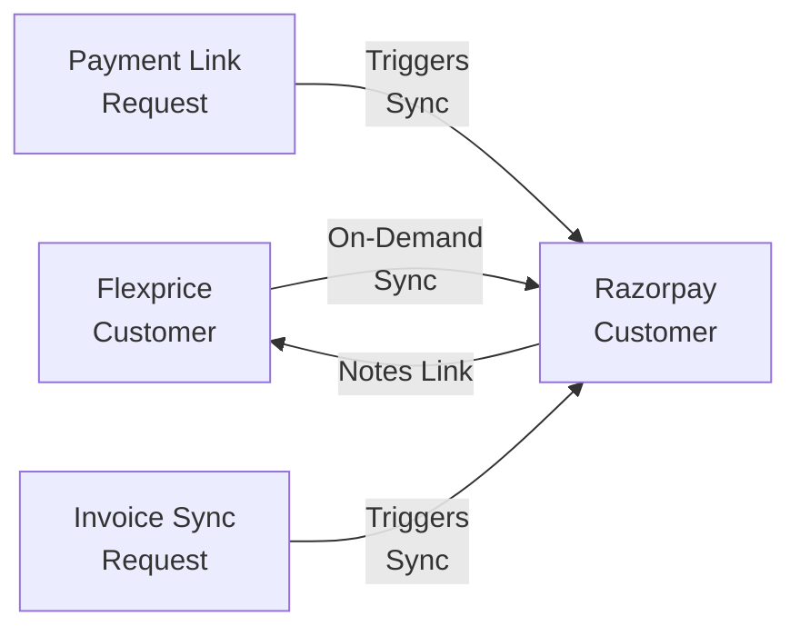
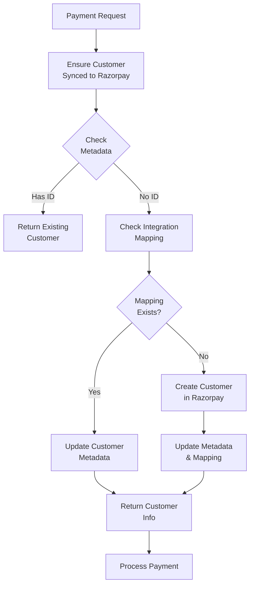

## Overview

Customer synchronization ensures that customers exist in both Flexprice and Razorpay with linked identifiers, enabling:
- **On-demand sync**: Customers are synced to Razorpay only when needed for payments
- Payment link creation for any Flexprice customer
- Invoice sync to Razorpay
- Consistent customer data across platforms
- Efficient payment processing workflows

**Note**: Customer sync is **one-way only** (Flexprice → Razorpay). Customers are automatically synced to Razorpay when:
- Creating payment links
- Syncing invoices to Razorpay

## Synchronization Flow

Customer sync works **on-demand** and is **one-way only** (Flexprice → Razorpay):



### Key Concepts

- **One-Way Sync**: Customers are synced from Flexprice to Razorpay only (not bidirectional)
- **On-Demand Sync**: Customers are synced to Razorpay only when payment interactions occur
- **Sync Triggers**: Sync happens automatically when creating payment links or syncing invoices
- **Entity Integration Mapping**: Links Flexprice customers to Razorpay customer IDs
- **Notes Storage**: Customer notes store cross-platform references for linking
- **Duplicate Prevention**: Intelligent checks prevent duplicate customer creation in Razorpay
- **Performance Optimization**: No unnecessary syncs for customers who never make payments

## Customer Data Model

### Flexprice Customer Structure

```json
{
  "id": "cust_1234567890abcdef",
  "metadata": {
    "razorpay_customer_id": "cust_razorpay123abc"
  },
  "environment_id": "prod",
  "tenant_id": "tenant_123",
  "status": "active",
  "created_at": "2024-01-20T10:30:00Z"
}
```

## Sync Configuration

### Required Fields for Sync

| Field | Flexprice → Razorpay | Notes |
|-------|---------------------|-------|
| `name` | ✅ | Customer full name |
| `email` | ✅ | Primary email address |

## Sync Process Details

### On-Demand Sync Flow (Payment-Triggered)



## Customer Linking

### Notes Storage

Customer linking is maintained through notes fields:

**In Flexprice Customer:**
```json
{
  "metadata": {
    "razorpay_customer_id": "cust_razorpay123abc",
    "razorpay_sync_timestamp": "2024-01-20T10:30:00Z"
  }
}
```

**In Razorpay Customer:**
```json
{
  "notes": {
    "flexprice_customer_id": "cust_1234567890abcdef",
    "flexprice_environment": "prod",
    "flexprice_sync_timestamp": "2024-01-20T10:30:00Z"
  }
}
```

## Error Handling

### Common Sync Errors

| Error | Cause | Resolution |
|-------|-------|------------|
| "Customer not found" | Invalid customer ID | Verify customer exists |
| "Email already exists" | Duplicate email in Razorpay | Check for existing customer |
| "Invalid email format" | Malformed email address | Fix email format |
| "Razorpay API error" | Razorpay connection issue | Check Razorpay credentials |

### Sync Failure Recovery

When sync fails:

1. **Log Error**: Record failure with details
2. **Retry Logic**: Automatic retry with exponential backoff
3. **Manual Intervention**: Admin can retry failed syncs
4. **Notification**: Alert on persistent failures

## Testing Customer Sync

### Test Environment Setup

1. **Test Razorpay Account**: Use Razorpay test mode
2. **Test Customers**: Create test customers in Flexprice only
3. **Webhook Testing**: Use ngrok for local webhook testing

### On-Demand Sync Testing Flow

1. **Create Test Customer**: Add customer in Flexprice (no sync yet)
2. **Verify No Sync**: Customer should NOT exist in Razorpay initially
3. **Create Payment Link**: Trigger payment link creation
4. **Verify Auto-Sync**: Customer should now exist in Razorpay
5. **Test Invoice Sync**: Sync invoice with same customer
6. **Verify Reuse**: Should use existing Razorpay customer (no duplicate)

