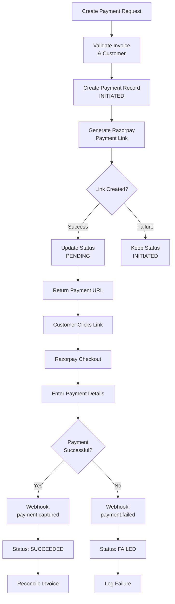

## Overview

Payment links in Flexprice provide a secure, hosted checkout experience powered by Razorpay. Customers click a payment URL and are redirected to Razorpay's secure checkout page to complete their payment.

### Key Features

- **Secure Checkout**: Hosted by Razorpay with PCI compliance
- **Multiple Payment Methods**: Cards, UPI, netbanking, wallets, and more
- **Real-time Updates**: Webhook-driven status updates
- **Invoice Integration**: Automatic invoice reconciliation
- **Auto-generated Links**: Razorpay automatically generates payment link URLs

## Payment Link Lifecycle



## Payment Status Flow

### Status Transitions

```
INITIATED → PENDING → SUCCEEDED
    ↓           ↓          ↓
  FAILED     FAILED    REFUNDED
```

### Status Definitions

| Status | Description | Triggers |
|--------|-------------|----------|
| `INITIATED` | Payment record created, Razorpay link not yet created | Initial payment creation |
| `PENDING` | Razorpay payment link created successfully | Successful Razorpay API call |
| `PROCESSING` | Payment is being processed | Temporary status during updates |
| `SUCCEEDED` | Payment completed successfully | Razorpay webhook: `payment.captured` |
| `FAILED` | Payment attempt failed | Razorpay webhook: `payment.failed` |
| `REFUNDED` | Payment was refunded | Manual refund processing |

## Creating Payment Links

### Prerequisites

1. **Razorpay Connection**: Active Razorpay connection configured
2. **Customer Sync**: Customer must have Razorpay customer ID
3. **Invoice Status**: Invoice must be finalized and unpaid
4. **Valid Amount**: Payment amount must match invoice outstanding
5. **Currency Minimums**: Ensure amounts meet Razorpay minimums

### Currency Minimum Amounts

Razorpay requires minimum amounts in the smallest currency subunit:

| Currency | Minimum amount (in smallest subunit) | Equivalent Minimum Value |
|----------|-------------------------------------|-------------------------|
| INR | 100 | ₹1.00 |
| USD | 1 | $0.01 |

**Important**: Amounts are automatically converted to smallest currency units (paise for INR, cents for USD) when creating payment links.

### API Request

**Endpoint:** `POST /api/v1/payments`

**Headers:**
```http
Content-Type: application/json
Authorization: Bearer your_api_key
X-Environment-ID: your_environment_id
```

**Request Body:**
```json
{
    "amount": 100,
    "currency": "inr",
    "destination_id": "inv_01K34HYZN03V6X8Q6V3T8X6G4F",
    "destination_type": "INVOICE",
    "payment_method_type": "PAYMENT_LINK",
    "process_payment": true,
    "payment_gateway": "razorpay",
    "success_url": "https://admin.flexprice.io/customer-management/invoices/inv_01K34HYZN03V6X8Q6V3T8X6G4F?page=1"
}
```

### Response

```json
{
  "id": "pay_1234567890abcdef",
  "payment_status": "pending",
  "payment_url": "https://rzp.io/i/abc123",
  "amount": "100.00",
  "currency": "inr",
  "gateway_tracking_id": "plink_1234567890abcdef",
  "created_at": "2024-01-20T10:30:00Z",
  "metadata": {
    "razorpay_payment_link_id": "plink_1234567890abcdef"
  }
}
```

**Note**: The `payment_url` is automatically generated by Razorpay and returned as a short URL (e.g., `https://rzp.io/i/abc123`).

## Payment Link Configuration

### Required Fields

| Field | Type | Required | Description |
|-------|------|----------|-------------|
| `destination_type` | string | ✅ | Must be `"INVOICE"` |
| `destination_id` | string | ✅ | Valid invoice ID |
| `payment_method_type` | string | ✅ | Must be `"PAYMENT_LINK"` |
| `payment_gateway` | string | ✅ | Must be `"razorpay"` |
| `amount` | string | ✅ | Payment amount (must match invoice) |
| `currency` | string | ✅ | Valid currency code (INR, USD, etc.) |
| `process_payment` | boolean | ✅ | Set to `true` to create Razorpay link |
| `success_url` | string | ❌ | Callback URL after payment (optional) |

## Razorpay Payment Link Configuration

### Default Payment Link Settings

When creating payment links, Flexprice automatically configures Razorpay with:

- **Payment Methods**: Cards, UPI, netbanking, wallets, and more
- **Currency**: Matches the payment currency
- **Amount**: Exact payment amount (converted to smallest unit)
- **Customer**: Pre-filled with customer data
- **Description**: Invoice details and line items
- **Notifications**: Email and SMS notifications enabled
- **Reminders**: Payment reminders enabled

### Callback URL

Razorpay uses a single `callback_url` for both successful and cancelled payments:

- **Success**: Customer is redirected to `callback_url` with payment details
- **Cancel**: Customer is redirected to `callback_url` with cancellation status
- **Method**: Only GET method is supported for payment links

## Webhook Processing

### Payment Completion Webhook

When a payment is completed, Razorpay sends a `payment.captured` webhook:

```json
{
  "event": "payment.captured",
  "payload": {
    "payment": {
      "entity": {
        "id": "pay_1234567890abcdef",
        "amount": 10000,
        "currency": "INR",
        "status": "captured",
        "invoice_id": "inv_razorpay123",
        "notes": {
          "flexprice_payment_id": "pay_1234567890abcdef"
        }
      }
    }
  }
}
```

### Webhook Processing Flow

1. **Receive Webhook**: Flexprice receives the webhook from Razorpay
2. **Verify Signature**: Validate webhook signature for security
3. **Find Payment**: Locate payment record using payment ID from notes
4. **Update Status**: Change payment status to `SUCCEEDED`
5. **Reconcile Invoice**: Update invoice payment status and amounts
6. **Trigger Events**: Send payment completion events

## Error Handling

### Common Payment Errors

| Error | Cause | Resolution |
|-------|-------|------------|
| "Customer not found in Razorpay" | Customer not synced | Sync customer to Razorpay first |
| "Invalid invoice amount" | Amount mismatch | Ensure amount matches invoice |
| "Invoice already paid" | Invoice status issue | Check invoice payment status |
| "Amount below minimum" | Below currency minimum | Ensure amount meets minimum (₹1.00 for INR, $0.01 for USD) |
| "Razorpay link creation failed" | API error | Check Razorpay connection |

### Payment Failure Handling

When payments fail:

1. **Webhook Received**: Razorpay sends `payment.failed` webhook
2. **Status Updated**: Payment status changed to `FAILED`
3. **Error Logged**: Failure reason recorded
4. **Customer Notified**: Optional failure notification
5. **Retry Available**: Customer can create new payment link

## Testing Payment Links

### Test Environment Setup

1. **Use Test Keys**: Configure Razorpay test mode
2. **Test Cards**: Use Razorpay's test card numbers
3. **Test Webhooks**: Use ngrok for local webhook testing

### Test Card Numbers

#### Test Cards for Indian Payments

| Card Network | Card Number | CVV | Expiry Date |
|--------------|-------------|-----|-------------|
| Mastercard | `2305 3242 5784 8228` | Random CVV | Any future date |
| Visa | `4386 2894 0766 0153` | Random CVV | Any future date |

#### Test Cards for International Payments

| Card Network | Card Number | CVV | Expiry Date |
|--------------|-------------|-----|-------------|
| Mastercard | `5421 1393 0609 0628` | Random CVV | Any future date |
| Mastercard | `5105 1051 0510 5100` | Random CVV | Any future date |
| Mastercard | `5104 0600 0000 0008` | Random CVV | Any future date |
| Visa | `4012 8888 8888 1881` | Random CVV | Any future date |

### Test UPI IDs

| UPI ID | Description |
|--------|-------------|
| `success@razorpay` | Successful payment |
| `failure@razorpay` | Failed payment |

#### To use the test UPI ID details:

1. At the Checkout, select **UPI** as the payment method
2. Enter the UPI ID
3. **Test payment success flow** using `success@razorpay`
4. **Test payment failure flow** using `failure@razorpay`

<Warning>
**Watch Out!**

In test mode, payment cancellation will result in a successful payment. Use the live mode to test payment cancellation on UPI.
</Warning>

### Testing Flow

1. **Create Test Payment**: Use test invoice and customer
2. **Generate Payment Link**: Create payment with test data
3. **Complete Payment**: 
   - Use test card numbers listed above in Razorpay checkout
   - Or use test UPI ID `success@razorpay` for UPI payments
4. **Verify Webhook**: Check webhook processing
5. **Confirm Status**: Verify payment and invoice updates

## Invoice Integration

### Payment Links from Synced Invoices

When an invoice is synced to Razorpay:

1. **Invoice Sync**: Invoice is created in Razorpay with payment URL
2. **Payment Link Reuse**: If payment link is requested for synced invoice, the existing Razorpay invoice payment URL is returned
3. **Automatic Association**: Payments made through the URL are automatically associated with the invoice

### Invoice Sync Timing

Invoices are automatically synced to Razorpay when:
- Invoice is finalized (status changes from `DRAFT` to `FINALIZED`)
- Invoice outbound sync is enabled in the Razorpay connection
- Customer is successfully synced to Razorpay

## Security Considerations

### Payment Link Security

- **HTTPS Required**: All payment links use HTTPS
- **Link Expiry**: Links expire based on Razorpay settings
- **One-time Use**: Each link can only be used once
- **Signature Verification**: All webhooks verified

### Data Protection

- **PCI Compliance**: Razorpay handles sensitive payment data
- **No Card Storage**: Card details never stored in Flexprice
- **Encrypted Storage**: All payment data encrypted at rest
- **Access Controls**: Role-based access to payment data

## Webhook Endpoints

- `POST /api/v1/webhooks/razorpay/{tenant_id}/{environment_id}` - Razorpay webhook handler

For complete API documentation, see the [API Reference](/api-reference/payments/create-a-new-payment).

