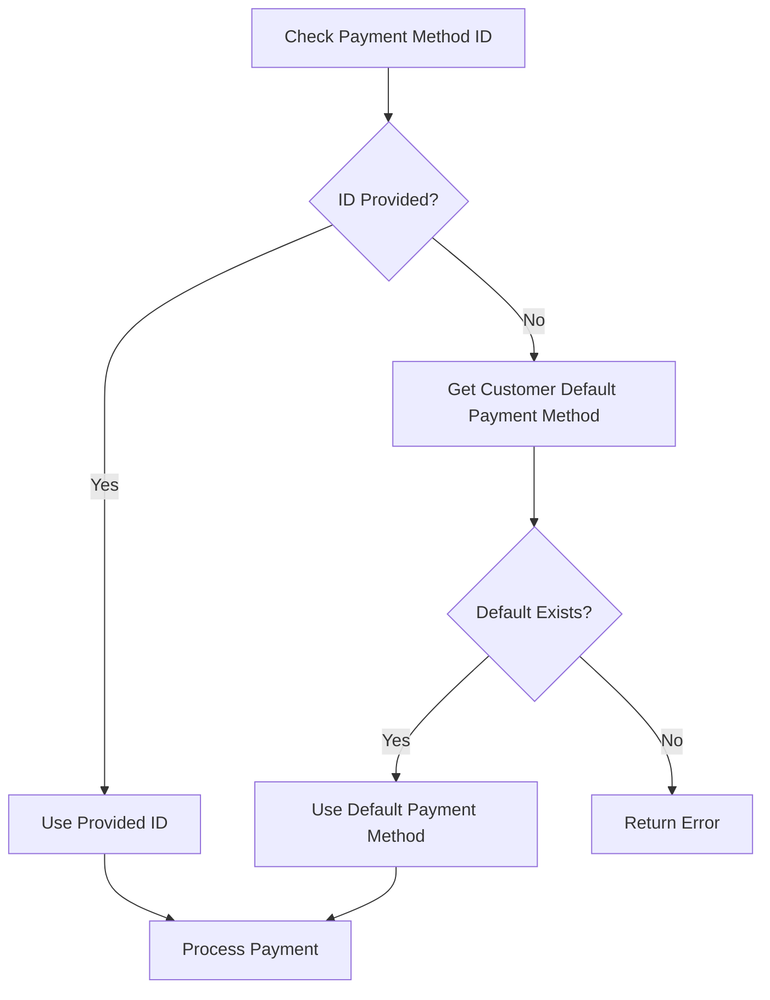

## Overview

Card payments in Flexprice allow customers to pay using their previously saved payment methods. This flow is designed for returning customers who have already saved their card details through a payment link with `save_card_and_make_default: true`.

### Key Features

- **Instant Payments**: No redirect to external checkout pages
- **Saved Payment Methods**: Uses customer's default payment method
- **Off-Session Processing**: Payments processed without customer interaction
- **Automatic Reconciliation**: Invoice updates happen automatically
- **Secure Processing**: All card data handled by Stripe

## Card Payment Prerequisites

### Customer Requirements

- **Existing Customer**: Customer must exist in both Flexprice and Stripe
- **Default Payment Method**: Customer must have a default payment method set in Stripe
- **Previous Payment Link**: Default payment method created via payment link with `save_card_and_make_default: true`

### System Requirements

- **Stripe Integration**: Active Stripe connection configured
- **Valid Invoice**: Invoice must be finalized and have outstanding amount
- **Matching Currency**: Payment currency must match invoice currency

## Payment Status Flow

### Status Transitions for Card Payments

```
INITIATED → PROCESSING → SUCCEEDED
    ↓           ↓           ↓
  FAILED     FAILED    REFUNDED
```

### Status Definitions

| Status | Description | Triggers |
|--------|-------------|----------|
| `INITIATED` | Payment record created, validation pending | Initial payment creation |
| `PROCESSING` | Payment intent created and being processed | Stripe payment intent confirmation |
| `SUCCEEDED` | Payment completed successfully | Successful charge confirmation |
| `FAILED` | Payment attempt failed | Stripe payment failure or validation error |
| `REFUNDED` | Payment was refunded | Manual refund processing |

## Creating Card Payments

### API Request

**Endpoint:** `POST /api/v1/payments`

**Headers:**
```http
Content-Type: application/json
Authorization: Bearer your_api_key
X-Environment-ID: your_environment_id
```

**Request Body:**
```json
{
    "amount": 150.00,
    "currency": "usd",
    "destination_id": "inv_01K34HYZN03V6X8Q6V3T8X6G4F",
    "destination_type": "INVOICE",
    "payment_method_type": "CARD",
    "process_payment": true,
    "payment_gateway": "stripe"
}
```

### Response

**Success Response:**
```json
{
  "id": "pay_1234567890abcdef",
  "payment_status": "succeeded",
  "amount": "150.00",
  "currency": "usd",
  "payment_method_id": "pm_1234567890abcdef",
  "gateway_tracking_id": "pi_1234567890abcdef",
  "created_at": "2024-01-20T10:30:00Z",
  "metadata": {
    "stripe_payment_intent_id": "pi_1234567890abcdef",
    "card_last4": "4242",
    "card_brand": "visa"
  }
}
```

**Error Response:**
```json
{
  "error": {
    "code": "no_default_payment_method",
    "message": "Customer must have a default payment method to make card payments. Please make a payment using payment link with save_card_and_make_default=true first.",
    "details": {
      "customer_id": "cus_1234567890abcdef",
      "payment_id": "pay_1234567890abcdef"
    }
  }
}
```

## Card Payment Configuration

### Required Fields

| Field | Type | Required | Description |
|-------|------|----------|-------------|
| `destination_type` | string | ✅ | Must be `"INVOICE"` |
| `destination_id` | string | ✅ | Valid invoice ID |
| `payment_method_type` | string | ✅ | Must be `"CARD"` |
| `payment_gateway` | string | ✅ | Must be `"stripe"` |
| `amount` | decimal | ✅ | Payment amount (must match invoice) |
| `currency` | string | ✅ | Valid currency code |
| `process_payment` | boolean | ✅ | Set to `true` to process immediately |

### Optional Fields

| Field | Type | Required | Description |
|-------|------|----------|-------------|
| `payment_method_id` | string | ❌ | Specific payment method ID (uses default if empty) |
| `metadata` | object | ❌ | Additional payment metadata |

### Payment Method Selection

When creating a card payment, you can specify which payment method to use:

- **No `payment_method_id` provided**: Uses the customer's default payment method
- **`payment_method_id` provided**: Uses the specified payment method for this payment

**Example with specific payment method:**
```json
{
    "amount": 150.00,
    "currency": "usd",
    "destination_id": "inv_01K34HYZN03V6X8Q6V3T8X6G4F",
    "destination_type": "INVOICE",
    "payment_method_type": "CARD",
    "payment_method_id": "pm_1234567890abcdef",
    "process_payment": true,
    "payment_gateway": "stripe"
}
```

**cURL Example:**
```bash
curl -X POST https://api.cloud.flexprice.io/v1/payments \
  -H "Content-Type: application/json" \
  -H "Authorization: Bearer your_api_key" \
  -H "X-Environment-ID: your_environment_id" \
  -d '{
    "amount": 150.00,
    "currency": "usd",
    "destination_id": "inv_01K34HYZN03V6X8Q6V3T8X6G4F",
    "destination_type": "INVOICE",
    "payment_method_type": "CARD",
    "payment_method_id": "pm_1234567890abcdef",
    "process_payment": true,
    "payment_gateway": "stripe"
  }'
```

## Payment Processing Flow

### Payment Validation

Before processing, the system validates:

- **Invoice Status**: Must be finalized and have outstanding amount
- **Customer Existence**: Customer must exist in both systems
- **Amount Matching**: Payment amount must match invoice outstanding
- **Currency Matching**: Payment and invoice currencies must match

### Default Payment Method Retrieval



### Stripe Payment Intent Creation

The system creates a Stripe Payment Intent with:

- **Amount**: Exact payment amount in smallest currency unit
- **Currency**: Payment currency
- **Customer**: Stripe customer ID
- **Payment Method**: Default payment method ID
- **Confirmation**: Immediate confirmation (`confirm: true`)
- **Off Session**: Set to `true` for saved payment methods

### Payment Confirmation

Payment intents are automatically confirmed with the following parameters:

```json
{
  "amount": 15000,
  "currency": "usd",
  "customer": "cus_stripe123abc",
  "payment_method": "pm_1234567890abcdef",
  "off_session": true,
  "confirm": true
}
```

## Error Handling

### Common Card Payment Errors

| Error Code | Cause | Resolution |
|------------|-------|------------|
| `no_default_payment_method` | Customer has no default payment method | Create payment link with `save_card_and_make_default: true` |
| `card_declined` | Card was declined by issuer | Customer should contact their bank |
| `insufficient_funds` | Insufficient funds on card | Customer should use different payment method |
| `authentication_required` | 3D Secure authentication needed | Use payment link flow for authentication |
| `expired_card` | Card has expired | Customer needs to update payment method |

### Error Response Format

> **Note:** All card payment errors follow this standardized format for consistent error handling.

```json
{
  "error": {
    "code": "error_code",
    "message": "Human-readable error message",
    "details": {
      "customer_id": "cus_1234567890abcdef",
      "payment_id": "pay_1234567890abcdef",
      "stripe_error_code": "card_declined"
    }
  }
}
```

### Recovery Flow

1. **Immediate Failure**: Payment status set to `FAILED`
2. **Error Logging**: Detailed error information recorded
3. **Customer Notification**: Optional failure notification sent
4. **Alternative Options**:
   - Retry with payment link flow
   - Update payment method via payment link with `save_card_and_make_default: true`
   - Use different payment method

## Security Considerations

### Payment Security

- **Off-Session Payments**: All card payments are off-session using saved methods
- **PCI Compliance**: No card data stored in Flexprice systems
- **Stripe Security**: All sensitive operations handled by Stripe
- **Authentication**: Strong Customer Authentication (SCA) compliance

### Data Protection

- **Encrypted Storage**: All payment data encrypted at rest
- **Access Controls**: Role-based access to payment information
- **Audit Logging**: All payment operations logged for compliance
- **Data Retention**: Payment data retained per compliance requirements

## Testing Card Payments

### Test Environment Setup

1. **Stripe Test Mode**: Use Stripe test keys
2. **Test Customer**: Create customer with saved payment method
3. **Test Payment Link**: First create payment link with `save_card_and_make_default: true`
4. **Test Card Payment**: Then test card payment flow

### Test Scenarios

| Scenario | Test Card | Expected Result |
|----------|-----------|-----------------|
| Successful Payment | `4242424242424242` | Payment succeeds |
| Declined Card | `4000000000000002` | Payment fails with decline |
| Insufficient Funds | `4000000000009995` | Payment fails with insufficient funds |
| Authentication Required | `4000002760003184` | Payment fails, requires payment link |

## API Reference

For complete API documentation, see the [API Reference](/api-reference/payments/create-a-new-payment).
