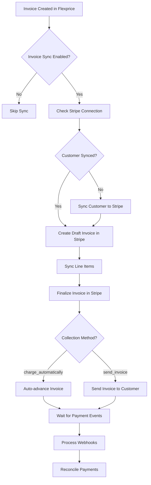
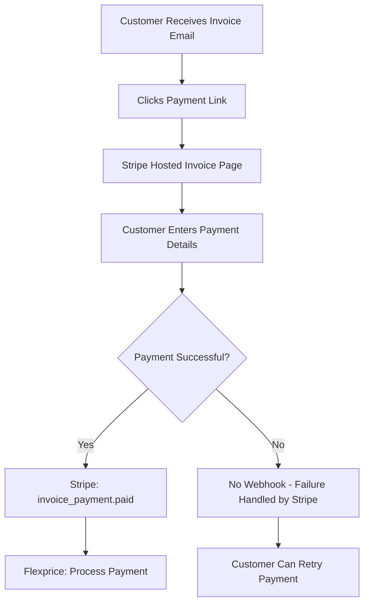
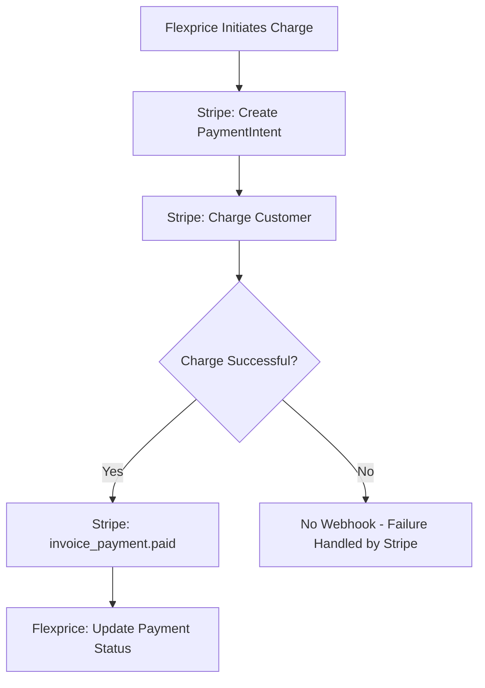
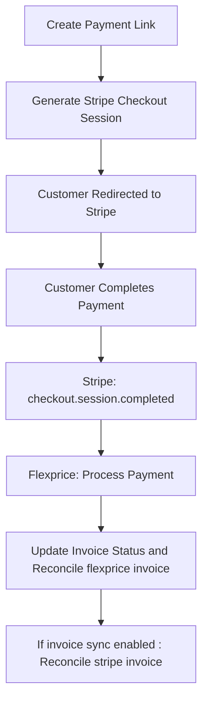
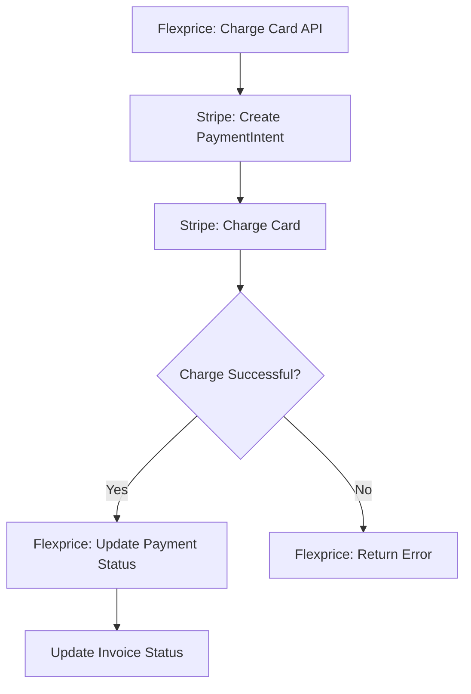

## Overview

The Stripe Invoice Sync Flow enables Flexprice to synchronize invoices with Stripe, allowing for seamless payment processing and reconciliation across both platforms. This system handles different collection methods, webhook processing, and ensures accurate payment tracking.

### Key Features

- **Invoice Synchronization**: Automatic sync of Flexprice invoices to Stripe
- **Collection Methods**: Support for `charge_automatically` and `send_invoice` methods
- **Payment Reconciliation**: Real-time payment tracking across platforms
- **Webhook Processing**: Comprehensive webhook handling for all payment events
- **Credit/Offline Restrictions**: Disabled when invoice sync is enabled
- **Metadata Tracking**: Uses `flexprice_payment_id` and `flexprice_invoice_id` for reconciliation

## Invoice Sync Lifecycle



## Collection Methods

### Charge Automatically

When `collection_method` is set to `charge_automatically`:

1. **Invoice Creation**: Creates a draft invoice in Stripe with `charge_automatically` collection method
2. **Auto-advance**: Stripe automatically creates a PaymentIntent and attempts to charge the customer's default payment method
3. **Payment Processing**: Stripe handles the payment attempt immediately
4. **Webhook Events**: Listen for `invoice_payment.paid` and `payment_intent.succeeded`

**Behavior:**

- Immediate payment attempt upon invoice finalization
- Uses customer's default payment method
- Automatic retry on failure (based on Stripe settings)
- Subscription status depends of payment behavior until payment succeeds

### Send Invoice

When `collection_method` is set to `send_invoice`:

1. **Invoice Creation**: Creates a invoice in Stripe with `send_invoice` collection method
2. **Due Date**: Sets the invoice due date from Flexprice invoice
3. **Send Invoice**: Automatically sends the invoice to the customer via email
4. **Customer Action**: Customer must manually pay using Stripe's hosted invoice page
5. **Webhook Events**: Listen for `invoice_payment.paid` and `payment_intent.succeeded`

**Behavior:**

- Customer receives email with payment link
- Manual payment required by customer
- Subscription status depends on payment behavior setting
- More control over payment timing

## Payment Flows

### Stripe Payment Methods

#### 1. Invoice Link (Stripe Hosted)

**Flow:**



**Webhook Handler:** `payment_intent.succeeded`

- **Trigger**: Customer pays via Stripe invoice link
- **Action**: Creates payment record in Flexprice
- **Reconciliation**: Uses `flexprice_invoice_id` from invoice metadata
- **Note**: We don't listen to failure webhooks, only success

#### 2. Charge Customer (Stripe Direct)

**Flow:**



**Webhook Handler:** `invoice_payment.paid`

- **Trigger**: Direct charge to customer's payment method succeeds
- **Action**: Updates existing payment record
- **Reconciliation**: Uses `flexprice_invoice_id` from invoice metadata

### Flexprice Payment Methods

#### 1. Checkout Link (Flexprice Hosted)

**Flow:**



**Webhook Handler:** `checkout.session.completed`

- **Trigger**: Customer completes payment via Stripe Checkout
- **Action**: Updates payment status to `SUCCEEDED`
- **Reconciliation**: Uses `flexprice_payment_id` from PaymentIntent metadata
- **Note**: We get the invoice ID from the PaymentIntent and don't listen to failure webhooks

#### 2. Charge Card (Flexprice Direct)

**Flow:**



**No Webhook Processing:**

- **Reason**: Payment is processed synchronously
- **Action**: Immediate status update in Flexprice
- **Reconciliation**: Direct API response handling

## Webhook Processing

### Webhook Event Types

| Event Type                      | Trigger                    | Action                       | Reconciliation Method                              |
| ------------------------------- | -------------------------- | ---------------------------- | -------------------------------------------------- |
| `checkout.session.completed`    | Payment link completed     | Update payment status        | `flexprice_payment_id` from session metadata       |
| `payment_intent.succeeded`      | Checkout payment succeeded | Update payment status        | `flexprice_payment_id` from PaymentIntent metadata |
| `payment_intent.payment_failed` | Direct charge failed       | Update payment status        | `flexprice_payment_id` from PaymentIntent metadata |
| `invoice_payment.paid`          | Invoice payment succeeded  | Create/update payment record | `flexprice_invoice_id` from invoice metadata       |

### Metadata Requirements

**Critical:** Never delete `flexprice_payment_id` or `flexprice_invoice_id` from Stripe metadata. These are essential for payment reconciliation.

**Required Metadata Fields:**

- `flexprice_payment_id`: Links Stripe payment to Flexprice payment record
- `flexprice_invoice_id`: Links Stripe invoice to Flexprice invoice record
- `flexprice_customer_id`: Links Stripe customer to Flexprice customer record

## Payment Reconciliation

### Reconciliation Process

1. **Webhook Received**: Stripe sends webhook with payment event
2. **Metadata Extraction**: Extract `flexprice_payment_id` or `flexprice_invoice_id`
3. **Record Lookup**: Find corresponding Flexprice record
4. **Status Update**: Update payment/invoice status
5. **Amount Verification**: Ensure payment amounts match
6. **Event Triggering**: Send internal events for downstream processing

## Restrictions and Edge Cases

### When Invoice Sync is Enabled

**Disabled Payment Methods:**

- ❌ **Credit Payments**: Cannot use wallet credits for payment
- ❌ **Offline Payments**: Cannot mark payments as offline
- ❌ **Manual Payment Recording**: Must use Stripe payment methods

**Reasoning:**

- Invoice sync requires payment reconciliation with Stripe
- Credit and offline payments bypass Stripe's payment tracking
- This ensures accurate financial reporting and reconciliation

### Edge Cases

#### 1. Partial Payments

- **Stripe**: Handles partial payments automatically
- **Flexprice**: Syncs partial payment amounts
- **Reconciliation**: Tracks cumulative payment amounts

#### 2. Refunds

- **Stripe**: Process refunds through Stripe dashboard
- **Flexprice**: Manual reconciliation required

#### 3. Failed Payments

- **Retry Logic**: Handled by Stripe's retry mechanism
- **Webhook**: `payment_intent.payment_failed` for direct charges only
- **Flexprice**: Updates payment status to `FAILED`
- **Note**: Invoice payment failures are not tracked via webhooks

## Configuration

### Enabling Invoice Sync

1. **Stripe Connection**: Configure Stripe integration
2. **Enable Sync**: Set `"invoice": {"inbound": false, "outbound": true}`
3. **Customer Sync**: Ensure customers are synced to Stripe
4. **Webhook Setup**: Configure webhook endpoints

### Webhook Endpoints

```
POST /api/v1/webhooks/stripe/{tenant_id}/{environment_id}
```

**Required Events:**

- `checkout.session.completed`
- `payment_intent.succeeded`
- `payment_intent.payment_failed`
- `invoice_payment.paid`

## Error Handling

### Common Errors

| Error                          | Cause                             | Resolution                                |
| ------------------------------ | --------------------------------- | ----------------------------------------- |
| "Invoice not synced to Stripe" | Invoice sync disabled             | Enable invoice sync or use manual payment |
| "Customer not found in Stripe" | Customer not synced               | Sync customer to Stripe first             |
| "Payment already exists"       | Duplicate webhook                 | Skip processing (idempotent)              |
| "Metadata missing"             | Webhook without required metadata | Log warning and skip                      |

### Error Recovery

1. **Webhook Failures**: Stripe retries failed webhooks
2. **Sync Failures**: Manual retry via admin interface

## Testing

### Test Scenarios

1. **Invoice Sync**: Create invoice and verify Stripe sync
2. **Payment Link**: Generate link and complete payment
3. **Direct Charge**: Charge customer directly
4. **Webhook Processing**: Simulate webhook events
5. **Reconciliation**: Verify payment amounts match

### Test Data

**Test Cards:**

- `4242424242424242`: Successful payment
- `4000000000000002`: Card declined
- `4000000000009995`: Insufficient funds

**Test Webhooks:**
Use Stripe CLI to forward webhooks to local development environment.

For additional support, refer to the [API Reference](/api-reference) or contact the development team.
